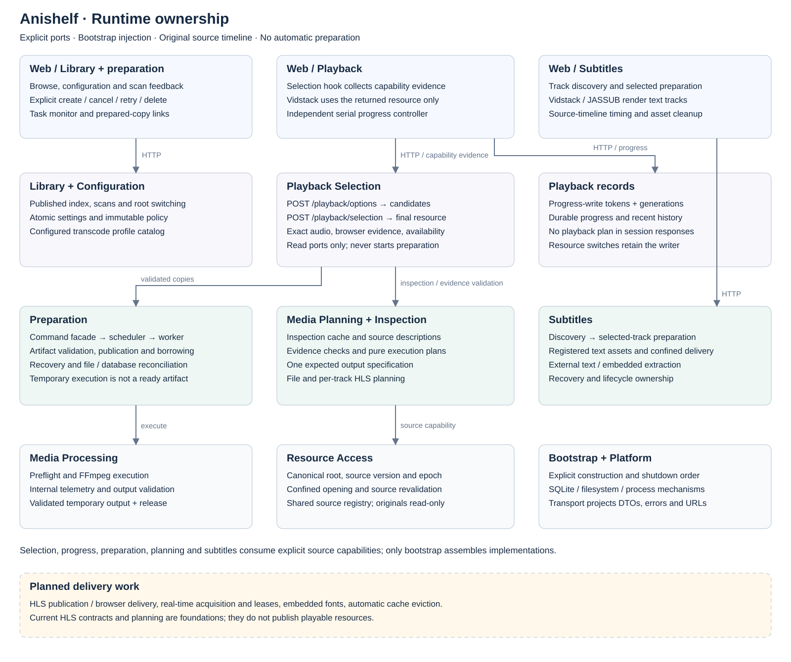

# Anishelf Architecture

- [Modules and boundaries](#modules-and-boundaries)
- [Configuration and persistence](#configuration-and-persistence)
- [Library and resource identity](#library-and-resource-identity)
- [Playback and progress](#playback-and-progress)
- [Subtitles](#subtitles)
- [Video compatibility checks](#video-compatibility-checks)
- [Playback plans and resource ownership](#playback-plans-and-resource-ownership)
- [Internal media execution](#internal-media-execution)
- [Persistent Web preparation](#persistent-web-preparation)
- [HLS migration foundation](#hls-migration-foundation)
- [Real-time playback design](#real-time-playback-design)
- [HTTP boundaries](#http-boundaries)
- [UI design](#ui-design)

This document records ownership, design decisions and cross-module constraints.
[Requirements](requirements.md) owns scope and acceptance;
[Development](development.md) owns setup and operations;
[History](history.md) preserves complete V1 designs and superseded proposals.
Schemas, database definitions and module Public APIs are authoritative for fields,
routes, types and policy values.

Direct playback, saved progress/history, external and embedded text subtitles,
compatibility negotiation, persistent preparation and prepared-copy playback are
implemented. Real-time HLS, embedded fonts, automatic cache eviction and broader
playback/cache settings remain planned. The dedicated Continue watching UI is
also planned; recent history and resume are implemented. HLS resource contracts,
per-track planning and source-time mapping are implemented as a migration foundation;
HLS packaging, resource acquisition and HLS browser playback are not implemented.

## Modules and boundaries

Anishelf is a React/Node.js application with one backend process. Business modules
collaborate through in-process Public APIs; HTTP is the browser/server boundary.
Bootstrap assembles dependencies and owns startup/shutdown. It closes durable
preparation and subtitle owners before shared processing/inspection and closes
persistence last. Production supplies one shutdown sequence to HTTP composition.

The diagram separates implemented owners from future delivery work.

| Module | Owns |
| --- | --- |
| Configuration | Effective immutable policy, user settings and transcode profile catalog |
| Library | Published in-memory index, scans and root-switch coordination |
| Resource Access | Confined file access, source identities, root epoch and source registry |
| Media Inspection | Shared source-version-bound inspection cache and probe concurrency |
| Media Planning | Source/output descriptions, browser evidence validation, expected output specifications and read-only execution decisions |
| Media Processing | Execution preflight, FFmpeg work and validated temporary outputs |
| Playback Selection | Read-only candidate inspection, browser-evidence validation and final original/prepared resource choice |
| Playback | Progress-write sessions, durable progress and history |
| Preparation | Persistent tasks, queue, reusable artifacts and cache delivery |
| Subtitles | Discovery, selected-track preparation, delivery and asset lifecycle |
| HLS | Resource/segment models, policy and lease port; publication/delivery implementation is pending |
| Real-time | Session and lifecycle ports; runtime ownership implementation is pending |

Cross-module imports, including types, use explicit module entries: `public.ts`
for service contracts and pure decisions, `policy.ts` for defaults/validation, and
Resource Access's `files.ts` for the confined-filesystem capability. Public service
contracts are explicit interfaces rather than aliases derived from Applications.
Policy/service entries do not load Application or infrastructure implementations.
Only bootstrap may import implementations from other modules for assembly.
HTTP handlers call their own Application; Applications coordinate domain logic,
adapters and other modules' Public APIs. Domain code does not depend on HTTP,
Applications or concrete infrastructure. Platform adapters provide filesystem,
database and media-process mechanisms without owning business workflows or
importing business modules. Platform owns the input types it needs; Configuration
validates and injects those inputs. Runtime environment capture belongs to Platform.
Frontend features likewise expose `public.ts`; routes compose them.

Resource Access receives an indexed-source catalog port from bootstrap rather
than importing Library. Playback, inspection and subtitles consume the same
read-only source capability. The shared source registry prevents each feature
from inventing its own source identity. Runtime dependencies remain acyclic. Boundary checks include type-only imports;
type-only cycles are distinguished from runtime initialization cycles.
`npm run architecture:check` enforces these constraints with dependency-cruiser.
See [Refactoring baseline](refactoring-baseline.md) for preserved behaviors and
the refactoring implementation/status inventory.

## Configuration and persistence

Modules own their policy defaults and semantic validation. Configuration composes
and validates them, then injects immutable views into consumers. Policy may narrow
supported capabilities; it cannot create codec, format or renderer support.
Fixed protocol/security invariants remain separate from tunable policy.

Startup environment values configure deployment. `settings.json` stores explicit
user choices; omitted values use current program defaults. Commit settings
atomically before publishing the new snapshot. Failed writes preserve the prior
configuration. Program defaults are not copied into the data directory.
Custom profiles load at startup from `dataDir/transcode-profiles.json`; see
[Transcode profiles](transcode-profiles.md) for their configuration contract.

The Web workspace owns presentation timing and media-controller preferences.
It imports only browser-safe shared constraints and has no runtime client-policy
request. English is the shipped/default/fallback locale; message keys and error
codes remain independent of translated text. Additional locales and metadata
language selection are future work.

| Storage | Responsibility |
| --- | --- |
| Settings JSON | User choices, atomically persisted |
| SQLite through Drizzle / better-sqlite3 | Durable source/progress records and recoverable task/asset metadata |
| Private cache files | Generated media/subtitle payloads referenced by registered opaque IDs |
| Process memory | Rebuildable library index, epochs, session tokens and bounded probe caches |

Use reviewed migrations, foreign keys, WAL, finite busy waits and short
transactions with durable commits. Never hold a transaction across media work
or streaming. Migration failure preserves the database and reports the failure;
it must not silently replace it with an empty store. Backups must account for WAL.

Files and SQLite cannot commit together. Validate and publish bytes before
committing ready metadata; reconcile incomplete/orphan files and missing records
at startup. Operational cache cleanup never removes original files or durable
source/progress history. Missing generated assets are recoverable failures.

## Library and resource identity

The library publishes a complete scan snapshot atomically. Failed/cancelled scans
preserve the previous snapshot; partial child failures remain visible. A single
coordinator owns scan state, scheduling and the settings/scan exclusion gate.
Startup, manual and scheduled scans use the same lifecycle. A root change commits
settings before invalidating the epoch and resetting the index; same-root saves
preserve the index.

Source identity binds canonical root, relative file identity and a version from
safely opened stat metadata. It detects ordinary replacement, not identical-stat
adversarial mutation or content equivalence. Renames create new identities;
automatic relinking is deferred. Persisted identities omit the process-local root
epoch so valid assets survive restart. In-flight asynchronous work must check both
version and epoch before reuse/publication.

Confined access checks containment, symlinks and regular-file type when opening
resources. Root switches must not redirect an in-flight lookup. Existing readers
retain their opened handles. This assumes a trusted local media tree.

Availability comes from the current index and source revalidation. An unscanned
source is unknown, not missing. History records alone cannot authorize playable
links. Root switches and scan omissions preserve records in their original
namespace; replaced sources do not inherit old progress.

## Playback and progress

Vidstack owns native media controls and rendering. The application owns source
selection and server progress; independent player resume storage is disabled.
Load saved progress before enabling writes, restore after media metadata arrives,
and clamp to the actual duration. A failed history read keeps media usable with
saving disabled, avoiding accidental zero overwrites.

Original and prepared bytes share the registered original-source history key.
Subtitle timing remains on that source timeline. Switching delivery resources
preserves position and must not create a new progress generation merely because
the media URL changed. Route revalidation must not recreate an active player.

### Playback progress storage

Each source version has at most one current progress row. A successfully opened
session increments its generation transactionally; updates carry increasing
sequence numbers. Reject obsolete generations/sequences. An identical retry of
the latest accepted update succeeds without changing viewing time; a different
payload at the same sequence conflicts. Backward seeks, including zero, are
ordinary newer writes. Ordering uses server viewing time, not client clocks or
maximum position. Opening another session supersedes the previous writer.

Serialize frontend saves and coalesce periodic samples. Flush on pause, completed
seek, ended and normal exit; ambiguous retries retain their original sequence and
payload. Exit cleanup does not block navigation; tab termination is best effort.
Session expiry bounds abandoned tokens, and restart requires reopening sessions.

History filters against the active root and current source version while retaining
unavailable records durably. Continue watching additionally excludes known near-end
positions; unknown duration does not imply completion. Apply display limits after
availability filtering and use a stable tie-breaker. Completion is derived from
progress and policy rather than a stored watched marker. Recent history may include
completed files and saved zero positions.

External-player links refer to original media at the current browser origin and
retain access checks. Copying a link neither launches a player nor updates history.
External-player invocation and state synchronization remain separate future work.

## Subtitles

Discovery is metadata-only and starts on file selection. It never extracts tracks
or reads subtitle contents when a list/menu opens. External tracks match the exact
video stem with a supported extension or dot-separated suffix; ambiguous matches
start off. Embedded tracks retain visible unsupported status for unknown/bitmap
codecs. Size, language and support metadata are descriptive, not proof of rendering.

One selected-track preparation contract serves both origins. The server resolves
opaque IDs and source versions; clients cannot submit paths, stream selectors or
conversion arguments. External preparation validates bounded decodable text and
returns its version-checked original URL without an asset row or cache copy.
Embedded preparation deduplicates extraction by source/stream/format/processing
version, returning pending status or a registered ready URL. Poll only when a
status URL is supplied.

Publish extracted text atomically and revalidate the source around work. Reconcile
interrupted/orphan/missing assets at startup; preserve valid ready assets for reuse.
Busy/full-cache failures remain explicit and retryable. Closing the subtitle owner
awaits extraction cleanup; shared inspection is closed by bootstrap. Cancelling
client waiting does not cancel reusable server work. Initialization failure may
disable embedded preparation while preserving direct playback and external text.

Vidstack tracks and its CC menu own selection. One controller handles preparation,
switching, off and retry for both origins; late responses cannot replace a newer
selection. VTT/SRT use Vidstack; ASS/SSA use JASSUB through its TextRenderer adapter
with bundled worker/WASM and fallback font. Switching/off/unmount releases loaders
and overlays. Format parsing does not guarantee styling or missing glyph coverage.
Subtitle failures never force audio/video conversion or automatic burn-in.

### Planned font and bitmap handling

Extract referenced TTF/OTF attachments into private registered assets with validated
payloads and bounded per-file/aggregate sizes. Attachment names are never output
paths. Supply validated fonts to JASSUB with fallback and missing-font feedback.
Bitmap extraction must preserve required paired files, but Web bitmap rendering,
OCR and burn-in remain outside the selected scope.

Future real-time playback must map both text cues and the JASSUB clock to source
time, including generation changes, without accumulating offsets.

## Video compatibility checks

Media Planning owns `inspect()`, `check()` and `plan()`; Playback owns progress
sessions and history. Preparation consumes its own minimal `PreparationPlanner`
port, wired directly to Media Planning by bootstrap.

Inspection describes the original source and, when explicitly requested, concrete
output candidates for a selected profile/delivery target. Browser evidence is
bound to source, root, profile content and exact queries. Checking rebuilds that
context and rejects stale/mismatched evidence. Evidence is client-specific, never
persisted as universal support and never authority to submit processing parameters.

Identify containers from content signatures and codec descriptors from inspected
metadata/initialization data. Extensions and MIME hints do not prove support;
missing metadata remains unknown. Prefer the default usable video stream, exclude
cover art and permit video-only sources. Inspect every audio stream, including its
language, title and default disposition. Original compatibility includes a browser
query for every audio stream and every video/audio pair; per-track decisions are
returned in `audioTracks`. Each response contains one authoritative audio description
list, `defaultAudioStreamIndex`, and ordered `selectedAudioStreamIndices`. The
default index describes native disposition; it never overrides an explicit
selection. Audio/video descriptions have distinct fields according to `kind`.
Browser queries contain only content types and decoding parameters, rather than
full stream objects. Evidence retains support, reason and smoothness; unused
power-efficiency data is not transported. The internal checked snapshot is an
explicit model, not an extension of an HTTP result.

A rejected track rejects the aggregate, and incomplete
or missing evidence for any remaining track keeps it unknown. Do not invent bitrate for CRF output or infer
SDR merely from absent HDR metadata.

File and Media Source evidence are distinct. Compatibility decisions are
supported, unsupported or unknown; poor smoothness warns without automatically
forcing conversion. Browser reports and FFmpeg build inventory each fall short of
actual playback/execution proof. HDR conversion is blocked; hardware availability
and universal browser support remain unverified.

The player selects supported originals directly. Unsupported originals may use an
existing verified copy; unknown support retains an explicit original-file attempt.
Actual playback failure invalidates cached reports and remains distinct from
capability predictions. Audio playback with no decoded picture must not be
reported as successful video playback. Viewing never enqueues processing.

## Playback plans and resource ownership

`MediaPlanningApplication.plan()` is read-only: it consumes checked compatibility,
resolves a processing decision and revalidates the source. It neither creates
history nor acquires tasks, files or real-time sessions. Private execution requests
are projected explicitly into public decisions by `POST /api/media/plans`.
Planning never publishes a playable HLS URL or creates a session. A HLS plan returns
`hls-required` with a plan identity and stream actions; it is not an accepted task.

| Resource | Owner guarantee |
| --- | --- |
| Direct | Resource Access authorizes the original on each request |
| Prepared | Preparation has validated and published a current completed artifact |
| Preparing | An actual accepted task exists; no playable URL yet |
| Real-time (planned) | A session owns a generation with playable published segments |
| Blocked | A reason exists, with no playable resource |

Derived identity binds root/source version, selected streams, effective profile,
delivery target and resolver version. Display metadata does not invalidate output;
processing policy changes do. Identity equality alone is insufficient for reuse:
publication, availability and current browser acceptance must also hold.

Playback Selection owns the final resource decision through two read-only requests:
`POST /api/playback/options` describes the original and eligible completed copies;
`POST /api/playback/selection` validates browser evidence and returns one resource
or a blocked decision. Preparation is accessed only through read ports.

Eligibility binds canonical root, source version and exact ordered audio selection.
Current profile and artifact availability are checked by Preparation. Selection
checks the actual task mode against output combination evidence, re-reads artifact
availability, and revalidates source/epoch before returning. The selected profile
ranks first, then newest task update and stable task ID. Browser-submitted candidate
order does not set priority. Options describe at most 128 eligible candidates in
server priority order, independently of the task-list window. Original evidence preserves omitted versus explicit
audio intent; candidate evidence uses normalized ordered indexes. Default
single-audio supported playback uses the
original; multi-audio/default and unsupported playback prefer a verified copy.
Explicit audio selections require matching copies, including empty and custom-order
selections. Unsupported or unknown evidence never silently authorizes a copy.

A blocked player may poll while matching tasks are pending. An active player keeps
its resource through task refreshes; explicit recheck, audio intent changes and
runtime failure trigger selection again. Runtime failures exclude the failed resource
for that intent; recheck permits fresh evidence and another attempt. An explicit
original attempt uses the same selection endpoint without requiring media analysis,
while retaining confined source/version/epoch checks. It intentionally plays the
original native track behavior regardless of selected copy tracks.

The progress session response carries token, source version, file and saved
progress only. Its sole generation is `progress.generation`; it neither chooses
resources nor duplicates the generation. Resource selection never opens a progress
session. Delivery switches reuse the current writer and original timeline.
A playback borrower cannot delete
a reusable artifact through the processing owner's temporary-output release API.
Real-time segment generations are independent of durable progress generations.

## Internal media execution

Media Planning owns the pure `resolveExecutionPlan()` and
`resolveHlsExecutionPlan()`. They apply selected profile policy to checked
compatibility. Copy compatible streams when packaging and transformation constraints
allow it; encode only required streams, with a reason per decision. Missing output
context or unknown required compatibility blocks processing. Subtitle preparation
is independent of audio/video encoding.

Preparation includes all audio tracks by default. Clients can select a subset in
source order or a custom order through `audioStreamIndices`: use comma-separated
absolute FFprobe stream indexes on `GET /api/files/:id/compatibility`, and an array
on compatibility checks and preparation creation/retry requests. Omission selects
all tracks; an empty string/array requests video-only output. A selection requires
new source/profile-bound browser evidence and processing rather than native direct
playback. Unknown, non-audio and duplicate indexes are rejected. Inspection still
checks every original audio track; output negotiation covers only selected tracks.
The ordered selection participates in both description and derived-output identity.

Selected audio tracks share the profile audio policy: copy all when every selected
track is compatible and needs no channel conversion; otherwise encode all selected
tracks when compatibility is known and the encoded combinations are supported.
Output validation checks each track's codec, channels and duration. The adapter
maps every selected track explicitly and preserves its stream metadata and default
disposition. This delivers a completed multi-track file; HLS/DASH manifests and
playback-time switching are not implemented by this backend.

The Web preparation action opens audio choices for multi-track sources, with all
tracks selected initially. It submits the chosen subset (or video-only output)
with fresh browser evidence. The playback page lists original audio tracks and
per-track compatibility; choosing one uses or explicitly prepares a single-track
copy. Viewing or changing a selection never creates a server task automatically.
The `audio` query parameter preserves the ordered selection in watch links, and
copy discovery, pending status, retry and verification use that same selection.
Original playback and all-track copies use their native default audio; seamless
in-player switching remains dependent on a future HLS/DASH delivery path.

One pure expected-output specification in Media Planning supplies browser output
queries, execution constraints and post-execution validation. Copy preserves
source dimensions/codecs/channels. Encoding predicts the actual FFmpeg filters:
`scale=-2` rounds proportional width to the nearest even integer, then padding
rounds both dimensions up to even. CRF bitrate remains unknown. Stereo conversion,
H.264 High level 5.1 descriptors and macroblock/rate limits share this specification.
Non-H.264 encoding does not carry H.264 level settings. Processing derives the
expected specification from the persisted execution settings and inspected source;
it does not persist a second output snapshot. Publication checks exact known
dimensions, pixel format, codecs and per-track channels, as well as durations.

### Media identities and invalidation

| Identity | Meaning and invalidation |
| --- | --- |
| `fileId` | Library resource address within a root; it does not prove unchanged bytes |
| `sourceVersion` | Source observation/version used by inspection, revalidation and output reuse; changed source invalidates those observations |
| `rootEpoch` | In-process root-switch guard; prevents publishing a result from a previous root, even when switching away and back |
| `descriptionId` | Exact browser-negotiation context: rules, root/epoch, source version, output profile/target, decoding queries and normalized ordered selection; explicit selection also binds the processing intent |
| Profile fingerprint | Effective encoding/packaging policy; excludes display ID/name metadata, changes when output policy changes |
| Execution-plan ID | Deterministic output identity binding root, source, effective profile, target, ordered streams, actions and resolver version; excludes browser query shape and negotiation epoch |

Batch 2 uses `rulesVersion: "4"`; old browser descriptions must be collected
again. This does not invalidate persisted task snapshots or valid artifacts.
Unchanged file/H.264/copy execution settings retain `preparation-execution:2` IDs;
corrected non-H.264 encode plans use `preparation-execution:3`. HLS planning retains
its existing `hls-execution:1` identity format. Previously stored requests remain
executable in their original representation, and valid completed bytes remain
reusable after restart. Task IDs, artifact IDs and transient execution IDs retain
their separate lifecycles. Source validation, profile validation and evidence
validation remain independent; identity equality alone does not certify output.

Processing owns source checks, selected-stream validation, server capability
preflight, execution and output validation. The FFmpeg adapter compiles trusted
typed settings, selects explicit streams and declares all required filters.
No arbitrary client/admin argument strings or filter graphs are accepted.
Build inventory cannot establish usable hardware, muxing combinations or output
validity; missing/unknown dependencies fail explicitly without substitution.

### Media tools and subtitle delivery

Platform media adapters resolve/version-check FFmpeg and FFprobe independently.
An invalid explicit path does not fall back to PATH; missing tools disable dependent
operations while direct playback remains available. Spawn resolved binaries with
argument arrays, no shell or interactive input, confined inputs and restricted
protocols. Bound concurrency, diagnostics, deadlines and output consumption.
Capabilities are backend-only and cached for the process lifetime.

Processing distinguishes startup, stalled progress and overall deadlines. A
heartbeat alone is not progress. Cancellation/timeout/shutdown waits for child
closure before cleanup. Percentage requires reliable duration and is not readiness.
Observer failures cannot change execution ownership or completion.

Successful child exit is insufficient: validate size, packaging, stream counts,
codecs, descriptor, requested dimensions/channels and available durations; recheck
the source and publish atomically. Processing outputs remain temporary until
adopted by Preparation. Stop awaits cleanup; release removes only processor-owned
outputs. Fragmented MP4 execution produces a complete artifact, not HLS streaming.

## Persistent Web preparation

Preparation owns persistent task state, deduplication, a bounded FIFO queue,
progress persistence, cache accounting and completed-media delivery. It consumes
public planning, processing and source APIs. Jobs snapshot effective execution
policy rather than retaining browser reports. Compatible originals create no task.
Cancel waits for execution cleanup; retry requires fresh browser evidence for the
same derivation. Changed source/profile identity requires new work.

The module has explicit responsibilities:

| Component | Owns |
| --- | --- |
| `PreparationApplication` | Create, cancel, retry, delete and read use cases; fresh planning and queue admission |
| `PreparationScheduler` | One active attempt, database queue selection, cancellation and shutdown |
| `PreparationWorker` | Derive the processing request, apply budgets, persist telemetry and finalize an attempt |
| `PreparationArtifacts` | Validate, publish, open, borrow, invalidate and delete completed files |
| `PreparationRecovery` | Initialize processing/files and reconcile persisted jobs and artifact metadata |
| Transport presenters | Public task projection, user progress and prepared-media URLs |

Task specifications are immutable and separate from mutable execution state and
artifact metadata. A specification contains one source identity, one execution-plan
ID and one effective profile fingerprint. Persisted snapshot version 1 contains
encoding settings and ordered stream indexes only; the source is reconstructed
from its durable source record. Processing requests are derived when an attempt
starts. Progress saves update execution state without rewriting the specification.
Display filename/profile ID are task metadata. Task ID survives explicit retries;
the deterministic artifact ID and transient processor execution ID retain distinct
ownership and lifetimes.

Task states are `queued`, `processing`, `cancelling`, `ready`, `failed` and
`cancelled`. Internal state unions restrict valid progress/failure combinations.
A cancellation request signals the active attempt immediately and persists
`cancelling`. `cancelled` is committed only after child completion, processor
release, prepared-file cleanup and terminal-state persistence. A failed cleanup
never returns successful cancellation; the scheduler stops admitting new work
until restart reconciles outputs. Shutdown similarly waits for active cleanup and
commands already in flight. Queued/interrupted/cancelling attempts become failed
with `interrupted` during recovery, requiring explicit fresh-evidence retry.

Repeated creation of the same derivation returns the existing task, including a
failed/cancelled task; it never silently restarts work. A ready task is validated
and reused. Retry requires a terminal task, fresh matching evidence and available
queue capacity. The same specification is preserved. A task cannot retry while
its old artifact is still borrowed, preventing replacement under an existing reader.

Planning, source inspection and read-only queries do not enter a global Promise
queue. Synchronous repository operations commit deduplication, queue capacity and
insertion without an intervening await. Repository SQL computes queue count, the
next queued task (ordered by enqueue/retry time and ID), and retained artifact
bytes. Per-artifact gates serialize publication, validation, borrow registration,
deletion and invalidation of the same file; independent task controls remain free
to proceed. Ready validation rechecks source/root after file validation, preventing
an old-root result from being advertised after a root switch.

Internal process telemetry remains diagnostic/persisted state. Public progress
contains only `mediaTimeMs`, `percent` and `speed`; frames, output-byte counters and
process-end flags are not readiness signals and are not exposed in task DTOs.

Preparation adopts validated output by hard link within the application data
filesystem, syncs and atomically publishes it, then commits the ready record.
Processing releases its temporary link. A hard-link failure fails visibly rather
than allocating a second large copy. Closing the service preserves completed files.

Ready artifacts are rechecked against source, profile and file availability.
During startup scanning, unknown source availability preserves valid files but
withholds playback URLs. Changed/missing sources, profiles or outputs invalidate
reuse. Startup removes orphan/partial files and marks interrupted jobs failed for
explicit retry; it does not silently resume incomplete work.

Cache accounting includes invalidated bytes still held by readers. Bound queued
work and narrow each execution's output budget to available cache and free space.
Full budgets fail visibly; eviction is manual. Deleting an in-use copy returns busy.
Invalidation blocks new readers while existing handles finish; final release
reclaims the invalidated bytes. Neither operation removes originals or history.

### Web integration

The application QueryClient is the authority for server query data. Shared options
and keys live in `web/src/api/queries.tsx`; router loaders preload that cache while
mounted pages observe it. Navigation cancellation releases its consumer without
cancelling a request used by another loader or observer. Queries and mutations do
not retry automatically or refresh on window focus/reconnection. Browser capability
caching remains local evidence rather than server state.

Directory compatibility observers share source-metadata/root/revision keys and a
bounded cancellable admission queue. A directory submits one
`POST /api/preparations/summaries` per group of at most 500 distinct file IDs. SQL
filters canonical root and file IDs before projection, including publications
outside the global recent-task limit. Summaries report counts per source version
for current effective profiles, not URLs or certified playback availability.
`GET /api/preparations?summary=true` provides recent task metadata with unknown
availability and no resource URL. Neither summary path opens source/artifact files.
The normal per-file/detail endpoints retain full validation and load on demand.
Startup reconciliation still validates persisted files as part of recovery.

Global and file task lists have separate canonical Query entries; components do not
merge their own copies. Preparation mutations centrally invalidate task lists and
publication summaries. Profile mutations update the shared catalog and invalidate
preparation facts. Query polls only pending tasks/summaries and stops at terminal
states. Publication metadata can be stale after external file changes; selection
and delivery remain authoritative.

Pre-transcoding is explicit. File menus query detailed tasks only while open and
keep action controls mounted while a command runs. The app-shell panel monitors
active tasks across routes; collapsing or navigating does not stop server jobs.

`usePlaybackController` coordinates validated route intent, delivery selection and
independent progress sessions. `FilePlayer` composes separate compatibility, audio
and preparation views. Selection queries collect browser evidence and load only the
server's returned resource. A blocked pending selection polls; an accepted resource
remains stable across unrelated task/scan updates. Keys distinguish ordered audio,
source scope, local negotiation attempts and failed resources. Explicit original
attempts still work when inspection is unavailable. Watching never creates a task.

Subtitle discovery uses a source-scoped Query entry. A selected track executes a
non-retrying preparation mutation; its status has an observer only while selected
and pending. Structural sharing preserves unchanged track metadata across refreshes.
Progress writes remain in their serial/coalescing controller, preserve original
sequence retries and invalidate cached history on departure. Resource switches do
not replace the writer generation or source timeline.

## HLS migration foundation

The target Web delivery is HLS/fMP4. Preserve `GET/HEAD /api/media/:id` as original
file delivery with existing Range/conditional requests for external players.
File details expose `originalMediaUrl`; browser playback URLs belong to playback
resources. Copy media link must always use the original file route and never
acquire a processing resource.

The migration currently preserves native file playback and completed-file
preparation. Playback plans use a discriminated `resource`: `delivery: file` carries
URL/MIME/timeline; `delivery: hls` additionally carries resource identity, stream
generation, complete/growing state, tracks and available source-time ranges.
Prepared resources must be complete. Pending plans contain no resource or URL.
The selection endpoint returns direct or complete prepared file resources, while
progress sessions carry no plan. HLS selection/acquisition remains future work.

Compatibility output requests accept `target: hls`; browser decoding queries use
`media-source`, not a fictional HLS MediaCapabilities query type. Evidence remains
bound to source/profile/selection and each requested combination. HLS planning
requires an MP4 profile, ignores native-file acceptance as a packaging shortcut,
and resolves each audio track separately. One track may be copied while another
is encoded. Unknown/missing evidence blocks the plan. HLS identity includes the
packaging version, effective settings and target segment duration. Track IDs map
explicitly to source stream indexes; playback selection is separate from the
tracks retained in an output.

`HlsExecutionPlan` is separate from the legacy complete-file execution plan.
It describes one video track, individual audio actions and fMP4 packaging policy.
The file executor rejects HLS output; no HLS executor is composed yet.
Processed file results identify their private file output explicitly. Future
segmented results identify a directory/master playlist, not a single media path.
Preparation exposes separate complete-file and completed-HLS artifact models;
the repository still persists only file artifacts. No database migration, cache
conversion or deletion is performed in this foundation step.

HLS owns segment/resource and acquire/release contracts. Preparation will own
completed publication and deletion; real-time will own leases, child execution and
stream generations. Playback borrows resources. The initial interfaces are ports,
not functioning resource services. Shared scheduling, segment publication,
validated reads and generation-specific HTTP routes remain to be implemented.

`MediaTimeline` records source and media origins plus the original duration.
Browser progress converts through the shared mapping on restore/save. Finishing
an offset stream must not mark the entire source watched. ASS/SSA and future
WebVTT delivery must use the same mapping; subtitle clock integration is pending.
HLS generations are independent of durable progress generations.

Migration order: implement validated complete HLS output/cache; integrate the
HLS Provider and backend resource selection; implement real-time acquisition,
leases, shared scheduling and out-of-range seeking; then add WebVTT subtitles.
Keep ASS/SSA on JASSUB. Do not advertise HLS delivery merely because plans or
schemas exist. All browser builds must be deployed with matching API contracts.

## Real-time playback design

**Planned.** Real-time mode processes an existing file while watched, using
session-scoped HLS/fMP4. Vidstack uses hls.js on validated MSE clients; native HLS
requires separate validation. The target strategy is a verified complete HLS resource, then necessary
real-time packaging/processing; compatible streams are copied. Original Range
delivery remains available for external players. Native Web playback remains
the current behavior until HLS execution/delivery has been implemented. Use a distinct versioned low-latency profile,
copy compatible streams and avoid an automatic fallback loop on generic errors.
No ABR ladder or live-source ingestion is required.

Publish initialization and complete segments before exposing a playable URL.
Publish playlists atomically with application-owned relative URLs; segment URLs
carry the session generation and reference immutable registered bytes. Copied
video cuts at existing keyframes, so segment durations and independence cannot be
assumed. Finalize at EOF; session files never silently become a prepared MP4.

In-range seeks reuse generated coverage. Out-of-range seeks stop the old child and
start a new generation near the requested source keyframe, returning the actual
origin and decoding forward as needed. Old responses cannot update the new player.
Do not process from zero merely to satisfy a late seek. Display full-source duration
and map media time, saves and subtitle clocks consistently; account for timestamps
and pre-roll without applying an offset twice.

Leases bound abandoned sessions. Exit, stop, replacement, prolonged pause, source
change and shutdown reclaim children, readers and temporary files. Restart expires
sessions and offers reopen/resume. Bound buffering/disk use; do not drop segments
still advertised by the playlist. Slow encoding displays buffering and offers
preparation rather than promising real-time speed.

### Planned shared scheduling

Real-time work and preparation share one processing slot. Real-time work takes
priority: stop active preparation, discard partial output and requeue it with an
interruption reason. Restart that task after the slot is released; no partial MP4
resume is claimed. Bound waiting work; source/root changes terminate affected work.
Probing and subtitle extraction retain separate concurrency. These priority and
session rules are proposals, distinct from the implemented preparation FIFO queue.

## HTTP boundaries

Strict browser-safe schemas and presenters define public contracts. Handlers enter
Applications; they do not access repositories or open files directly. Public DTOs
omit private paths, raw probe objects, stream selectors and execution settings.
Safe errors expose stable codes and request IDs; unexpected details stay in logs.
Validate Host/Origin and browser mutation metadata rather than trusting forwarded
headers or enabling general CORS.

Media routes authorize current originals or registered ready artifacts and stream
bounded bytes with HEAD/single-Range support. Invalid/multipart ranges fall back
to full responses; unsatisfiable ranges return 416. Completion/disconnect/errors
release handles. The browser player requests media directly; never load a whole
film through the JSON client or into a Blob. Pending work has no media URL.

## UI design

Visual hierarchy, information density, interaction, feedback, accessibility and
responsive-layout conventions are defined in [Design](design.md). This document
owns the UI's implementation boundaries and runtime behavior.

Unknown original compatibility exposes pre-transcoding actions for both single-
and multi-audio files. Fresh output compatibility evidence decides whether a task
can be created. The player always offers an explicit original-file attempt
when playback is blocked, including when prepared-copy discovery fails. This action
asks the server for the original resource without creating a preparation task. In-context recovery
actions share a single titled playback-unavailable panel and wrapping action row.
Check again, Try original file, and Pre-transcode use compact labeled buttons with
icons; the page-level return link is not repeated inside the panel.

The preparation audio-selection migration converts legacy single audio indices to
one-element arrays, and legacy null selections to empty arrays, in both stored
requests and derived identities. Existing task and artifact identities remain intact;
new snapshots continue to use ordered arrays.
