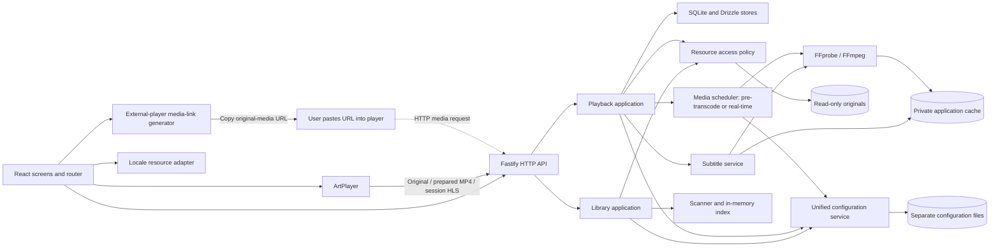

# Anishelf — Current Design Overview

**Active design: V2, planned and not implemented. Latest implemented release: V1.**

This page shows the complete application architecture, functional modules and current decisions. The [current requirements](current-version-requirements.md) define scope and acceptance. All expanded contracts, algorithms, defaults and failure rules remain in the [V2 design record](history/v2-design.md). [Development documentation](development.md) describes the existing implementation; [historical documentation](historical-design.md) preserves earlier designs.

## 1. Feature and Version Coverage

“Implemented in” records delivered behavior; “Target” records planned changes. Preserve the first implementation version when extending a feature. V2 rows remain unimplemented until acceptance passes.

| Feature / requirement | Implemented in | Target | Design boundary |
| --- | --- | --- | --- |
| Root configuration (V01) | V1 | V1, retained in V2 | One read-only resource root; persistent settings |
| Manual scans (V02) | V1 | V1, retained in V2 | Bounded traversal and atomic in-memory snapshots |
| Directory browsing (V03) | V1 | V2 presentation update | Real hierarchy, original names, stable natural ordering |
| Direct playback and controls (V04–V05) | V1, native video | V2 ArtPlayer replacement | Keep direct media streams and seeking; replace player UI |
| Failure feedback (V06) | V1 | V2 extensions | Add progress, subtitle, preparation, and media-link failures |
| Progress and resume (W01) | — | V2 | Server records, ordered writes, start over |
| Continue watching and recent viewing (W02) | — | V2 | File-based lists; no episode watched status |
| External subtitles (P03) | — | V2 | VTT/SRT/ASS/SSA matching, selection, off |
| Subtitle discovery and extraction (P08) | — | V2, partial | Extract MKV/container text and supported bitmap tracks; browser rendering follows the format matrix |
| Styled subtitles (P09) | — | V2, partial | ASS/SSA rendering and embedded fonts; image-subtitle rendering remains unassigned |
| Strategy selection (P05) | — | V2 | Validated browser profile and source probe |
| Remuxing (P06) | — | V2 | Preserve compatible audio and video streams |
| FFmpeg pre-transcoding and real-time transcoding (P07) | — | V2 | Reusable MP4 copies or session HLS; re-encode only necessary streams |
| External-player media link (C01) | — | V2 | Generate/copy an origin-relative original-media link; manual player open |
| Browser invocation of an external player (C02) | — | Later | Protocol launch or other native-app invocation |
| Everyday Web interface (O16) | — | V2 | Library, player, tasks, settings; responsive and accessible |
| Multilingual foundation (O14, partial) | — | V2 | English catalog and locale-independent contracts; translated UI deferred |
| External configuration (O17) | — | V2 | Separate default files and unified typed access |
| External-player state reading (C03) | — | Later | Read native state when a future integration exposes it |
| All other requirements | — | Unassigned | No implied V3 commitment; see Section 7 |

## 2. Architecture and Functional Modules

Retain a modular Node.js/TypeScript backend with Fastify, Pino, and asynchronous filesystem access. Retain React, Vite, React Router Data Mode, Tailwind CSS, shadcn/ui, Vitest, and Biome. V2 adds ArtPlayer, FFprobe/FFmpeg child processes, SQLite with Drizzle ORM, hls.js for real-time HLS, JASSUB for styled subtitles, and generation of transferable external-player media links. Browser invocation of a player is deferred. TanStack Query remains unassigned.

The external player runs on the browser user's computer and fetches the original media URL itself. With a remote server, resolve the media route against the browser's SSH-forwarded application origin. The user copies the URL and opens it manually in the player. Browser invocation remains a later feature.

| Module | Version | Responsibility |
| --- | --- | --- |
| Deployment configuration and logging | V1; V2 extension | Load startup options, resolve media tools, configure shared Pino logger |
| Unified configuration service | V2, extending V1 settings | Initialize separate default files, validate schemas/references, expose typed snapshots and commit settings |
| Library application, scanner, index | V1 retained | Own scans, settings exclusion, publication, browsing |
| Resource access | V1; V2 extension | Confined regular-file access, including subtitle sources |
| HTTP transport | V1; V2 extension | Validation, DTOs, typed errors, HEAD/Range and handle cleanup |
| Playback application | V2 | Source resolution, playback plan, progress sessions and asset selection |
| Media inspector, scheduler, transcode worker | V2 | Probe, decide stream copy/encoding, schedule pre-transcodes and real-time sessions |
| Subtitle service | V2 | Discover/extract subtitle and font assets, retain format/support metadata and serve them safely |
| SQLite repositories through Drizzle | V2 | Transactions for history, jobs, asset metadata, sessions; no media BLOB storage |
| External-player link generator | V2 | Resolve accessible original media and expose a client-reachable URL for copying; no application invocation |
| Locale resources | V2 foundation | English catalog and fallback; stable keys and future locale selection boundary |
| App shell, library browser, scan feedback and API client | V1; V2 extension | Routing, directory context, polling, errors and accessible settings/tasks/history screens |
| ArtPlayer adapter | V2 | Player lifecycle, media events, subtitle selection and resume |

HTTP calls application use cases. Application modules do not depend on Fastify or React; storage, inspection, and processing adapters do not own HTTP contracts. Keep existing import boundaries. The entry point assembles dependencies; avoid putting the new workflow inside route handlers or the scanner.

## 3. Configuration, Storage and Identity

Startup uses built-in defaults and environment variables, with no TOML file. `ANISHELF_DATA_DIR` overrides `$XDG_DATA_HOME/anishelf`, whose fallback is `$HOME/.local/share/anishelf`. Listener and logging overrides use the variables documented in [Development configuration](development.md#deployment-configuration). Existing deployments must remove `ANISHELF_CONFIG` and explicitly retain their old data directory. This current decision supersedes the startup TOML/bootstrap wording in the archived V1/V2 records; their planned policy files remain separate from startup parameters.

A unified typed configuration service creates missing files from packaged defaults, validates their contents and references, and supplies immutable views to application modules. Existing custom files are preserved. Administrator policy applies on restart; UI preferences use atomic writes. Policy values and format choices live in configuration files, while access/security invariants remain enforced by the program.

| Storage/file | Responsibility |
| --- | --- |
| Startup defaults and environment variables | Implemented host, port, XDG data directory and logging; optional tool/config-directory overrides remain planned |
| `settings.json` | User resource root, Web playback preference and cache budget |
| `media-formats.json` | Discovery extensions, MIME mappings and container/codec policy |
| `transcode-profiles.json` | Versioned prepared/real-time output formats and encoding parameters |
| `subtitles.json` | Discovery/extraction/rendering policy, font types and size limits |
| `runtime-policy.json` | Concurrency, queues, progress intervals, completion rules, leases, timeouts and diagnostic bounds |
| `localization.json`, `locales/en.json` | English default/fallback catalog and multilingual interface contract |
| SQLite + Drizzle (`better-sqlite3`) | Durable root/source identity and history; transactional job/session/asset metadata |
| Private cache files | Prepared media, HLS segments/manifests, extracted subtitles and fonts |
| In-memory library index | Rebuildable scanned hierarchy and current availability |

FFmpeg/FFprobe resolve independently from optional paths or process PATH. Missing tools disable dependent capabilities while independent browsing/direct playback stays available. Originals, configuration, database, cache and frontend assets have separate roles. History is scoped by canonical root and source version; changed sources/profile content invalidate derived output. Cache cleanup preserves originals, durable records and in-use assets. Database migrations, asset publication and restart reconciliation preserve recoverable data.

English remains the shipped UI. Stable message keys and fallback reserve future locales; future program metadata reserves language-tagged titles/aliases/descriptions and original language independently of program IDs. Metadata features and additional language packs remain outside V2.

[Configuration files, defaults, update rules, SQLite transactions and identity details](history/v2-design.md#3-configuration-persistence-and-identity).

## 4. Complete Runtime Workflow

| Functional area | Current design | Expanded explanation |
| --- | --- | --- |
| Scan and browse | One configured root, manual bounded traversal, atomic snapshot publication, natural sorting and retained snapshot on scan failure | [Library and media](history/v2-design.md#4-inherited-library-and-media-behavior-v1--v2) |
| Resource and media delivery | Opaque IDs, confined read-only regular files, bounded original/prepared streaming and HEAD/single Range support | [Access and delivery](history/v2-design.md#4-inherited-library-and-media-behavior-v1--v2) |
| Web player | React-owned ArtPlayer lifecycle, source switching and resume; keep playback stable across navigation/status refresh and clean up on exit | [ArtPlayer](history/v2-design.md#5-artplayer-web-playback-v2-v04v06-o16) |
| History and lists | Server-owned ordered progress, start over, shared original/prepared/HLS history, availability-aware continue/recent lists | [Progress and resume](history/v2-design.md#6-progress-resume-and-lists-v2-w01w02) |
| Subtitles | External VTT/SRT, JASSUB ASS/SSA, lazy embedded text/fonts and supported bitmap extraction; bitmap Web rendering remains unsupported | [Subtitle pipeline](history/v2-design.md#7-subtitles-v2-p03-partial-p08p09) |
| Media inspection/planning | Probe stream compatibility and select direct, remux, audio-only or necessary video processing; prefer original, valid prepared copy, then real-time work | [Planner](history/v2-design.md#8-playback-plan-and-ffmpeg-transcoding-v2-p05p07) |
| Preparation | Reusable validated fast-start MP4, deduplicated jobs, visible state/retry/cancel and cache deletion | [Pre-transcoding](history/v2-design.md#pre-transcoding) |
| Real-time playback | Session HLS/fMP4 with complete published segments, source-time seeks/resume/subtitles, leases and bounded scheduling/cleanup | [Real-time transcoding](history/v2-design.md#real-time-transcoding) |
| External-player support | Generate/copy an origin-aware original-media URL; the user opens it manually; Web history is unchanged | [Media-link generation](history/v2-design.md#9-external-player-media-link-v2-c01) |

## 5. HTTP and Interface Overview

Retain V1 health/settings/library/scan/directory/file/original-media contracts. V2 adds safe client configuration, playback plans, history/progress sessions, subtitle/font assets, preparation jobs/prepared-media delivery and real-time sessions/leases/HLS routes. Typed validation, opaque IDs, stable error codes and request IDs apply across the API. Detailed fields, routes, statuses and failure semantics are in the [HTTP contract record](history/v2-design.md#10-http-contracts-and-failure-semantics).

| Screen | Main responsibilities |
| --- | --- |
| Library | Hierarchy, scan feedback, continue/recent viewing, original filenames and directory context |
| Player | Watch/resume, controls, subtitles, progress/start over, processing status/reasons and Copy media link |
| Media tasks | Preparation/real-time states, reliable progress, retry/cancel/stop, play/delete ready copy |
| Settings | Resource root, Web mode, cache budget and validated save feedback |

Retain React Router loaders/actions and existing directory/file URLs; add tasks/settings routes. Use Tailwind/shadcn tokens and a consistent English visual system with responsive/accessibility/error states. Preserve navigation and playback during unrelated refreshes. [Expanded UI layout, lifecycle and visual acceptance](history/v2-design.md#11-everyday-interface-v2-o16).

## 6. Delivery and Verification

Deliver source identity/configuration/SQLite → ArtPlayer/history → subtitles → preparation/real-time HLS → media links → completed interface/integration. Develop the shell early and retain all V1 regressions. Acceptance covers every A01–A28 scenario in the [requirements overview](current-version-requirements.md#4-acceptance-coverage). Code changes must pass Biome check, lint, type checks and relevant tests; actual decoding, styling and timing require representative media/browser checks.

[Delivery stages, verification methods and completion evidence](history/v2-design.md#12-delivery-order-acceptance-and-deferred-scope).

## 7. Future Scope and Version Records

C02 browser/OS invocation and C03 external-player state reading are later requirements. Metadata/episode organization, subscriptions/download ingestion, external trackers, watched markers, next episode, multiple roots/devices, automatic scans, move relinking, original downloads, bitmap rendering/OCR/burn-in, advanced playback tools, desktop control/handoff, public/LAN authentication, translated locales, TanStack Query and advanced log maintenance remain outside V2. The [overall requirements](requirements.md) retain the full inventory and targets.

Keep this overview complete when advancing releases: inherited modules remain visible, new modules are added, and superseded implementations are identified. Detailed rules stay in version-specific records and are linked from the overview. During V2, maintain the [V2 design record](history/v2-design.md) together with this page. Preserve it on the next version; use [historical documentation](historical-design.md) for V1 and superseded proposals.
