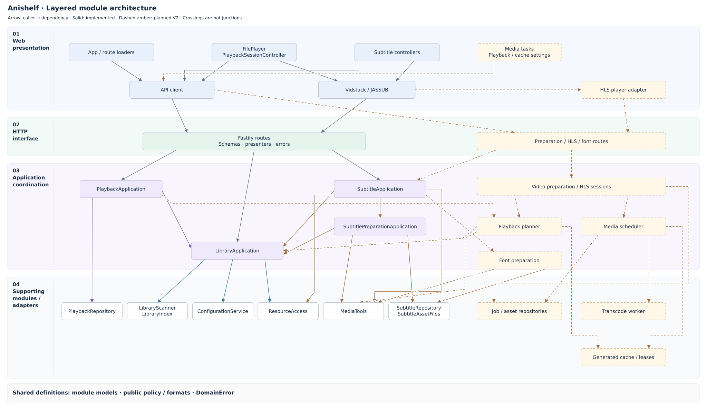

# Anishelf — Current Design

**V1 is implemented; V2 is in progress.** The direct-playback Vidstack adapter
and saved progress are implemented. External subtitle delivery/rendering and embedded
subtitle discovery/preparation/delivery are implemented; embedded fonts, video preparation,
and the remaining V2 workflows are planned. The [current requirements](current-version-requirements.md) define scope and acceptance.

The shared [design system](design-system.md) records page compositions and screen
conventions built on Tailwind defaults and shared controls. The broader V2 interface remains planned.

## 1. Architecture and Modules

### 1.1 Architecture classification

Anishelf is a browser/server (B/S) application with a separate frontend and
backend. The backend is a modular monolith with a practical layered architecture;
code is organized by a mixture of technical layers and business features. Data is
persisted as current state through repositories and transactions. The frontend
and backend communicate through HTTP request/response, while backend modules
collaborate through in-process calls.

The classifications below describe the **current implementation**, excluding
planned video-transcoding, HLS and other future modules.

| Dimension | Classification | Evidence and scope |
| --- | --- | --- |
| System form | Browser/server (B/S) | React runs in the browser and accesses the Node.js backend over HTTP; the backend accesses media files. Running both on one machine does not change this relationship |
| Frontend/backend relationship | Separate frontend and backend | `web` and `backend` are separate workspaces with an HTTP API boundary. Shared TypeScript contracts and optional backend hosting of frontend static files do not remove that boundary |
| System decomposition | Modular monolith | One backend process contains library, playback, subtitle, persistence and media-tool modules; business modules are not independently deployed services |
| Code organization | Hybrid package by layer and package by feature | `http/`, `application/` and `database/` group technical responsibilities; `library/`, `playback/` and `subtitles/` group business concepts. Features span these directories rather than forming complete vertical slices |
| Internal application design | Primarily layered architecture | HTTP delegates to applications, which coordinate supporting modules and adapters. Business models and rules remain in their owning modules; dependency injection and selected interfaces do not constitute a strict Clean, Hexagonal or Onion Architecture |
| Database read/write design | CRUD-style current-state persistence | Repositories and transactions read/update progress, source identities and subtitle asset state. There are no separate CQRS read/write models or event logs used to reconstruct state |
| Module communication | Request/response and direct in-process calls | HTTP connects browser and backend; backend modules call methods directly. Scans and subtitle preparation use background work and status polling, without a message queue or event bus |

These dimensions are complementary rather than mutually exclusive. React
components do not by themselves establish MVVM, and the application is not
organized around a conventional MVC structure. Business modules and domain errors
alone are insufficient to classify the design as DDD. Background tasks and player
event callbacks are local mechanisms rather than an event-driven system
architecture.

### 1.2 Layered architecture: implemented and planned

The single diagram below combines the implementation inspected on **2026-10-03**
with the remaining planned V2 modules, arranged from top to bottom: Web presentation, HTTP interface, application
coordination, and supporting modules/adapters. Every arrow means **caller →
dependency**. Lines attach to named modules; crossings are not junctions. Related
components may share a box. Solid boxes and connections are implemented; amber
dashed boxes and connections are proposed V2 additions. A dashed connection from
an existing module denotes a future extension. Only the main dependencies are
shown; proposed module names describe responsibilities, not existing classes.

Applications can depend on other applications within the same layer:
`PlaybackApplication`, `SubtitleApplication` and
`SubtitlePreparationApplication` use `LibraryApplication` for source access and
identity; `SubtitleApplication` delegates extraction to the preparation
application. Their vertical positions make these dependencies readable; they do
not introduce additional architectural layers.

Business models and rules live in their owning modules and shared `public/`
definitions. They are cross-cutting dependencies, not a separate processing stage.
The supporting layer contains both internal services (scanner/index) and concrete
adapters (configuration, files, repositories and media tools). This is a practical
layered architecture, not a strict domain/ports/adapters split. Startup wiring,
storage ownership and detailed call sequences are described below.

The backend is one modular Node.js/TypeScript process. `backend/src/index.ts`
loads configuration, creates the shared Pino logger, discovers media tools,
opens/migrates SQLite, initializes the library and starts its startup scan. It
then constructs playback and subtitle applications, reconciles subtitle assets,
and builds the Fastify server. Shutdown closes application work and the database.
Missing media tools or unavailable persistence reduce dependent capabilities;
they do not inherently disable original-media delivery.

The browser is a React/Vite application using React Router Data Mode. Page
loaders/actions and the API client exchange public JSON with Fastify. Vidstack
requests original media through a separate GET/HEAD/Range path. Subtitle content
is loaded through the text-track/rendering pipeline. The dashed video-transcode and HLS modules are not part of this implemented path.

| State or resource | Current owner | Lifetime / location |
| --- | --- | --- |
| Resource root and scan interval | `ConfigurationService` | User choices in atomic `dataDir/settings.json`; effective immutable settings in memory |
| Scan status, directory/file snapshot and scan timer | `LibraryApplication`, `LibraryScanner`, `LibraryIndex` | Rebuildable process memory; publication belongs to the application |
| Original videos and sidecar subtitles | `ResourceAccess` | Confined access under the configured media root; separate from writable application data |
| Root/source identities and playback progress | `PlaybackRepository` | Durable SQLite records in `resource_roots`, `media_sources`, `playback_progress` |
| Playback tokens, expiry and captured root epoch | `PlaybackApplication` | Process-local session registry; not persistent database sessions |
| Embedded probe results and in-flight probes | `SubtitleApplication` | Bounded process-local cache, keyed by root/file/source version |
| Subtitle asset state and source identity | `SubtitleRepository` | SQLite `subtitle_assets` plus root/source records |
| Extracted subtitle text | `SubtitleAssetFiles` | Private `dataDir/cache/subtitles`; atomically published files, not database BLOBs |
| Player selection, pending requests and renderer lifecycle | Web playback/subtitle controllers | Component/controller lifetime; cancellation and disposal on replacement/unmount |

### 1.3 Backend dependencies and ownership

HTTP routes validate requests and call applications. Presenters project business
results into public DTOs; routes do not query repositories, traverse the library
or construct filesystem paths. Application modules coordinate the work without
importing Fastify or React. Lower-level modules do not import application or HTTP
modules. These boundaries are enforced by `biome.json`.

| Module / code entry | Responsibility and direct collaborators |
| --- | --- |
| [`index.ts`](../backend/src/index.ts) | Composition and process lifecycle; assembles configuration, logging, tools, database, library, playback, subtitles and HTTP |
| [`config/service.ts`](../backend/src/config/service.ts), `deployment.ts`, `persistent.ts` | Deployment/environment configuration, built-in policy and validated atomic user-settings persistence; injected into the library through its settings-store boundary |
| [`public/`](../backend/src/public/) | Shared policy, subtitle format/identity rules, deployment defaults, storage conventions and adapter policy; only browser-safe exports are consumed by Web |
| [`http/app.ts`](../backend/src/http/app.ts), `schemas/`, `contracts.ts`, `presenters.ts` | Fastify composition, origin checks, request IDs, errors, validation and DTO projection; `client-config.ts` projects safe policy |
| [`application/library.ts`](../backend/src/application/library.ts) | Settings/scan exclusion, startup/root-change/manual/interval scan lifecycle, source resolution, root epochs and media opening; coordinates configuration, scanner, index and resource access |
| [`library/scanner.ts`](../backend/src/library/scanner.ts), [`library/index.ts`](../backend/src/library/index.ts) | Scanner traverses a captured root through resource access; index owns the published lookup snapshot and sorting. Neither decides when a scan starts |
| [`resources/access.ts`](../backend/src/resources/access.ts) | Root confinement, regular-file validation, safe handles and source-version metadata for videos and subtitles |
| [`application/playback.ts`](../backend/src/application/playback.ts) | Direct playback plan, session generation/sequence rules, progress saving and history queries; resolves sources through the library and persists through `PlaybackRepository` |
| [`application/subtitles.ts`](../backend/src/application/subtitles.ts) | External discovery/content, embedded metadata probing/cache and track identity; calls library source resolution, resource access, subtitle helpers and `MediaTools`; delegates prepared assets to the preparation application |
| [`application/subtitle-preparation.ts`](../backend/src/application/subtitle-preparation.ts) | Selected text-track extraction, deduplication, source/epoch validation, bounded publication and startup reconciliation; coordinates library, tools, subtitle repository and asset files |
| [`media/tools.ts`](../backend/src/media/tools.ts), `process.ts` | Executable discovery/version checks, FFprobe inspection and FFmpeg subtitle extraction; bounded subprocess output, timeout and cancellation |
| [`subtitles/`](../backend/src/subtitles/) | External discovery, bounded text reading, subtitle models and private asset-file operations; does not own HTTP or application workflows |
| [`database/index.ts`](../backend/src/database/index.ts), `schema.ts`, repositories | SQLite initialization/migrations and Drizzle transactions; playback/subtitle repositories map stored records to their module models |

The implemented [backend data structures](backend-data-structures.md) document
expands type ownership. Public JSON contracts derive from HTTP schemas. The Web
workspace re-exports those contracts with **type-only imports**, rather than
bundling backend applications or persistence code.

Configuration is a dependency across these modules, not an extra processing
stage. `ConfigurationService` owns effective backend policy; the HTTP
`/api/client-config` projection exposes only safe client values. Local loading,
polling and Toast timing remain in `web/src/config/interaction-policy.ts`.

### 1.4 Browser dependencies

| Entry / module | Collaboration |
| --- | --- |
| [`main.tsx`](../web/src/main.tsx), [`routes/library.tsx`](../web/src/routes/library.tsx) | Mount router and Toaster; compose library, directory, file, history and settings routes |
| [`App.tsx`](../web/src/App.tsx), [`routes/loaders.ts`](../web/src/routes/loaders.ts) | Shared library/client-config/settings context, scan actions and revalidation; explicit retry changes player version, ordinary polling does not |
| [`api/client.ts`](../web/src/api/client.ts), `contracts.ts` | Request cancellation, API error classification, response handling and shared public types |
| [`components/file-player.tsx`](../web/src/components/file-player.tsx), [`hooks/use-playback-session.ts`](../web/src/hooks/use-playback-session.ts), [`playback/session.ts`](../web/src/playback/session.ts) | Compose player and media link; open session, resume, serialize progress saves, flush and release |
| [`components/video-player.tsx`](../web/src/components/video-player.tsx) | Vidstack direct-video provider, media events and external/embedded text-track integration |
| [`components/external-subtitles.tsx`](../web/src/components/external-subtitles.tsx), `hooks/use-external-subtitles.ts` | Discover both external and embedded tracks despite the historical names; register tracks, selection controller and styled renderer |
| [`subtitles/embedded.ts`](../web/src/subtitles/embedded.ts), `preparation.ts` | Selection-triggered preparation, status polling, retry, stale-request cancellation and prepared-track URL installation |
| [`subtitles/renderer.ts`](../web/src/subtitles/renderer.ts) | `StyledSubtitleRenderer` integrates JASSUB for ASS/SSA; VTT/SRT use Vidstack's text pipeline |
| [`lib/media-link.ts`](../web/src/lib/media-link.ts), `components/media-link.tsx` | Recheck file access, validate the original-media URL, resolve it against browser origin and provide clipboard/selectable fallback |
| `components/ui/`, `i18n.ts`, `locales/en.json` | Shared shadcn/Base UI controls and Toasts, English messages and error translation; persistent validation/status remains inline |

### 1.5 Key implemented call paths

1. **Scan and browse:** startup, settings changes, a manual request or the interval
   timer reaches `LibraryApplication.startScan`; `LibraryScanner.scan` traverses
   through `ResourceAccess`; the application publishes the resulting entries to
   `LibraryIndex`. HTTP browsing reads the published snapshot. `App` polls while
   a scan is running and revalidates route data.
2. **Direct playback and saved progress:** `FilePlayer` uses
   `PlaybackSessionController` → `POST /api/playback/sessions` →
   `PlaybackApplication.open` → library source resolution + playback repository.
   Vidstack independently fetches `/api/media/:id` → HTTP Range handling →
   `LibraryApplication.openMedia` → `ResourceAccess`. Player events queue
   `PUT /api/playback/sessions/:token/progress`; the application checks the
   current source, generation and sequence before durable saving.
3. **Subtitle discovery:** the discovery hook → `GET /api/files/:id/subtitles`
   → `SubtitleApplication.discoverSubtitles` → library source identity, external
   sidecar discovery and optional FFprobe metadata inspection. Listing tracks
   does not extract them.
4. **Selected embedded subtitle:** `EmbeddedSubtitleController` →
   `prepareSelectedSubtitle` → `POST /api/files/:id/subtitles/:trackId/prepare`
   → `SubtitleApplication` → `SubtitlePreparationApplication` → FFmpeg.
   Preparation revalidates source/root identity, atomically publishes text through
   `SubtitleAssetFiles`, then commits the ready row through `SubtitleRepository`.
   The browser polls `/api/subtitle-assets/:id/status`, installs the ready content
   URL and renders through Vidstack or JASSUB. Startup reconciliation handles
   interrupted work and missing assets.
5. **Settings and client policy:** route action → `PUT /api/settings` →
   `LibraryApplication.updateSettings` → `ConfigurationService.update` → atomic
   settings write and snapshot replacement. Root changes invalidate the library
   context and trigger a scan. Separately, the root loader requires
   `GET /api/client-config` before dependent screens are rendered.

### 1.6 Planned V2 extensions and historical design

The dashed modules in the diagram map to the V2 design below. They are a proposed
responsibility split; implementation may refine the interfaces without changing
the layer boundaries. Solid modules retain their current scope until explicitly
extended.

| Planned module / extension | Intended responsibility and integration | Design section |
| --- | --- | --- |
| Media tasks and playback/cache settings | Add task management and playback/cache preferences to the existing routes and API client; the basic settings screen already exists | 2, 10 |
| HLS player adapter | Extend Vidstack with hls.js, generation-aware seeking, source-time mapping and session leases | 4, 7 |
| Preparation / HLS / font routes | Add validation and delivery for video jobs, prepared media, HLS sessions/segments and registered fonts; delegate to applications | 9 |
| Video preparation / HLS sessions | Coordinate persistent preparation jobs and ephemeral real-time session lifecycles; use the shared planner, scheduler and job/asset repositories | 7 |
| Playback planner | Extend direct-only playback selection with compatibility decisions, stream-copy/encoding plans and prepared-asset reuse; use library identity, inspection and generated-cache state | 7 |
| Media scheduler | Own the single video-processing slot, bounded queue and real-time priority; coordinate worker execution, persisted state and cache leases | 7 |
| Transcode worker | Execute validated FFmpeg video jobs, report state and stop/await child processes; reuse bounded media-process conventions | 7 |
| Job / asset repositories | Extend SQLite persistence for jobs, prepared outputs and recoverable operational metadata; retain playback history separately | 2, 7 |
| Generated cache / leases | Manage generated video files, source/profile validity, budget, eviction and active-reader/session protection; extend beyond the existing subtitle-only cache | 2, 7 |
| Font preparation | Extend subtitle workflows with attachment extraction, validation, registered font assets and JASSUB font delivery; reuse and extend media tools and subtitle storage | 6 |

Additional configuration fields and profile rules extend `ConfigurationService`
and shared policy; they are not a second configuration subsystem. Font delivery
extends the existing JASSUB integration. Existing probing, subtitle extraction,
SQLite repositories and asset files do not by themselves implement the dashed
video/font workflows.

Unassigned features such as metadata providers, subscriptions/downloads, tracker
synchronization, a desktop bridge and additional locales remain outside this V2
module diagram. Their architecture has not been selected; the overall requirements
retain their future scope.

Retain the historical [V1 design](history/v1-design.md) and
[historical design index](historical-design.md). The detailed V2 design below
continues to describe intended extensions. Implemented interval scanning and
copyable original-media links are included in the current architecture; neither
should be mistaken for a transcode scheduler or native-player invocation.

## 2. Configuration, Persistence, and Identity

### Configuration (V1 retained; V2 additions)

Startup uses defaults and environment variables for the listener, data directory and logging. Optional `ANISHELF_FFMPEG_PATH` and `ANISHELF_FFPROBE_PATH` executable paths accept absolute values. When omitted, resolve `ffmpeg` and `ffprobe` from the server process environment's **PATH**. Resolve each independently; do not require both overrides and do not invent mandatory binary-specific environment variables. An invalid explicit override produces an actionable tool error rather than silently choosing another binary. The implemented tool layer resolves and checks versions at startup, retains absolute paths for child processes, and rediscovers after restart. It offers on-demand media inspection and selected text-subtitle extraction through `MediaTools`; embedded inspection, registered text assets and player selection are integrated. Transcoding and embedded font integration remain planned. Missing binaries log warnings without disabling direct playback. Service managers must provide PATH if their default environment omits the tools.

Missing tools do not prevent V1 browsing, direct media delivery, or already usable external subtitles. Disable dependent probing/extraction/transcoding with a precise capability error. The administrator controls executable paths; Web requests never supply executables or arbitrary flags.

`settings.json` contains **user-configurable values only**: the resource root and V2's Web playback preference (`auto`, `direct`, or `pretranscoded`), total generated-cache budget (default 10 GiB) and selected profile IDs where exposed. `auto` tries supported original playback, then a valid prepared copy, then necessary real-time processing. `direct` does not start processing; `pretranscoded` offers preparation and waits for a ready copy if the original is incompatible. Per-file preparation remains explicit. If custom profile editing is exposed, store only validated user-defined profiles or parameter overrides here. Do not store built-in profile copies or viewing history in settings.

The cache budget applies to generated files, not the database or original media. Reserve capacity for active sessions and remove least-recently-used, unleased regenerable assets when necessary; never delete viewing history, originals, or active output. If capacity cannot be made available, return a storage error. Lowering the budget schedules cleanup rather than removing in-use assets.

Originals, writable data, and frontend static assets remain separate and non-overlapping. Use a single process-lifetime Pino logger, configured level and fixed stdout/file destination, synchronous writes and flush on shutdown; add structured job/session IDs and redact credentials. Deferred log rotation/fallback requirements remain unchanged.

### Built-in defaults and user settings (O17)

The current-function foundation is implemented in `public/policy.ts` and `config/service.ts`. The composition root creates one service; adapters receive typed read-only policy views. The service retains raw explicit settings separately from the effective immutable snapshot. Missing settings do not generate a file, failed writes preserve the published snapshot, and existing root-only settings remain valid. Current settings are `resourceRoot` and optional `scanIntervalMinutes`; the additional V2 settings described below remain planned.

`GET /api/client-config` projects `defaultLanguage`, scanning defaults/constraints, progress-save/request timing, subtitle size/renderer timing/memory policy and supported formats, plus media extension/MIME mappings. It excludes deployment settings, paths and server resource budgets. HTTP settings schemas receive primitive constraints through a factory. The root Web loader requires valid client configuration; failure uses the existing retryable route error. Player policies remain stable across scan polling so revalidation does not reopen sessions or reset subtitle renderers. Loading-indicator delay and scan polling are local frontend interaction policy.

Current policy defaults preserve existing behavior: scan concurrency 8 and warning preview 5; session idle expiry 30 minutes and capacity 1000; history/continue defaults 100/20 and list/batch bounds 100; near-end threshold min(30 seconds, 5%); subtitle text 10 MiB; tool detection 5 seconds/64 KiB, execution 30 seconds/10 MiB and extraction 60 seconds; HTTP body 64 KiB, database busy wait and shutdown 5 seconds; progress saves/requests 5 seconds; subtitle initialization 15 seconds and renderer memory 64 MiB. These values are program-owned and are not user-editable. Transcode profiles and derived-cache invalidation remain planned.

The policy audit also centralizes subtitle read chunks (64 KiB), probe/extraction concurrency (one each), default text conversion (SRT), and name sorting (English, numeric, base sensitivity, directories first). `LibraryApplication` applies sorting to its index; subtitle discovery shares the name comparator. The history HTTP route delegates an omitted limit to `PlaybackApplication.history`, so an injected history default is honored. The history description does not embed a fixed count.

`web/src/config/interaction-policy.ts` owns loading delay, scan/subtitle polling (1000/500 ms), default/error Toast lifetimes (6000/10000 ms), persistent preparation feedback, seek steps (5 seconds), and eager/metadata player loading. These local presentation settings and the frontend default language are owned by the web workspace and are not serialized as server configuration. `public/subtitles.ts` supplies browser-safe subtitle enums, renderer subsets, MIME mappings, format conversions to schemas and adapters. The subtitle registry is the single source for format names, extensions, MIME, conversions, renderer support and native codecs; policy derives its default maps and codec list from that registry. Program capability checks remain separate from policy subsets.

`public/subtitle-identity.ts` owns opaque track/asset ID construction and the extraction processing version. Hash payloads and existing IDs remain compatible. `public/storage.ts` owns stable paths, source-version markers, temporary suffixes and private permissions; changes require compatibility review. `public/adapter-policy.ts` names fixed SQLite durability, logging redaction/write behavior and development static-cache constraints. `public/defaults.ts` shares deployment defaults and the Vite development port/origins. Subtitle fallback names are defined in `public/subtitle-identity.ts`; no separate subtitle message catalog is needed. No policy or capability file is generated in the data directory.

Startup uses environment variables. Media capabilities, transcode profiles, subtitle rules and runtime policy are defined in TypeScript. The English message catalog is a bundled read-only resource. None of these defaults is copied into `dataDir`; `dataDir/settings.json` stores only user choices and explicit overrides.

| Owner | Values | Update rule |
| --- | --- | --- |
| TypeScript | Discovery extensions and MIME mappings for MP4/M4V, WebM and MKV; container/codec capabilities; supported subtitle codecs/renderers/font types; 10/20/100 MiB text/font/total-font limits | Updated with the program; enabling discovery does not guarantee browser decoding |
| TypeScript | Prepared MP4 profile: H.264/yuv420p CRF 20/medium and AAC 192 kbit/s; real-time HLS/fMP4 profile: CRF 23/veryfast and AAC 192 kbit/s | Updated with the program; validate against delivery adapters and detected tools |
| TypeScript | Scan concurrency 8; media/probe/extraction slots 1 each; queue 20; progress interval 5 s; near-end 30 s/5%; lease renewal/expiry 10/30 s; paused stop 30 s; bounded cleanup and job timeouts | Updated with the program; define finite values and valid timing relationships |
| Bundled resource | English message catalog and fallback `en` | Updated with the program; additional locales and selection deferred |
| User | Resource root, Web mode, 10 GiB default cache budget, selected profile IDs; optional custom profile definitions or parameter overrides only if editing is exposed | Validated atomic writes to `settings.json`; explicit values persist |

The effective configuration is the current built-in defaults merged with explicit user settings. Missing settings keys use current defaults, so new program defaults apply without rewriting a generated policy file. Existing root-only settings remain valid. Reject malformed or unsupported explicit values with file/key diagnostics; perform an explicit migration only when the settings schema changes. Custom profiles cannot add a muxer, encoder or delivery adapter that the program lacks.

The entry point constructs a typed `ConfigurationService`. Only this layer reads environment variables, resolves built-in policy, validates user settings and writes `settings.json`. Library, resource access/MIME resolution, playback planner, workers, subtitle service and HTTP composition receive immutable typed views through injection. The Web API projects only safe client preferences, English messages and supported capabilities; never server paths or credentials. Add read-only `GET /api/client-config` and retain validated `GET/PUT /api/settings` for writable preferences.

Settings commit to disk atomically before replacing the in-memory snapshot. Running scans/jobs capture their effective settings and profile hash; any change to effective profile content invalidates derived-cache reuse, even when its ID stays the same. Validation schemas and path confinement remain program invariants.

### Multilingual readiness (O14 foundation; future M07)

Keep English as the shipped/default/fallback locale. Put UI text and user-facing error translations behind stable message keys in a separate English catalog, including player controls and accessible labels. API errors retain stable codes and interpolation parameters plus an English fallback message; never use translated strings as identity. Locale changes must not recreate playback or alter IDs, filenames, records or routes. No additional language pack or language selector is required in V2.

Future program metadata must support language-tagged titles, aliases and descriptions, an original-language tag, and locale-independent program/episode IDs. Resolution will prefer exact locale, base language, original language, then a deterministic available value. Reserve this contract without adding metadata tables, provider integration or program pages to the file-based V2 workflow. Original filenames remain untouched.

### SQLite and Drizzle ORM (V2)

Use a local `anishelf.sqlite` under `dataDir`, accessed through Drizzle repositories; select `better-sqlite3` as the initial adapter and verify its Node/runtime packaging during implementation. Drizzle supports [SQLite adapters](https://orm.drizzle.team/docs/sqlite/get-started-sqlite). Generate and review versioned SQL migrations with Drizzle Kit, apply them before dependent features become ready, and track applied migrations. Do not perform destructive schema push at runtime. V1 has no history database to import; retain its settings JSON untouched except explicit user-setting upgrades.

| Storage | Contents | Policy |
| --- | --- | --- |
| settings.json | User-configurable application preferences | Atomic JSON writes; authoritative settings source |
| SQLite durable tables | Root/source identity and progress | Transactional; never erased by cache cleanup |
| SQLite operational/cache tables | Probe results, subtitle/font asset metadata, conversion jobs, prepared assets, HLS sessions | Versioned, invalidatable and recoverable |
| Private cache directories | MP4, HLS manifests/segments, extracted subtitles/fonts | File payloads; referenced by opaque database IDs |
| In-memory index | Rebuildable current directory snapshot | Retain V1 scan behavior |

Use foreign keys, a finite busy timeout, WAL mode, and short transactions. Uniquely constrain source-version/profile/preparation-mode keys for deduplication; enforce progress generation/sequence checks and updates within one transaction. Index history by root and last-viewed time, and jobs by state. Never hold a transaction across FFmpeg work or streaming. Choose `synchronous=FULL` for committed durable records and include WAL-aware backup/migration recovery in operational documentation. SQLite must be on local writable storage; copying a live database file alone is not a complete backup.

The filesystem and SQLite are not one transaction: write/validate and rename an asset first, then commit its ready row. Startup reconciliation removes orphan files, invalidates missing ready assets, and fails interrupted sessions/jobs. Cache deletion marks an asset unavailable transactionally before file removal; retry tombstones after failure. Database/migration failure must not silently create an empty database: preserve data, report diagnostics, disable dependent writes and derived playback, and keep independent V1 functions available where their state is valid.

| Record | Minimum fields | Lifecycle |
| --- | --- | --- |
| Root / source | Canonical root key, file ID, source version | Namespace history/cache; revalidate before use |
| Progress | Source key, position, duration, server time, session generation, sequence | Durable; original, MP4 and HLS share it |
| Probe cache | Source version, tool/probe version, streams/duration | Regenerable |
| Subtitle / font asset | Source/sidecar version, stream or attachment ID, format, converter version, file ID | Lazy extraction and invalidation |
| Transcode job / prepared asset | Source, stream selections, profile/mode, state, output ID, error | Persistent queue; publish only validated completion |
| Real-time session | Source, profile, generation, source-time origin, lease, segment registry, state | Ephemeral files; interrupted sessions expire on restart |

V1 file IDs hash kind and relative path and are not globally unique across roots. V2 therefore namespaces records by canonical root identity. A source version uses high-resolution size/mtime/ctime and available device/inode metadata from the safely opened file; ordinary content replacement invalidates records even at the same path. Check before and after processing. Identical-stat adversarial replacement is outside the trusted-local-media-tree model; this is not a content hash guarantee. Renames create new identities; automatic relinking remains L11, unassigned.

The library index stays in memory and is rebuilt by an automatic scan at startup whenever a resource root is configured, and after the resource root changes; scheduled scans default to a 60-minute interval after scan completion, with a configurable interval or disable option in settings.json. Manual scans remain available after media changes. History survives independently. Until a scan completes, lists explain that availability is unknown; do not expose playable links merely because a history record exists. Partial scan omissions never erase history. Switching roots clears the active listing and playback session but retains records under their original root keys.

## 3. Inherited Library and Media Behavior (V1 → V2)

Preserve one scan with bounded traversal, shared concurrent scan starts, settings/scan exclusion, directories-first natural sorting, and atomic snapshot publication. Retain the prior snapshot on root failure; report partial child failures. Scan only recognized video extensions; inspect subtitles on file selection rather than adding them as playable library entries.

Keep original media read-only and IDs opaque. Recheck canonical containment, path components, symlink replacement, and regular-file type when opening resources. Capture the root and entry together so a settings change cannot redirect an in-flight lookup. Existing open streams keep their handles. This retains the local trusted-tree threat model, not a guarantee against hostile concurrent filesystem mutation.

Retain bounded streaming, `HEAD`, single bounded/open/suffix byte ranges, `206`, and unsatisfiable `416`. Malformed/multipart ranges and unverifiable `If-Range` fall back to full `200`; HEAD ignores Range. Close handles on completion, errors, and disconnect. Never buffer the whole media file into a browser Blob. Prepared-media delivery uses the same transport behavior, resolved through a separate private asset registry.

## 4. Vidstack Web Playback (V2; V04–V06, O16)

The current adapter uses bundled `@vidstack/react` 1.15.6 for original-media HTTP Range playback. `MediaPlayer`, `MediaProvider`, and the default video layout provide player state, accessible controls, keyboard interaction, and fullscreen. The application owns source-access checks and server progress persistence. Provider setup attaches the native video to the progress controller; unmount detaches before provider cleanup. Local player storage is disabled so it cannot compete with server resume. The broader workflow below remains the V2 target.

Use the [React components](https://vidstack.io/docs/player/getting-started/installation/react/) from the pinned npm dependency, with bundled styles and no runtime CDN. The provider controls the browser video element; it does not add codecs or replace server preparation.

1. A file or resume action opens `/files/:id?directory=<id>`. Load the source reference, playback plan, history, and subtitle choices, keeping individual nonfatal failures separate.
2. Mount one player per selected source. Provide the original, ready-copy, or real-time HLS URL, English controls, metadata preload, play/pause, seeking, volume, and fullscreen. Playback starts from user input; do not require audible autoplay.
3. Load history before enabling automatic progress writes. Restore a finite saved position after media metadata arrives, clamped to actual duration; then enable event-driven saving. If history loading fails, playback remains available with Retry file available and saving disabled.
4. Map underlying media metadata, pause, seek completion, time updates, ended, and error events into application actions. Keep the adapter independent of route revalidation; scan polling must not recreate the player.
5. On explicit source/copy switch, capture position, pause saving during setup, load the new URL, restore position once ready, and reapply the selected subtitle. Original, copy, and real-time playback use the same history key. HLS uses the source-time mapping in Section 7.
6. On normal exit, capture the final position and save/release in the background without blocking navigation; unmount the player to release its media source. Tab termination only permits best-effort flushing. Destroy hls.js/JASSUB workers, release real-time sessions, remove timers/listeners, and abort obsolete subtitle/metadata requests. Verify React StrictMode setup/cleanup and repeat navigation.
7. On playback error, recheck accessibility before reporting a missing/unreadable source. If decoding remains uncertain, show a generic playback failure with retry, pre-transcoding, real-time playback, and a Copy media link option. Automatic Web mode may select real-time transcoding for a known incompatibility; a generic error alone must not trigger repeated conversion attempts or launch a native player.

Keep subtitle labels and filenames as text, and subtitle HTML escaping enabled. Do not enable server-dependent download, offset, quality workflows, extra shortcuts, or unrelated plugin features merely because they exist. Basic keyboard accessibility is required; P10's additional playback tools remain unassigned. Disable any built-in independent resume store so server history is authoritative.

## 5. Progress, Resume, and Lists (V2; W01–W02)

Create a server-issued playback session only after a successful history read. Atomically increment its generation for that source. Each update includes source version, generation, monotonically increasing sequence, position, and duration. Reject an older generation or sequence; retrying an identical accepted update is idempotent. Check finite nonnegative times and clamp to the validated duration. Use server timestamps for ordering, never client clock order or maximum playback position.

Save approximately every five seconds while playing, and on pause, completed seek, ended, and normal exit. Serialize frontend writes and coalesce periodic updates; retain the newest failed payload for retry. An intentional backward seek, including seeking to zero, is a newer ordinary update within the current session generation. Opening a new session rotates the generation and rejects delayed writes from earlier sessions. After server restart, sessions must be reopened before updates are accepted. This protects one-session operation without introducing W06's multi-client reconciliation.

Continue watching includes available records with positive position that are not near the end, ordered by `lastViewedAt` descending with source ID as a stable tie-breaker. Define near-end as remaining time no greater than `min(30 seconds, 5% of duration)` for a finite positive duration. An ended event stores duration as position. This only controls list membership; it does not mark an episode watched. A compact Recently watched list includes finished records as well, under the same availability checks. Missing files may be shown disabled with rescan feedback; do not delete their records. Unknown/nonfinite duration does not qualify for completion and is not persisted as a fabricated value.

## 6. Subtitles (V2; P03, Partial P08–P09)

`SubtitleApplication` owns both subtitle HTTP use cases, independently of playback
sessions. Startup injects the resolved `MediaTools` instance. `GET /api/files/:id/subtitles`
merges same-directory external candidates with FFprobe subtitle-stream descriptors.
Tracks carry an `origin` discriminator. Embedded descriptors include an opaque ID,
codec, language/title, default/forced flags, anticipated output format, codec extraction
support, Web-format support, and an unsupported reason. Their size is unknown (`null`);
stream indexes and server paths are private. Support flags describe implemented codec
and format capabilities, not the availability of a prepared asset or a guarantee of
successful rendering. `mov_text`/`text` anticipate SRT conversion; WebVTT maps to `vtt`.
Unknown and bitmap codecs remain visible with an unsupported status.

Discovery validates the source/root before and after inspection. Successful probes
are cached in memory by canonical root, file ID and source version, up to the built-in
`media.maximumProbeCacheEntries` limit (32 by default); oldest insertions are evicted.
Same-source requests share one active probe. A different uncached source receives
`SUBTITLE_PROBE_BUSY` while inspection is occupied and can retry; there is no unbounded
probe queue. FFprobe absence/failure returns safe `SUBTITLE_PROBE_UNAVAILABLE` or
`SUBTITLE_PROBE_FAILED` warnings alongside external candidates, and failures are not
cached. Application shutdown aborts and awaits the active probe. An explicitly
external-only application without a tool provider skips embedded inspection.

Embedded discovery does not extract tracks or write assets. The player registers empty
local placeholder text tracks in Vidstack's CC menu, initially off. Only selecting a
supported embedded track calls `POST /api/files/:id/subtitles/:trackId/prepare` with
the discovered video `sourceVersion`; no selectors, paths or conversion flags are
accepted. The application resolves the opaque track ID against validated probe
metadata. The existing external content endpoint still accepts sidecar IDs only.

Preparation returns `202 pending` with a status URL, or `200 ready` with a content
URL for a reusable asset. `GET /api/subtitle-assets/:id/status` returns
`pending | ready | failed` and a safe error code. Failed attempts can be retried
through the same prepare request. `GET /api/subtitle-assets/:id` serves UTF-8 text
only for registered, ready assets whose source/root and bounded regular file are
still valid; pending output never has a content URL. The asset registry uses SQLite
`subtitle_assets`, a source foreign key, selected stream, format and processing
version. It does not create a playback session or update viewing progress.

Text extraction uses the policy concurrency limit (one by default); same-asset requests share its pending record,
while a different extraction receives retryable busy feedback when all slots are occupied. Cache budget checks and publication are serialized even when multiple extraction slots are enabled. Processing preserves
supported text formats, converts `mov_text`/`text` to the policy default output format (SRT by default) when required, validates
output identity and size, and rechecks the source/root before and after publishing.
Files live under `dataDir/cache/subtitles/<opaque asset ID>.<format>`. A private
`.pending` file is written and synced, atomically renamed, then committed ready in
SQLite. Text output is limited to 10 MiB; the initial subtitle-only cache has a
program-owned 256 MiB budget, including files on disk. Full caches return explicit
failure; automatic eviction and user cache management remain planned. The proposed
shared generated-media budget in Section 2 remains a future configuration feature.

Startup removes orphan/partial files, fails interrupted pending work and invalidates
missing or replaced ready files. Valid ready assets survive restart and are reused.
Cache/database initialization failure disables preparation while preserving direct
playback and external subtitles. Shutdown aborts and awaits extraction before the
database closes. Cancelling frontend waiting does not cancel reusable server work.
The player polls only its selected pending track, displays preparing/failure/retry
feedback through Toast notifications, replaces the selected placeholder with the ready content URL, and ignores
late results after switching/off/unmount. Original-source cue timing and the existing
Vidstack/JASSUB rendering paths are retained. Browser acceptance used a generated
H.264 MP4 with an embedded `mov_text` track: opening CC made no cache file, selection
showed preparing feedback, extracted SRT rendered in the player, and captions off/on
removed/restored the overlay. Real MKV/SubRip preparation is also covered by an HTTP
integration test. This does not certify embedded fonts or every subtitle sample. Embedded fonts and bitmap extraction
remain planned; bitmap tracks are discoverable but cannot be selected for Web rendering.

Same-directory external subtitle discovery is implemented through `GET /api/files/:id/subtitles`, independently of library scans and playback-session persistence. Version-checked text delivery and player selection/off are implemented for direct playback through registered Vidstack text tracks and its built-in CC button / Captions menu. Retry file rebuilds the player and refreshes discovery; the current UI has no separate subtitle controls or feedback panel. `<Track src>` lets Vidstack load, parse and render VTT/SRT from version-checked text URLs. A JASSUB 2.5.16 adapter is registered with Vidstack's `TextRenderer` interface for ASS/SSA; Vidstack owns renderer selection and lifecycle. Worker/WASM and the fallback font are bundled. Custom/embedded font loading remains planned. Parsing a format does not guarantee typography or effects. Package worker/WASM assets with the application and validate pinned versions. The supported V2 matrix is explicit:

| Input | Discovery / extraction | Browser rendering |
| --- | --- | --- |
| External VTT / SRT | Confined same-directory source; serve supported format without unnecessary conversion | Vidstack text subtitles |
| External ASS / SSA | Same-directory source; pass original ASS/SSA text directly to JASSUB | JASSUB renders supported styling and positioning with a fallback font; custom fonts remain planned |
| Embedded WebVTT / SubRip / ASS / SSA, including MKV | FFprobe descriptors; FFmpeg extracts selected stream to a standalone asset, retaining timing/styles where available | Same rendering path as an external file |
| Embedded font attachments | Extract referenced TTF/OTF attachments into private cache with opaque names | Supply only validated font assets to JASSUB; fallback font and warning if unavailable |
| Embedded PGS / VobSub | Identify and extract a supported native bitmap representation with FFmpeg; retain required paired files | Explicitly unsupported in Web V2; no OCR or silent conversion to text |
| Other codecs or malformed assets | Show descriptor and unsupported/extraction error | Video remains usable without the subtitle |

P08 remains partial for other extraction formats; P09 delivers ASS/SSA styling/fonts in V2 while bitmap rendering/burn-in remains unassigned. Do not mistake embedded extraction for native Vidstack demuxing of MKV or require video transcoding just to expose a subtitle.

For video stem `Episode 01`, match `Episode 01.<supported extension>` or dot-suffixed variants such as `Episode 01.zh-Hans.ass`. Compare the entire stem exactly, case-insensitive extension, and a dot boundary before suffixes. Display original filename/language/title; ambiguous matches start off and require selection. Include every discovered embedded track with its format/support status. Select only one renderer/track at a time; switching/off tears down the old overlay and works for original, prepared and real-time playback.

Resolve track and attachment IDs on the server, never accept paths or FFmpeg selectors from the client. Preserve original subtitle formats when directly supported. Normalize encoding where needed and reject undecodable inputs visibly. Bound text subtitle size (10 MiB), individual font size (20 MiB), total extracted fonts (100 MiB), task time, diagnostics and total cache usage; bitmap extraction follows the shared cache budget. Ignore attachment filenames as output paths and allow only validated font payloads. Deduplicate extraction by source version, stream/attachment ID and converter version; sidecars include their own source version. Serving through the asset registry rechecks validity and type. No extracted asset is a public static directory.

Keep cue time on the original source timeline. When real-time playback restarts at a source-time offset, map both plain-text cues and JASSUB's renderer clock to that offset; recreate or shift the track for the new generation without accumulating offsets. Test seek, resume, source switching, multiple simultaneous styled lines, font fallback, and CJK text. Missing or unsupported subtitles never force audio/video re-encoding; no automatic burn-in in V2.

## 7. Playback Plan and FFmpeg Transcoding (V2; P05–P07)

### Inspection and minimum necessary processing

Probe on demand, with bounded FFprobe work cached by source version. Return container, duration, video/audio descriptors, subtitle choices, target profile and a per-stream action/reason. Select default video/audio streams, falling back to the first usable stream; missing audio is valid. File extensions alone never determine compatibility. Match codec/profile/pixel format/audio/container and target browser capabilities; uncertain combinations are reported as uncertain, not claimed playable.

The first validation target remains Linux desktop Chromium/Chrome. Record OS, browser, FFmpeg/FFprobe, Vidstack, hls.js, JASSUB at acceptance. Availability of a binary alone does not certify its encoders/muxers. HDR conversion, hardware encoding and universal browser support remain unassigned.

| Compatibility with the chosen delivery format and browser | Audio/video action |
| --- | --- |
| Original is supported | Direct original; no media-processing job |
| Only container/packaging is unsupported | Remux; copy compatible streams |
| Audio alone unsupported | Copy video, encode audio |
| Video unsupported | Encode video; copy compatible audio or encode if needed |
| Subtitle needs extraction/format conversion | Process subtitle separately; do not encode otherwise compatible audio/video |

Use the same planner for pre-transcoding and real-time output, evaluating compatibility with MP4 or HLS respectively. Do not encode a copied stream just to force a uniform codec or segment length. Every actual encoding decision must carry a reason. FFmpeg's [stream-copy model](https://ffmpeg.org/ffmpeg.html) underpins the compatible-stream path.

### Pre-transcoding

**Prepare for Web** creates a reusable fast-start MP4. Use a versioned profile: preserve resolution, timeline and compatible streams; encode required video to H.264/yuv420p (initial CRF 20, medium), required audio to AAC (initial 192 kbit/s). These settings require sample validation. Deduplicate by source version, selected streams, profile and mode. Compatible originals return a direct-play result without creating a copy. Completed valid copies take priority over starting new real-time work.

Persist `queued → processing → ready | failed | cancelled` states in SQLite. Process one media job at a time. Write a private temporary output, require successful exit plus stream/duration/timeline validation, recheck source version, rename atomically, then commit the ready record. Only complete MP4s are playable with HEAD/Range. A percentage requires reliable duration/timestamps. On restart revalidate queued work, fail interrupted attempts with retry, reconcile partial/orphan files, and never offer them as ready. Copy deletion invalidates its registry entry, waits for open readers, removes files, and leaves originals/history intact.

### Real-time transcoding

Real-time mode processes an existing file **while it is being watched**; it is not a live-source ingestion feature. Use a session-scoped HLS stream with fragmented MP4 segments. Vidstack uses [hls.js](https://github.com/video-dev/hls.js) on the selected MSE-capable browser, with native HLS only on separately validated clients. For required encoding use a distinct versioned real-time profile, initially H.264/yuv420p CRF 23 / veryfast and AAC 192 kbit/s; copy streams instead wherever compatible. No ABR ladder is required. The automatic Web strategy chooses direct original, valid prepared copy, then necessary real-time conversion. Users can also explicitly choose real-time playback or pre-transcoding; a generic media error does not cause an infinite fallback loop.

1. Resolve the source/version and requested source-time position; allocate an opaque transcode session and generation. Return `starting`, not a playable URL until initialization and at least one complete segment exist.
2. FFmpeg emits an event playlist and approximately four-second segments. Write temporary segments and publish only complete ones; publish playlists atomically. Copied video cuts at existing keyframes, so segment durations may be longer. Assert independent segments only when actually guaranteed. See the [FFmpeg HLS muxer documentation](https://ffmpeg.org/ffmpeg-formats.html#hls-2).
3. Transition `starting → streaming → completed`, or `failed/stopped`. Streaming means completed segments are available while FFmpeg is still running; it never means partial segment bytes are playable. At EOF finalize the playlist. These temporary session files are not silently promoted to a durable prepared MP4.
4. Serve playlists and registered init/segment IDs through confined API routes. Playlists use only application-owned relative URLs; no arbitrary file path or external segment URLs. Playlists are no-store; segment URLs include session generation and identify immutable completed bytes.
5. The player displays source duration and position, not the growing HLS playlist duration. In-range seeks reuse generated segments. A seek beyond available coverage asks the backend to stop the old FFmpeg child and create a new generation near the target source keyframe. Return the actual source-time origin; seek/decode forward to the requested position. Old manifests/segments cannot update the new player state. Never require transcoding from time zero to satisfy a late-file seek.
6. Source time is `actual generation origin + local media time`; use it for progress saves, duration clamps, resume, subtitle clocks and the near-end rule. Reset timestamps consistently across audio/video; copied-video pre-roll must not shift subtitle timing. The adapter provides a full-source seek bar instead of relying on a growing playlist's default duration.
7. Renew a lease every ten seconds while the player is present; expire after thirty seconds without renewal. Stop promptly on exit, explicit stop or generation replacement; release all children/readers and reclaim temporary files after a short grace period. Pausing beyond thirty seconds stops processing but retains the source position; resume creates a generation. On server restart sessions expire and the client offers reopen/resume.
8. Bound buffered output and disk consumption by the configured cache budget. Initially pace real-time input near playback speed and stop/fail with actionable storage feedback if the session cannot fit; do not silently drop segments needed by the advertised playlist. Slow encoding may buffer: show that state and offer pre-transcoding, without claiming every source can run at real-time speed.

### Shared scheduling and failure handling

One media-processing slot is shared by pre-transcodes and real-time sessions. Real-time requests take priority: stop an active pre-transcode, discard its incomplete output, and requeue it with a visible interrupted-for-playback reason; it restarts after the session releases the slot. Do not claim partial MP4 resume. Bound the waiting queue at 20 and return retryable busy feedback. Same-source real-time retries share the current session; an explicit new playback session stops the previous one under the one-active-session scope. Subtitle extraction/probing has separate bounded concurrency (one each), size/time limits, and cannot start a second audio/video transcode.

Spawn fixed resolved binaries with argument arrays, no shell, bounded stderr, and validated confined inputs. Use distinct startup/stall watchdogs for real-time sessions and a bounded whole-job timeout for pre-transcodes; do not apply a short startup timeout to an entire film. Kill and await children on timeout/shutdown before cleanup. Check free disk space and handle ENOSPC during writes. Root changes conflict with active media work and require stopping/cancelling it first; source changes invalidate jobs and terminate sessions. All process errors remain actionable without modifying originals or durable viewing history.

## 8. External-Player Media Link (V2; C01)

Implemented: the Web player includes a secondary **Copy media link** action. It rechecks accessibility with `GET /api/files/:id`, validates that the returned route belongs to the selected file, and supports Clipboard API copying with a selectable read-only field in a shadcn Dialog (Radix UI) modal. Duplicate requests are suppressed, unmount cancels pending requests, and retries clear stale links. No new backend endpoint or configuration field is needed.

V2 generates a transferable link for a user to paste into an external player's Open URL command. It does not ask the browser or operating system to invoke another application. That feature is deferred as C02. No player-specific URL scheme or player adapter is required.

Resolve the selected opaque file ID through the existing file API and recheck resource access. Construct an absolute original-media URL by resolving the existing same-origin media route against the browser-visible application origin. This preserves SSH-forwarded origins and avoids server filesystem paths or internal hostnames. Display the URL and provide a copy action; if clipboard access is unavailable, leave the full URL selectable and provide a clear message. The native player fetches the original media directly using HTTP/Range. The browser does not proxy media bytes.

Validate link generation and resource access with spaces, Unicode, percent signs and ampersands, including an SSH-forwarded address. Do not claim the player opened or playback started. The link does not carry Web resume position, credentials, arbitrary commands or player options. Under the current local/loopback deployment assumption the endpoint is reachable without browser-only cookies or custom headers. Authenticated deployments need a separately designed expiring access mechanism before external links can be offered.

External playback is playback only. V2 reads no player state and does not update Web history. Optional external-player state reading (C03) and browser/OS invocation (C02) are later requirements. Remote control, subtitle transfer, and multiple-device management remain unassigned. The superseded bridge proposal is retained in [Historical Designs](historical-design.md#superseded-v2-bridge-proposal); it is not part of the current architecture.

## 9. HTTP Contracts and Failure Semantics

Keep all existing V1 endpoints and their response shapes unless explicitly extended. New endpoints below are V2 proposals, not current API documentation. V2 extends GET/PUT settings with validated playback/cache preferences while retaining the resource-root field; older partial root updates preserve omitted preferences. A settings-only update must not clear scans or playback unless the root changes. All IDs are opaque, request schemas are strict, and public errors omit filesystem paths and credentials.

| Endpoint | Version | Purpose / result |
| --- | --- | --- |
| `GET /api/client-config` | V2 | Safe effective client preferences, locale messages and capabilities; no server paths or raw configuration |
| Existing `/api/health`, `/api/settings`, `/api/library`, `/api/library/scan`, `/api/directories/:id`, `/api/files/:id`, `/api/media/:id` | V1 retained | Health, configuration, scans, file lookup, original delivery |
| `GET /api/files/:id/subtitles` | V2 implemented | External candidates and embedded stream metadata/support status; safe per-file and probe warnings; no server paths or stream selectors |
| `GET /api/files/:id/subtitles/:trackId/content` | V2 implemented | UTF-8 text for Vidstack/JASSUB; version validation and resource confinement |
| `GET /api/files/:id/playback` | V2 | Source version, per-stream strategy, original/ready URLs, real-time capability, subtitle descriptors |
| `GET /api/history?view=continue\|recent` | V2 | Ordered availability-aware viewing entries |
| `POST /api/files/:id/playback-sessions` | V2 | Read history and issue a generation; fail closed for saving on store error |
| `PUT /api/playback-sessions/:id/progress` | V2 | Ordered, durable, idempotent update |
| `POST /api/files/:id/subtitles/:trackId/prepare` | V2 implemented, text only | Version-bound selected embedded text extraction; reuse ready/pending asset or retry failure |
| `GET /api/subtitle-assets/:id/status` | V2 implemented | Pending/ready/failed subtitle feedback |
| `GET /api/subtitle-assets/:id` | V2 implemented | Validated VTT/SRT/ASS/SSA or declared extracted format only when ready |
| `POST /api/files/:id/preparations` | V2 | Original result `200`, or deduplicated job `202` |
| `GET /api/preparations` | V2 | Queued/processing/ready/failed/cancelled jobs and safe diagnostics |
| `DELETE /api/preparations/:id` | V2 | Cancel queued/running pre-transcode and clean partial files |
| `GET /api/subtitle-assets/:id/fonts/:fontId` | V2 | Registered validated font asset |
| `POST /api/files/:id/transcode-sessions` | V2 | Create/reuse real-time session with source-time target |
| `GET /api/transcode-sessions/:id` | V2 | State, generation, source origin, coverage and playlist URL |
| `POST /api/transcode-sessions/:id/seek` | V2 | Restart outside-coverage seek with a new generation |
| `PUT /api/transcode-sessions/:id/lease`, `DELETE /api/transcode-sessions/:id` | V2 | Renew presence or stop and reclaim session |
| `GET /api/transcode-sessions/:id/:generation/playlist` and `/segments/:segmentId` | V2 | Atomic manifest and complete registered init/media segments |
| `DELETE /api/prepared-assets/:id` | V2 | Remove cached copy, not original/history |
| `GET /api/prepared-assets/:id/media` and `HEAD` | V2 | Registry-validated complete copy with Range behavior |

Use `400` for invalid shapes, `404` for unknown/missing references, `403` for access denial, `409` for stale versions/generations or conflicting work, `429` for bounded queue/rate limits, and `503` for unavailable tools/root/storage capabilities. Preserve V1's structured error envelope and request IDs. Return stable codes such as `SOURCE_CHANGED`, `PROGRESS_CONFLICT`, `PREPARATION_FAILED`, `SUBTITLE_UNSUPPORTED`, and `MEDIA_LINK_UNAVAILABLE`; HTTP success alone never means media decoded or a desktop player started.

## 10. Everyday Interface (V2; O16)

Keep existing directory/file URLs. Add `/tasks` and `/settings`; the shared shell contains Library, Media tasks, and Settings. Preserve the last directory when moving through these screens, and retain player return context. On root change, explicitly explain the reset to root and need to scan. React Router loaders/actions own server state; component state owns transient player and form state. Poll scans/preparations/transcode sessions only while active; stop timers on terminal state or unmount, cancel stale requests, and avoid reloading an active player for unrelated status changes.

| Screen | Layout and actions | Required states |
| --- | --- | --- |
| Library | Continue watching first, compact recent list, breadcrumbs, filename/size rows, scan status | Setup, unscanned, empty, loading, stale/partial scan, removed directory, retry |
| Player | Video as focus, full filename, return link, automatic resume, subtitle/off, source badge | Loading, unsupported media, ready-copy selection, real-time starting/buffering/seeking, missing file |
| Media tasks | Filename, state, reliable progress or indeterminate indicator, retry/cancel, play ready copy, delete copy, active real-time stop | Empty, queued, processing, ready, failed, insufficient space |
| Settings | Resource root, Web playback mode and cache budget in separate groups | Validation, saved, busy |

Use a restrained neutral palette with one accent for primary actions, semantic status colors accompanied by text/icons, the implemented [typography and layout rules](design-system.md), and clear page/section hierarchy. Reuse Tailwind theme tokens and shadcn controls. Desktop uses a compact sidebar and broad content area; narrow screens use compact navigation and stacked controls. Long filenames wrap or truncate with an accessible full-name action; controls retain readable labels and visible keyboard focus. Announce status changes without repeatedly interrupting playback.

The primary file action is **Watch** or **Resume**. **Copy media link** is secondary and optional. Pre-transcoding is explicit; automatic Web mode may start only necessary real-time processing. Show Direct / Prepared / Real-time and the processing reason; subtitle/progress controls reflect actual API state. At 1280 px and 390 px widths, verify readable names, no page-wide overflow, focus order, control contrast, fullscreen exit, subtitle placement, and all loading/empty/error states. Vidstack accessibility must be tested and supplemented by the adapter where needed. No invented artwork, placeholder data, or controls for unassigned features.

## 11. Delivery Order, Acceptance, and Deferred Scope

| Stage | Target | Coverage and completion evidence |
| --- | --- | --- |
| 1. Source identity, settings and SQLite | V2 | Optional PATH tool discovery, Drizzle migrations, transaction failure, root/content isolation; A08–A10, A14–A15, A25–A28 |
| 2. Vidstack and viewing workflow | V2 | Native-player replacement plus progress/lists; A01–A10 regressions and A19 |
| 3. Subtitle service and renderer | V2, partial P08–P09 | External formats, MKV extraction/fonts, styled rendering and bitmap boundaries; A11–A12, A24 |
| 4. Pre-transcoding and real-time HLS | V2 | Stream preservation, seeking/source-time mapping, interruption and recovery; A13–A15, A22–A23 |
| 5. External-player media link | V2 | Correct origin-aware URL, clipboard/selectable fallback and access checks; A16–A18 |
| 6. Complete interface and integration | V2 | Design the shell early, finish all live workflows and visual review; A19–A21 plus A01–A18 and A22–A28 |

Use Vitest for generation/sequence ordering, source invalidation, cue conversion, job recovery, and media-link generation and encoding tests. Use real temporary files and HTTP streams for containment, ranges, asset deletion, disk-write failures, and subprocess cleanup. Frontend tests cover adapter cleanup, revalidation without reset, stale responses, and nonblocking failures. Code implementation must pass Biome check, lint, type checks, and relevant tests.

Record actual Linux/browser/player/tool versions and representative samples before marking V2 delivered: compatible original, container-only, audio-only, video conversion, external/embedded text subtitles, unsupported subtitles, long/Chinese filenames, and inaccessible files. Verify stream preservation using probes, and actual playback/seek/subtitle timing in the browser. Verify generated media URLs with representative paths and local/SSH-forwarded origins. Opening a native player is outside V2 acceptance.

Other unselected overall requirements retain **Target: Unassigned**: metadata/episode mapping, subscriptions and qBittorrent, tracker synchronization, watched markers, automatic scans, multiple roots, move relinking, original downloads, bitmap subtitle rendering/OCR/burn-in, audio/speed/offset tools, next episode, desktop control, multiple devices, LAN/public authentication, translated locales and a language selector, bridge integration, TanStack Query migration, and advanced log maintenance. C02 browser invocation and C03 external-player state reading are later requirements. SQLite + Drizzle is selected for V2; settings remain JSON.

### Implemented recent history

`GET /api/history?limit=100` returns recent file/progress records, with a limit from 1 to 100 (default 100). History includes records with a saved viewing timestamp, including completed files and zero positions. Results resolve current source versions within the active canonical root; missing or replaced sources are excluded while their durable records remain. The `/history` route loads this list with request cancellation and uses the existing player route for resume. There is no separate `/api/continue-watching` endpoint; opening a playback session returns the saved progress for immediate resume.

### Feedback presentation

Follow `design-system.md`: operation results and recoverable video/subtitle errors
use Toast notifications. Embedded subtitle preparation uses a persistent Toast,
replaced by failure feedback with retry or closed on completion/selection changes.
Video playback failures use Toast and the existing page Retry action. Manual
refresh failures use Toast while persistent library errors remain in context.
Form validation, scan status/counts/warning details, stale indicators, initial
page errors, setup and empty states remain in their corresponding page regions.
