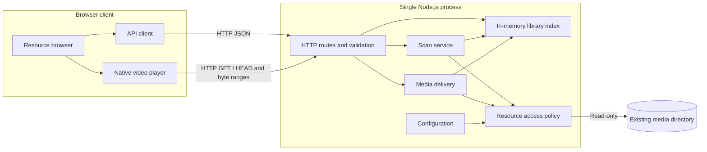

# Anishelf Current Version — Overall Design

**Version: V1**  
**Status: Proposed design; not an implementation or compatibility certification.**  
**Scope authority:** [Current Version Requirements](current-version-requirements.md).

This document describes only the active release: configure an existing resource directory, scan it, browse files, and play supported files in a browser. The two requirements documents remain the requirements sources; this document explains how to implement the current one.

## 1. Design Summary

Use a single Node.js backend with a React Web client. The server owns resource access and a rebuildable in-memory index; the browser owns playback and its transient UI state.

The system is client–server, with a browser–server deployment for V1. It is a modular monolith: modules share one backend process, and no module requires a separate service.

No database, media-processing process, account system, persistent viewing record, or background scheduling platform is needed. Subtitle functionality and a dedicated download action are outside this design.

## 2. Overall Architecture



The JSON API returns directory and scan information. The video element requests media directly from its URL; the UI must not fetch the complete video into a Blob before playing it. Original media stays outside the repository and is never exposed as an unrestricted static directory.

### Development and production

| Environment | Arrangement |
| --- | --- |
| Development | Vite serves the UI; its `/api` proxy forwards JSON and media requests to the backend. Bind both servers to loopback. |
| Production | One Node.js process serves the built `web/dist` assets and `/api` endpoints on the same origin. |

Proposed defaults are `127.0.0.1:3000` for the backend and the existing Vite development port for the UI. Production serves only the explicit frontend build directory as static assets. Unknown API paths return API errors, never the SPA HTML fallback.

## 3. Technology Decisions

| Area | Choice | Reason and boundary |
| --- | --- | --- |
| Runtime | Node.js 24 LTS | Matches the repository's `.nvmrc`; file and network I/O are the primary backend workload. |
| Language | TypeScript, strict mode, ESM | Matches the existing packages; type-check both workspaces independently. |
| Backend framework | Fastify | Routes, validation, streamed responses, and integration with the application Pino logger. |
| Logging | Pino | Structured JSON logs; one application logger shared by backend modules and Fastify. |
| Frontend | Existing React + Vite setup | Retain the existing scaffold; no SSR is needed for a local resource browser. |
| Playback | Native HTML `<video controls>` | Supplies the basic controls; browser decoding determines actual codec support. No player SDK or streaming protocol layer is needed. |
| File access | Node.js asynchronous filesystem APIs and readable streams | Enumerate without synchronous bulk traversal and stream without whole-file buffering. |
| API | HTTP JSON plus HTTP media requests | Poll scan status only while a scan is active; no WebSocket or SSE requirement. |
| Request validation | Fastify route JSON Schemas | Validate IDs and request shapes at the server boundary; TypeScript alone does not validate incoming data. |
| UI state | React component state and a small fetch wrapper | Two screens do not justify a separate global-state or server-cache framework. |
| UI styling | Existing CSS, split by component as needed | No component library is required by V1. |
| Configuration and persistence | Deployment TOML plus persistent JSON settings; in-memory file index | Startup parameters are separate from application settings; a manual scan rebuilds the index. |
| Validation | Type checking, Vitest backend tests, browser acceptance tests | Test file access and HTTP behavior, then verify real media in the selected browser. |

Node 24 is an LTS line in the official [release listing](https://nodejs.org/en/about/previous-releases). Node provides asynchronous [filesystem and stream access](https://nodejs.org/api/fs.html); Fastify accepts [stream replies](https://fastify.dev/docs/latest/Reference/Reply/#streams). Vite supports the frontend development/build workflow described in its [guide](https://vite.dev/guide/).

## 4. Module Design

### Backend

| Module | Responsibilities | Inputs and outputs | Requirement |
| --- | --- | --- | --- |
| Configuration | Load and validate deployment parameters and persistent settings; retain diagnostic state for unavailable roots | Deployment TOML and persistent JSON → validated settings or configuration error | V01 |
| Resource access | Centralize root confinement, file-type policy, readable regular-file checks, and safe opening | Internal relative path → validated directory/file access or typed error | V01, V04, V06 |
| Scanner | Run one bounded asynchronous traversal, collect warnings, and build a replacement index | Scan request → scan state and candidate snapshot | V02 |
| Library index | Hold the active snapshot, resolve resource IDs, and list direct children in stable natural order | Directory/file ID → metadata or not-found | V02, V03 |
| Media delivery | Open validated files, handle HEAD and byte ranges, stream data, and release resources | File ID and HTTP headers → media response | V04, V05 |
| HTTP application | Register schemas/routes, map errors, serve UI assets, and log request outcomes | HTTP requests → JSON, media, or UI assets | V01–V06 |

Dependencies flow from HTTP handlers into services. Scanner and media delivery share the resource-access policy. The resource-access module does not depend on HTTP, React, or the index; it receives internal paths and validated configuration.

### Frontend

| Module | Responsibilities |
| --- | --- |
| App/navigation | Switch between browsing and playback; retain the selected directory when returning |
| Resource browser | Render folders and files, parent navigation, scan action, and loading/empty/error states |
| Scan feedback | Poll active scan state, show counts and warnings, refresh listings after successful publication |
| Player | Resolve file metadata, set the media URL, expose native controls and a return action, translate playback failures |
| API client | Typed JSON requests, request cancellation, and a common error shape |

Use URL query state such as `?directory=<id>&file=<id>` with the History API. The file parameter selects the player; removing it returns to the directory. No routing package is necessary for these two views. Abort obsolete list requests so a delayed response cannot replace the newly selected folder.

## 5. Configuration and In-Memory Data

### Configuration

Use two configuration files with separate responsibilities:

| File | Contents | Location and lifecycle |
| --- | --- | --- |
| Deployment TOML | Startup parameters: listen address, port, dynamic data directory, log level, and log destination | Selected by the `ANISHELF_CONFIG` environment variable; read at startup |
| Persistent JSON | Application settings, initially the resource root | `settings.json` in the configured dynamic data directory; survives restart |

Example deployment configuration:

```toml
host = "127.0.0.1"
port = 3000
dataDir = "/absolute/path/to/anishelf-data"

[logging]
level = "info"
destination = "stdout"
# For file logging, set destination = "file" and path to an absolute file path.
# path = "/absolute/path/to/logs/anishelf.log"
```

Example persistent `settings.json`:

```json
{
  "resourceRoot": "/absolute/path/to/media"
}
```

Require `ANISHELF_CONFIG` to identify the deployment file. Use absolute paths for that file, the dynamic data directory, the resource root, and any log file. Bind to loopback; broad network exposure is not a supported V1 setting. Configuration changes require restart; no settings page or hot reload is required.

Missing, malformed, or invalid configuration fails startup with an actionable terminal message. Create the dynamic data directory if needed and verify that it is writable. A missing `settings.json` reports the expected location and required resource-root setting. A syntactically valid but missing/unreadable media root leaves the HTTP UI available with a library error; the user can fix the directory and retry scanning.

Any application write to persistent settings must use a temporary file followed by atomic replacement, preserving the previous file on failure. Deployment configuration is never rewritten by the application. The dynamic data directory must remain separate from the read-only media directory and must not be served as static assets.

### Logging

Use [Pino](https://github.com/pinojs/pino/blob/main/docs/api.md) as the backend logging library. Initialize one application logger from validated deployment settings and pass it to Fastify through [`loggerInstance`](https://fastify.dev/docs/latest/Reference/Logging/#using-custom-loggers). Use child loggers for module and request context instead of maintaining separate logging implementations.

Map `logging.level` to Pino's level option. Use a synchronous Pino destination for stdout or file output; the current application has low log volume. Keep production output as newline-delimited JSON; a pretty-printing dependency is not required. Before logger initialization, deployment configuration failures still use a concise stderr diagnostic.

- Use structured backend logs with timestamp, level, event, and request ID where applicable. Record startup/shutdown, configuration failures, scan start/completion/failure with counts and duration, HTTP outcomes, and media I/O failures.
- Configure `logging.level` in deployment TOML: `trace`, `debug`, `info`, `warn`, `error`, `fatal`, or `silent`; default to `info`. Emit only events at or above the selected level; `silent` disables normal logging.
- Configure the save location through `logging.destination`: `stdout` by default, or `file` with a required absolute `logging.path`. File output appends to the selected file; create its parent directory if needed and check writability before accepting requests. An invalid level, destination, or unusable file location fails startup with a terminal diagnostic.
- Use `info` for normal lifecycle and completed scans, `warn` for recoverable scan/access problems, and `error` for failed operations or unexpected failures. Routine requests and client cancellations should not flood warning/error logs; do not log each media chunk or each scanned entry at `info`.
- Do not log media contents, complete configuration files, secrets, or request/response bodies by default. Absolute paths may appear in local diagnostic logs but must not be exposed in API errors.
- Log writes are synchronous; avoid high-volume per-entry or per-chunk logs. Close the output destination during application shutdown. If log output fails at runtime, report a terminal diagnostic to stderr; the logger keeps its configured destination. Automatic output fallback is deferred.
- No application-managed asynchronous log queue is required. Asynchronous logging, log rotation, retention, file reopening, signal handling, and automatic output fallback are deferred to [Future Requirements](future-requirements.md#logging-maintenance-o11o13).

### Data model

| Record | Fields | Lifecycle |
| --- | --- | --- |
| DirectoryEntry | `id`, `parentId`, `name`, internal `relativePath` | In-memory snapshot |
| FileEntry | `id`, `parentId`, `name`, internal `relativePath`, `sizeBytes`, `modifiedAt`, `mimeType` | In-memory snapshot; rechecked when serving |
| LibrarySnapshot | `revision`, `scannedAt`, root ID, entries by ID, child IDs by parent | Atomically replaced after a successful scan |
| ScanState | `id`, `status`, `startedAt`, `finishedAt`, visited/matched counts, warning summary, error | Latest scan only, in memory |

Directory ID `root` identifies the configured root. Other IDs can be deterministic opaque hashes of entry kind and root-relative path. They are lookup keys, not access credentials or proof of confinement. Preserve IDs for unchanged paths between scans. No persistent identity across renames is required.

Do not return absolute filesystem paths. Responses contain IDs, display names, parent links, and necessary file metadata. Media contents stay on disk; browser playback position and duration stay in the current video element and are not saved.

## 6. Scan and Browse Workflow

1. Startup loads deployment configuration and persistent settings and creates an empty index with `revision: 0`. The page shows **Scan to load files**; no automatic scan is required.
2. A manual request starts one asynchronous scan. A second request returns the existing active scan instead of launching duplicate work.
3. Traverse the canonical root with bounded concurrency, initially eight filesystem operations. Skip symbolic links and non-regular media entries. Gather real subdirectories and matching files without reading video contents.
4. Initial extension allowlist: `.mp4`, `.m4v`, `.webm`, `.mkv`, case-insensitive. This is a discovery policy, not a codec-support promise. Keep one server-side allowlist and MIME mapping.
5. Build a new index separately. Keep the previous snapshot available while scanning.
6. On successful traversal, atomically publish the snapshot. Missing files disappear; duplicate paths cannot create duplicate entries.
7. For a missing or unreadable root, fail the scan and retain the previous snapshot with a visible warning that it may be stale. A failure in a child subtree produces a visible partial-scan warning and a snapshot of accessible entries; omitted entries are not treated as an authoritative deletion history.
8. Poll `GET /api/library` approximately once per second only while scanning, then fetch the current directory again. If it no longer exists, return to the root with a message.

List folders before files. Apply a fixed numeric-aware collator to names and an exact-name tie-breaker so sorting is stable. Return immediate children only; do not send the full tree for each navigation. V1 may return a whole directory listing without pagination; record unusually large-directory behavior during acceptance rather than promise an untested library size.

## 7. HTTP Interface

| Method and path | Purpose | Main results |
| --- | --- | --- |
| `GET /api/library` | Configuration readiness, index revision, and latest scan state | `200`, including recoverable library errors in the body |
| `POST /api/library/scan` | Start a scan or return the currently running scan | `202`; `503` if the root is unavailable before work starts |
| `GET /api/directories/:id` | Directory metadata, parent reference, and direct children | `200`, `404` |
| `GET /api/files/:id` | File metadata, current readability, and playback URL | `200`, `404`, `403` |
| `GET /api/media/:id` | Stream all or part of a file | `200`, `206`, `404`, `403`, `416` |
| `HEAD /api/media/:id` | Describe the file without sending media bytes | `200`, `404`, `403` |

Request validation failures use `400`; unexpected failures use `500`. A disappeared indexed file returns `404 RESOURCE_MISSING`; an unknown ID returns `404 RESOURCE_NOT_FOUND`. Permission failures return `403 RESOURCE_UNREADABLE`. API errors use:

```json
{
  "error": {
    "code": "RESOURCE_MISSING",
    "message": "This file is no longer available. Scan the library again.",
    "requestId": "request-id"
  }
}
```

Do not expose stack traces or absolute paths in responses. Detailed local logs may contain the paths needed to diagnose a failure.

### Media response behavior

Support byte-range retrieval for browser seeking according to [HTTP Semantics, RFC 9110](https://www.rfc-editor.org/rfc/rfc9110.html#section-14):

- A normal GET returns `200` with the full representation length and a bounded stream.
- A satisfiable single byte range, including open-ended and suffix forms, returns `206` with correct `Content-Range` and `Content-Length`.
- An unsatisfiable valid range returns `416` and `Content-Range: bytes */<size>`.
- Ignore unsupported multipart ranges or malformed range fields and serve `200`; do not construct multipart responses in V1.
- Ignore Range for HEAD and return the full representation headers without a body.
- Include `Accept-Ranges: bytes` and the mapped media `Content-Type`. Initially use `Cache-Control: no-store` to avoid stale-file cache complexity.
- When `If-Range` is present without a validator this implementation can verify, send the full representation rather than a partial response.

Open the file, obtain its size from that handle, and stream from the same handle. Validate integer bounds before calculating ranges. A client disconnect must destroy the stream and release the descriptor. If an I/O error occurs after headers were sent, terminate that response and log it; do not append JSON to video bytes.

Do not promise that one playback means one HTTP request: seeking and browser buffering can create several requests for the same file.

## 8. Playback and Error Flow

1. Selecting a file switches to the player while retaining its directory ID.
2. Fetch file metadata and current accessibility. On success, assign `/api/media/:id` to the native video element with `controls` and `preload="metadata"`.
3. The browser fetches media and performs decoding. The user starts playback; do not rely on audible autoplay being permitted.
4. Use native play/pause, seek, volume, and fullscreen controls. There is no subtitle track loading, resume position, audio-track chooser, or next-episode action.
5. Returning to the directory pauses and unloads the element, allowing media requests to stop.
6. On a media error, recheck file metadata if needed to distinguish a missing/unreadable resource from decoding or transport failure. If the browser supplies only a generic error, report **This media could not be played in this browser** rather than inventing a codec diagnosis.

The [HTML video element](https://developer.mozilla.org/en-US/docs/Web/HTML/Reference/Elements/video) provides native controls and media error events, but available formats depend on browser capabilities. Initial acceptance uses a real MP4/H.264/AAC sample. A discovered MKV or other file may fail playback; that is handled feedback, not a request to convert it.

Native browser controls may expose their own save/download behavior. V1 adds no application download feature; it does not attempt to prevent users from saving media bytes already delivered for playback.

## 9. File Access and Lifecycle Boundaries

- Resolve the configured root to its canonical path. Resolve resources from index IDs, never from arbitrary client-supplied filesystem paths.
- Skip symlinks during scans. At access time recheck path components, reject symlink replacements, validate canonical containment using path components rather than a string prefix, and require a regular file.
- Use read-only file handles and reject directories, devices, FIFOs, and sockets as media. Keep all serving through the shared access policy.
- Files may disappear after scanning; opening and reading errors are normal failure paths. Modifying a media file during playback is unsupported and may require reopening it.
- Path revalidation reduces stale-path risk but is not a portable guarantee against hostile concurrent directory replacement. V1 assumes the local user controls the media tree and the application has only necessary filesystem permissions. Test symlink escape and replacement before access explicitly.
- Keep the server on loopback, validate expected Host values, and reject untrusted cross-origin state-changing requests. No permissive CORS configuration is needed with the development proxy and same-origin production UI.
- On shutdown, stop accepting scans, cancel traversal, stop accepting new connections, and close outstanding media streams within a bounded grace period. There is no scan recovery journal; restart returns to an empty index.

## 10. Verification and Requirement Coverage

| Requirement | Design coverage | Acceptance evidence |
| --- | --- | --- |
| V01: directory configuration | Configuration and access modules | A01 valid root; A05 missing/unreadable root |
| V02: manual scanning | One scan, bounded traversal, atomic snapshots | A01 nested enumeration; A02 repeat/add/remove |
| V03: browsing | Parent IDs, direct-child listing, natural sorting | A01 navigation; A06 return to original folder |
| V04: playback | Media endpoint and native player | A03 real audio/video before full download; A07 valid special-character paths |
| V05: controls | Native controls plus Range delivery | A04 pause/resume/seek/volume/fullscreen |
| V06: failure feedback | Typed API errors and browser media error handling | A05 missing/unreadable/unplayable resources; A07 rejected outside-root access |

Use backend tests with temporary filesystem fixtures for repeat scans, partial failures, scan deduplication, natural ordering, root confinement, and missing files. HTTP tests should cover HEAD, bounded/open/suffix ranges, unsatisfiable ranges, ignored multipart ranges, and early disconnect cleanup. Test media delivery over a real local HTTP connection as well as handler-level checks.

Run browser acceptance against the production build with the exact browser and OS version recorded. Use known supported and unsupported media samples, seek beyond the initially buffered area, and verify that closing playback releases the request. Observe memory while playing a large file to check that it does not grow with total file size; record actual measurements instead of claiming an untested throughput target.

Before implementation, select the acceptance browser and representative media files. Chrome on the current macOS development machine is a proposed first target, not a validated support claim.

## 11. Implementation Order

1. Align existing workspace tooling and establish the Fastify application, two configuration loaders, Pino logging, and frontend proxy.
2. Implement resource access and scanner/index behavior; connect the resource-browser screen.
3. Implement and test HTTP media delivery, then connect native playback.
4. Complete error states, production static serving, cleanup, and the A01–A07 acceptance run.

Completion is the validated current workflow. This design creates no dependency on future media conversion, subtitles, downloads, tracking, or external integrations.
