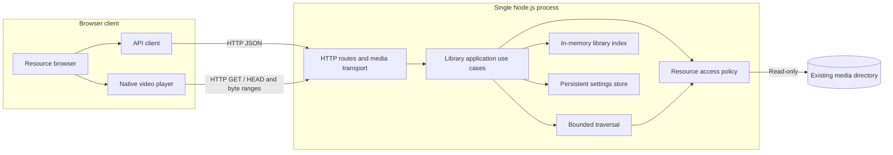

# Anishelf History

These complete snapshots describe their source release, not current support.
Product goals and future requirements are in [Requirements](requirements.md);
the retained module overview and boundaries are in [Architecture](architecture.md).
V2 requirements and detailed design are archived below, with acceptance gaps preserved.

- [V1 requirements](#v1-requirements)
- [V1 design](#v1-design)
- [V1 deferred requirements](#v1-deferred-requirements)
- [Superseded V2 bridge proposal](#superseded-v2-bridge-proposal)
- [V2 archive notes](#v2-archive-notes)
- [V2 requirements](#v2-requirements)
- [V2 requirements inventory snapshot](#v2-requirements-inventory-snapshot)
- [V2 design](#v2-design)
- [V2 UI design](#v2-ui-design)

The V1 source is commit `45962af7675ff904c5b62c00dafea9d104d01422`
(`Bump version`). Original paths were docs/current-version-requirements.md,
docs/current-version-design.md and docs/future-requirements.md. The complete bodies
are retained below; headings and links are adapted for this combined archive.
Historical status statements remain unchanged.

## V1 Requirements

**Current version: V1.**

Architecture and implementation decisions are described in [Current Version — Overall Design](history.md#v1-design).

This document defines the active release scope. Deferred capabilities are maintained in [Future Requirements](history.md#v1-deferred-requirements). Together, these two documents form the requirements set; when planning a new version, move selected requirements here and update the version label.

### 1. Goal

Allow the user to browse existing animation files on the server through a Web interface and select a file to play.

Core workflow: **configure an existing resource directory → scan manually → browse directories and files → play in the browser**.

This release validates resource access and playback. It does not require online anime metadata, episode mapping, tracking records, or a download workflow. The user supplies the existing files.

### 2. Operating Scope

- Personal use, one server, and one resource root with nested directories.
- Read-only access to original media: no uploading, moving, renaming, or deleting files.
- Acceptance testing covers local use and one explicitly selected desktop browser. Listen on localhost by default; LAN access and authentication are later extensions.
- Validate one active playback session; client coordination is outside this release.
- Configure the resource directory through a simple UI form. A missing persistent settings file must allow startup; the application generates it on the first successful save. A multi-step setup wizard is not required.
- Use English for application UI, messages, and metadata. Localization is deferred to O14 in the future requirements. Preserve original resource filenames.

### 3. Minimum Feature List

| ID | Feature | Current requirement |
| --- | --- | --- |
| V01 | Resource directory configuration | Configure and persist one server-accessible root through the UI; allow startup before setup; check existence and readability on startup or scan and expose errors |
| V02 | Manual scanning | Recursively discover agreed video file types; repeated scans do not duplicate paths; rescanning reflects additions and removals |
| V03 | Resource browsing | Show the actual directory hierarchy and original filenames with stable natural sorting; support parent-directory navigation |
| V04 | Web playback | Open a selected file in the player and serve its media from the server without requiring a full download before playback |
| V05 | Basic playback controls | Play, pause, seek, volume, fullscreen, and return to the original directory |
| V06 | Failure feedback | Distinguish missing files, unreadable files, and unsupported media or playback failures; provide understandable feedback |

Directories are the organizational unit and files are the playback unit. Anime identification, manual title linking, episode parsing, posters, and detail pages are unnecessary. Natural sorting helps users select files whose names contain episode numbers.

### 4. Playback Compatibility Boundary

Version 1 starts with browser direct playback. **Server-side transcoding and remuxing are not required for this release.**

Manual on-demand preparation of reusable Web-compatible copies is assigned to a later release; see [On-demand Web Preparation](history.md#v1-deferred-requirements).

- Select the target browser and version before implementation, then collect representative files from the user's existing library.
- MP4 with H.264 video and AAC audio is the initial validation candidate. Actual browser and file testing determines support; an extension alone does not guarantee playback.
- Document the file types included in scanning. Discovery does not imply that the browser supports the contained codecs.
- Subtitle discovery, loading, rendering, selection, and controls are outside this release, including external WebVTT. Subtitles already burned into the video image require no separate support. Audio-track selection is also deferred.
- If files such as MKV or HEVC media cannot play directly in the target browser, display an unsupported-media message. Do not automatically convert them or launch an external player.

**Scope validation prerequisite:** check whether representative files from the user's actual library can play directly. If the primary library requires conversion, this minimum release validates infrastructure but does not yet satisfy everyday viewing needs. In that case, explicitly revise the scope to add only the compatibility path required by those samples, rather than expanding into general format support.

### 5. Minimum Interface

Only two screens are required:

1. **Resource browser:** current directory, subdirectories and files, scan action, scan status, and errors.
2. **Player:** filename, video player, back action, and playback errors.

A dashboard, anime detail page, task center, tracking page, and integration settings are outside this release.

### 6. Explicit Exclusions

- Online metadata search, cover fetching, anime recognition, and episode mapping.
- Persistent playback progress, resume playback, watched markers, a continue-watching list, and automatic next-episode playback.
- Tracking status, subscriptions, RSS, resource search, download clients, and automatic ingestion.
- A dedicated Web action to download existing library files to the user's device; media delivery for playback remains included.
- AniList accounts or other external synchronization.
- Desktop player bridges, remote control, cross-client handoff, and native apps.
- Server-side transcoding, remuxing, all subtitle support, audio-track selection, and universal format support.
- Multiple users, multiple libraries, public access, file management, and automatic filesystem monitoring.

These belong to [Future Requirements](history.md#v1-deferred-requirements) and must not become hidden Version 1 dependencies.

### 7. Acceptance Criteria

| ID | Scenario | Passing result |
| --- | --- | --- |
| A01 | Configure and scan a directory containing nested folders and video files | The Web interface shows the hierarchy and allows navigation |
| A02 | Repeat a scan, then add or remove a file and rescan | No duplicate entries; the listing reflects the changes |
| A03 | Select a validated supported sample | Playback starts in the target browser with working audio and video before the entire file is downloaded |
| A04 | Pause, resume, seek to an unplayed position, adjust volume, and enter fullscreen | Controls work and playback resumes from the requested position |
| A05 | Use an unreadable directory, remove a file after scanning, or open unplayable media | An appropriate error appears; the interface remains usable and allows returning to the listing |
| A06 | Exit the player | The original directory is restored and another file can be selected |
| A07 | Use paths containing Chinese characters and spaces, then attempt to access a file outside the configured root | Valid resources play; outside-root access is rejected, including escapes through symbolic links |

Record the browser version and media codecs for the acceptance samples. Passing these scenarios completes Version 1 without waiting for future features.

### 8. Essential Quality Requirements

- Scanning and playback never modify original media.
- Media access is restricted to the configured root; endpoints cannot read arbitrary system paths.
- Scanning exposes running and completion states; an error does not make the resource browser unusable.
- Media delivery supports the partial reads required for seeking and does not load an entire video into server memory.
- Persist the resource-directory configuration. The file index may be rebuilt on startup; a comprehensive database model for future features is unnecessary.

Language, framework, and database choices are not prescribed by this document.

## V1 Design

**Version: V1**  
**Status: Design with implemented backend module boundaries; end-to-end acceptance and browser compatibility are not certified.**
**Scope authority:** [Current Version Requirements](history.md#v1-requirements).

This document describes only the active release: configure an existing resource directory, scan it, browse files, and play supported files in a browser. The two requirements documents remain the requirements sources; this document explains how to implement the current one.

### 1. Design Summary

Use a single Node.js backend with a React Web client. The server owns resource access and a rebuildable in-memory index; the browser owns playback and its transient UI state.

The system is client–server, with a browser–server deployment for V1. It is a modular monolith: modules share one backend process, and no module requires a separate service.

No database, media-processing process, account system, persistent viewing record, or background scheduling platform is needed. Subtitle functionality and a dedicated download action are outside this design.

### 2. Overall Architecture



The JSON API returns directory and scan information. The video element requests media directly from its URL; the UI must not fetch the complete video into a Blob before playing it. Original media stays outside the repository and is never exposed as an unrestricted static directory.

#### Development and production

| Environment | Arrangement |
| --- | --- |
| Development | Vite serves the UI; its `/api` proxy forwards JSON and media requests to the backend. Bind both servers to loopback. |
| Production | Caddy or another Web server serves `web/dist` and proxies `/api` to the Node.js backend on the same browser origin. |

Proposed defaults are `127.0.0.1:3000` for the backend and the existing Vite development port for the UI. The backend offers built-page hosting only in development mode. In production, the Web server serves only the explicit frontend build directory as static assets. Unknown API paths return API errors, never the SPA HTML fallback.

### 3. Technology Decisions

| Area | Choice | Reason and boundary |
| --- | --- | --- |
| Runtime | Node.js 24 LTS | Matches the repository's `.nvmrc`; file and network I/O are the primary backend workload. |
| Language | TypeScript, strict mode, ESM | Matches the existing packages; type-check both workspaces independently. |
| Backend framework | Fastify | Routes, validation, streamed responses, and integration with the application Pino logger. |
| Logging | Pino | Structured JSON logs; one application logger shared by backend modules and Fastify. |
| Frontend | Existing React + Vite setup | Retain the existing scaffold; no SSR is needed for a local resource browser. |
| Navigation | React Router in Data Mode | URL routes identify directories and files; loaders, actions, and revalidation manage server data. |
| Playback | Native HTML `<video controls>` | Supplies the basic controls; browser decoding determines actual codec support. No player SDK or streaming protocol layer is needed. |
| File access | Node.js asynchronous filesystem APIs and readable streams | Enumerate without synchronous bulk traversal and stream without whole-file buffering. |
| API | HTTP JSON plus HTTP media requests | Poll scan status only while a scan is active; no WebSocket or SSE requirement. |
| Request validation | Fastify route JSON Schemas | Validate IDs and request shapes at the server boundary; TypeScript alone does not validate incoming data. |
| UI state | Router loader/action data and local React state | The router owns server data; component state handles media errors and explicit player resets. |
| UI styling | Tailwind CSS 4 + shadcn/ui | Tailwind utilities and semantic theme tokens; shadcn components are owned in `web/src/components/ui`. |
| Configuration and persistence | Deployment TOML plus persistent JSON settings; in-memory file index | Startup parameters are separate from application settings; a manual scan rebuilds the index. |
| Validation | Type checking, Vitest backend tests, browser acceptance tests | Test file access and HTTP behavior, then verify real media in the selected browser. |

Node 24 is an LTS line in the official [release listing](https://nodejs.org/en/about/previous-releases). Node provides asynchronous [filesystem and stream access](https://nodejs.org/api/fs.html); Fastify accepts [stream replies](https://fastify.dev/docs/latest/Reference/Reply/#streams). Vite supports the frontend development/build workflow described in its [guide](https://vite.dev/guide/).

### 4. Module Design

#### Backend

| Module | Responsibilities | Inputs and outputs | Requirement |
| --- | --- | --- | --- |
| Deployment configuration | Load and validate startup parameters | Deployment TOML → validated deployment settings | V01 |
| Persistent settings store | Validate application settings and directory separation; load and atomically save JSON before publishing settings in memory | Persistent JSON and replacement settings → committed settings or configuration error | V01 |
| Library application | Own use cases, operation exclusion, latest scan state, cancellation, root changes, and snapshot publication | Settings/scan/query requests → application results; file ID → safely opened media handle | V01–V06 |
| Resource access | Centralize root availability, confinement, file-type policy, regular-file checks, and safe opening | Captured resource root and internal relative path → validated access or typed error | V01, V04, V06 |
| Scanner | Traverse one fixed root with bounded concurrency; collect progress and warnings; return candidate entries | Resource-access instance, root name, progress, abort signal → candidate entries or cancellation | V02 |
| Library index | Hold the active snapshot, validate replacements, resolve IDs, and list direct children in stable natural order | Candidate entries or resource ID → snapshot or metadata | V02, V03 |
| HTTP application and media transport | Register schemas/routes, map errors, serialize responses, handle HEAD/Range, stream media, and release handles | HTTP requests → JSON, media, or UI assets | V01–V06 |

`LibraryApplication` is the public entry point for library operations. HTTP handlers
call its use cases rather than combining the scanner, index, filesystem, and settings
store themselves. Application and lower-level modules have no Fastify dependency.
The entry point assembles the persistent store, index, application, logger, and HTTP
server; `createHttpApp` receives the application as its library dependency.

The application reserves the scan operation before asynchronous root preflight.
Concurrent starts share that preflight and the running scan. Settings changes are
excluded throughout preflight and traversal, and scans are excluded while saving.
The application captures settings for each scan, publishes only successful candidates,
retains the old snapshot on failure, and clears the index and latest scan only after
a changed root has been saved successfully. Saving the same root preserves both.
Shutdown rejects new operations, cancels traversal, and waits for pending preflight,
filesystem work, and settings saves to settle.

The scanner receives a fixed resource-access instance and returns candidate entries;
it does not read mutable settings, save configuration, own task lifecycle, or publish
the index. The index has no filesystem dependency. Root availability and safe opening
share the resource-access policy. File metadata and media opening capture the entry
and its matching root before asynchronous access; an overlapping settings change
cannot redirect the lookup into the new root. An already opened stream retains its
handle until completion or disconnect.

HTTP owns transport behavior: schemas, playback URLs, status codes, HEAD, byte ranges,
and stream cleanup. Application results explicitly select public fields. Internal
entries and snapshot maps live in the library model; public API contracts define
serializable DTOs independently. Biome import restrictions enforce the HTTP,
application, lower-level, and public-contract dependency boundaries.

#### Frontend

| Module | Responsibilities |
| --- | --- |
| App/navigation | Switch between browsing and playback; retain the selected directory when returning |
| Resource browser | Render folders and files, parent navigation, scan action, and loading/empty/error states |
| Scan feedback | Poll active scan state, show counts and warnings, refresh listings after successful publication |
| Player | Resolve file metadata, set the media URL, expose native controls and a return action, translate playback failures |
| API client | Typed JSON requests, request cancellation, and a common error shape |

Use React Router's Data Mode with `createBrowserRouter` and `RouterProvider`: `/` displays the root, `/directories/:id` displays a folder, and `/files/:id` selects the player. The shared layout renders an `Outlet`; loaders fetch library status, directory listings, and file metadata using the router request's abort signal. A scan action is submitted with `useFetcher`, and `useRevalidator` refreshes active loaders once per second during scanning. Child error boundaries provide retries while keeping the scan controls available. File links retain `?directory=<id>` for returning to the original listing. For direct file links without that query, use the parent ID from file metadata, with the root as a fallback. Selection is derived from the URL so reloads and browser back/forward restore the view. Unload video when leaving the player; scan revalidation preserves playback. Production Web server configuration must return the SPA entry for page routes while keeping proxied `/api` responses separate.

### 5. Configuration and In-Memory Data

#### Configuration

Use two configuration files with separate responsibilities:

| File | Contents | Location and lifecycle |
| --- | --- | --- |
| Deployment TOML | Startup parameters: listen address, port, dynamic data directory, log level, and log destination | Selected by the `ANISHELF_CONFIG` environment variable; read at startup |
| Persistent JSON | Application settings, initially the resource root | `settings.json` in the configured dynamic data directory; survives restart |

Example deployment configuration:

```toml
host = "127.0.0.1"
port = 3000
dataDir = "/absolute/path/to/anishelf-data"

[logging]
level = "info"
destination = "stdout"
# For file logging, set destination = "file" and path to an absolute file path.
# path = "/absolute/path/to/logs/anishelf.log"
```

Example persistent `settings.json`:

```json
{
  "resourceRoot": "/absolute/path/to/media"
}
```

Require `ANISHELF_CONFIG` to identify the deployment file. Use absolute paths for that file, the dynamic data directory, the resource root, and any log file. Bind to loopback; broad network exposure is not a supported V1 setting. Deployment TOML changes and manual JSON file edits require restart. Runtime updates through the persistent configuration manager validate and atomically save settings before publishing them in memory; the UI provides a resource directory form backed by GET/PUT `/api/settings`. No file watcher is required.

Missing or invalid deployment configuration, and malformed or unreadable existing persistent settings, fail startup with an actionable terminal message. The application prepares the writable dynamic data directory. A missing `settings.json` enters setup mode with `resourceRoot: null` while HTTP stays available. The user enters an absolute server resource directory in the UI; the first successful save generates `settings.json`. Scanning is disabled until a directory is configured. Saves are excluded while scanning; a changed root clears the previous index and scan state, returns the UI to the root page, and requires a new manual scan. A syntactically valid but missing/unreadable media root leaves the HTTP UI available with a library error; the user can fix the directory and retry scanning.

Any application write to persistent settings must use a temporary file followed by atomic replacement, preserving the previous file on failure. Deployment configuration is never rewritten by the application. The dynamic data directory must remain separate from the read-only media directory and must not be served as static assets.

#### Logging

Use [Pino](https://github.com/pinojs/pino/blob/main/docs/api.md) as the backend logging library. Initialize one application logger from validated deployment settings and pass it to Fastify through [`loggerInstance`](https://fastify.dev/docs/latest/Reference/Logging/#using-custom-loggers). Use child loggers for module and request context instead of maintaining separate logging implementations.

Map `logging.level` to Pino's level option. Use a synchronous Pino destination for stdout or file output; the current application has low log volume. Keep production and file output as newline-delimited JSON. The development command pipes stdout through the `pino-pretty` development dependency for readable, colored terminal logs with local timestamps. Before logger initialization, deployment configuration failures still use a concise stderr diagnostic.

- Use structured backend logs with timestamp, level, event, and request ID where applicable. Record startup/shutdown, configuration failures, scan start/completion/failure with counts and duration, HTTP outcomes, and media I/O failures.
- Configure `logging.level` in deployment TOML: `trace`, `debug`, `info`, `warn`, `error`, `fatal`, or `silent`; default to `info`. Emit only events at or above the selected level; `silent` disables normal logging.
- Configure the save location through `logging.destination`: `stdout` by default, or `file` with a required absolute `logging.path`. File output appends to the selected file; create its parent directory if needed, then delegate file opening and writes to Pino. Deployment loading validates the level, destination, and path format.
- Use `info` for normal lifecycle and completed scans, `warn` for recoverable scan/access problems, and `error` for failed operations or unexpected failures. Routine requests and client cancellations should not flood warning/error logs; do not log each media chunk or each scanned entry at `info`.
- Do not log media contents, complete configuration files, secrets, or request/response bodies by default. Absolute paths may appear in local diagnostic logs but must not be exposed in API errors.
- Log writes are synchronous; avoid high-volume per-entry or per-chunk logs. Use one logger for the process lifetime; the operating system releases file descriptors on exit. Delegate output errors to Pino; no application-specific error listener or destination switching is required. Automatic output fallback is deferred.
- No application-managed asynchronous log queue is required. Asynchronous logging, log rotation, retention, file reopening, signal handling, and automatic output fallback are deferred to [Future Requirements](history.md#v1-deferred-requirements).

#### Data model

| Record | Fields | Lifecycle |
| --- | --- | --- |
| DirectoryEntry | `id`, `parentId`, `name`, internal `relativePath` | In-memory snapshot |
| FileEntry | `id`, `parentId`, `name`, internal `relativePath`, `sizeBytes`, `modifiedAt`, `mimeType` | In-memory snapshot; rechecked when serving |
| LibrarySnapshot | `revision`, `scannedAt`, root ID, entries by ID, child IDs by parent | Atomically replaced after a successful scan |
| ScanState | `id`, `status`, `startedAt`, `finishedAt`, visited/matched counts, warning summary, error | Latest scan only, in memory |

Directory ID `root` identifies the configured root. Other IDs can be deterministic opaque hashes of entry kind and root-relative path. They are lookup keys, not access credentials or proof of confinement. Preserve IDs for unchanged paths between scans. No persistent identity across renames is required.

Do not return absolute filesystem paths. Responses contain IDs, display names, parent links, and necessary file metadata. Media contents stay on disk; browser playback position and duration stay in the current video element and are not saved.

### 6. Scan and Browse Workflow

1. Startup loads deployment configuration and optional persistent settings and creates an empty index with `revision: 0`. Without a saved resource root, the page prompts for directory setup; otherwise it shows **Scan to load files**. No automatic scan is required.
2. A manual request starts one asynchronous scan. A second request returns the existing active scan instead of launching duplicate work.
3. Traverse the canonical root with bounded concurrency, initially eight filesystem operations. Skip symbolic links and non-regular media entries. Gather real subdirectories and matching files without reading video contents.
4. Initial extension allowlist: `.mp4`, `.m4v`, `.webm`, `.mkv`, case-insensitive. This is a discovery policy, not a codec-support promise. Keep one server-side allowlist and MIME mapping.
5. Build a new index separately. Keep the previous snapshot available while scanning.
6. On successful traversal, atomically publish the snapshot. Missing files disappear; duplicate paths cannot create duplicate entries.
7. For a missing or unreadable root, fail the scan and retain the previous snapshot with a visible warning that it may be stale. A failure in a child subtree produces a visible partial-scan warning and a snapshot of accessible entries; omitted entries are not treated as an authoritative deletion history.
8. Poll `GET /api/library` approximately once per second only while scanning, then fetch the current directory again. If it no longer exists, return to the root with a message.

List folders before files. Apply a fixed numeric-aware collator to names and an exact-name tie-breaker so sorting is stable. Return immediate children only; do not send the full tree for each navigation. V1 may return a whole directory listing without pagination; record unusually large-directory behavior during acceptance rather than promise an untested library size.

### 7. HTTP Interface

| Method and path | Purpose | Main results |
| --- | --- | --- |
| `GET /api/health` | HTTP service availability, independent of library readiness | `200` with `{"status":"ok"}` |
| `GET /api/settings` | Read the configured resource directory or setup state | `200` with `{ resourceRoot: string \| null }` |
| `PUT /api/settings` | Validate and persist `{ resourceRoot: string }` | `200`; `400` invalid path/overlap, `409` scan/save in progress, `500` write failure |
| `GET /api/library` | Configuration readiness, index revision, and latest scan state | `200`, including recoverable library errors in the body |
| `POST /api/library/scan` | Start a scan or return the currently running scan | `202`; `409` before setup or during settings save; `503` if the root is unavailable before work starts |
| `GET /api/directories/:id` | Directory metadata, parent reference, and direct children | `200`, `404` |
| `GET /api/files/:id` | File metadata, current readability, and playback URL | `200`, `404`, `403` |
| `GET /api/media/:id` | Stream all or part of a file | `200`, `206`, `404`, `403`, `416` |
| `HEAD /api/media/:id` | Describe the file without sending media bytes | `200`, `404`, `403` |

Request validation failures use `400`; unexpected failures use `500`. A disappeared indexed file returns `404 RESOURCE_MISSING`; an unknown ID returns `404 RESOURCE_NOT_FOUND`. Permission failures return `403 RESOURCE_UNREADABLE`. API errors use:

```json
{
  "error": {
    "code": "RESOURCE_MISSING",
    "message": "This file is no longer available. Scan the library again.",
    "requestId": "request-id"
  }
}
```

Return the server-generated request ID in `x-request-id` on every response. Do not trust client-supplied IDs or expose stack traces or absolute paths in responses. Detailed local logs may contain the paths needed to diagnose a failure. Unknown endpoints return `404 ROUTE_NOT_FOUND`; untrusted state-changing requests return `403 REQUEST_FORBIDDEN`.

#### Media response behavior

Support byte-range retrieval for browser seeking according to [HTTP Semantics, RFC 9110](https://www.rfc-editor.org/rfc/rfc9110.html#section-14):

- A normal GET returns `200` with the full representation length and a bounded stream.
- A satisfiable single byte range, including open-ended and suffix forms, returns `206` with correct `Content-Range` and `Content-Length`.
- An unsatisfiable valid range returns `416` and `Content-Range: bytes */<size>`.
- Ignore unsupported multipart ranges or malformed range fields and serve `200`; do not construct multipart responses in V1.
- Ignore Range for HEAD and return the full representation headers without a body.
- Include `Accept-Ranges: bytes` and the mapped media `Content-Type`. Initially use `Cache-Control: no-store` to avoid stale-file cache complexity.
- When `If-Range` is present without a validator this implementation can verify, send the full representation rather than a partial response.

Open the file, obtain its size from that handle, and stream from the same handle. Validate integer bounds before calculating ranges. A client disconnect must destroy the stream and release the descriptor. If an I/O error occurs after headers were sent, terminate that response and log it; do not append JSON to video bytes.

Do not promise that one playback means one HTTP request: seeking and browser buffering can create several requests for the same file.

### 8. Playback and Error Flow

1. Selecting a file switches to the player while retaining its directory ID.
2. Fetch file metadata and current accessibility. On success, assign `/api/media/:id` to the native video element with `controls` and `preload="metadata"`.
3. The browser fetches media and performs decoding. The user starts playback; do not rely on audible autoplay being permitted.
4. Use native play/pause, seek, volume, and fullscreen controls. There is no subtitle track loading, resume position, audio-track chooser, or next-episode action.
5. Returning to the directory pauses and unloads the element, allowing media requests to stop.
6. On a media error, recheck file metadata if needed to distinguish a missing/unreadable resource from decoding or transport failure. If the browser supplies only a generic error, report **This media could not be played in this browser** rather than inventing a codec diagnosis.

The [HTML video element](https://developer.mozilla.org/en-US/docs/Web/HTML/Reference/Elements/video) provides native controls and media error events, but available formats depend on browser capabilities. Initial acceptance uses a real MP4/H.264/AAC sample. A discovered MKV or other file may fail playback; that is handled feedback, not a request to convert it.

Native browser controls may expose their own save/download behavior. V1 adds no application download feature; it does not attempt to prevent users from saving media bytes already delivered for playback.

### 9. File Access and Lifecycle Boundaries

- Resolve the configured root to its canonical path. Resolve resources from index IDs, never from arbitrary client-supplied filesystem paths.
- Skip symlinks during scans. At access time recheck path components, reject symlink replacements, validate canonical containment using path components rather than a string prefix, and require a regular file.
- Use read-only file handles and reject directories, devices, FIFOs, and sockets as media. Keep all serving through the shared access policy.
- Files may disappear after scanning; opening and reading errors are normal failure paths. Modifying a media file during playback is unsupported and may require reopening it.
- Path revalidation reduces stale-path risk but is not a portable guarantee against hostile concurrent directory replacement. V1 assumes the local user controls the media tree and the application has only necessary filesystem permissions. Test symlink escape and replacement before access explicitly.
- Keep the server on loopback, validate expected Host values, and reject untrusted cross-origin state-changing requests. No permissive CORS configuration is needed with the development proxy and same-origin production UI.
- On shutdown, stop accepting scans, cancel traversal, stop accepting new connections, and close outstanding media streams within a bounded grace period. There is no scan recovery journal; restart returns to an empty index.

### 10. Verification and Requirement Coverage

| Requirement | Design coverage | Acceptance evidence |
| --- | --- | --- |
| V01: directory configuration | Configuration and access modules | A01 valid root; A05 missing/unreadable root |
| V02: manual scanning | One scan, bounded traversal, atomic snapshots | A01 nested enumeration; A02 repeat/add/remove |
| V03: browsing | Parent IDs, direct-child listing, natural sorting | A01 navigation; A06 return to original folder |
| V04: playback | Media endpoint and native player | A03 real audio/video before full download; A07 valid special-character paths |
| V05: controls | Native controls plus Range delivery | A04 pause/resume/seek/volume/fullscreen |
| V06: failure feedback | Typed API errors and browser media error handling | A05 missing/unreadable/unplayable resources; A07 rejected outside-root access |

Use backend tests with temporary filesystem fixtures for repeat scans, partial failures, scan deduplication, natural ordering, root confinement, and missing files. HTTP tests should cover HEAD, bounded/open/suffix ranges, unsatisfiable ranges, ignored multipart ranges, and early disconnect cleanup. Test media delivery over a real local HTTP connection as well as handler-level checks.

Run browser acceptance against the production build with the exact browser and OS version recorded. Use known supported and unsupported media samples, seek beyond the initially buffered area, and verify that closing playback releases the request. Observe memory while playing a large file to check that it does not grow with total file size; record actual measurements instead of claiming an untested throughput target.

Before implementation, select the acceptance browser and representative media files. Chrome on the current macOS development machine is a proposed first target, not a validated support claim.

### 11. Implementation Order

1. Align existing workspace tooling and establish the Fastify application, two configuration loaders, Pino logging, and frontend proxy.
2. Implement resource access and scanner/index behavior; connect the resource-browser screen.
3. Implement and test HTTP media delivery, then connect native playback.
4. Complete error states, cleanup, production Web server guidance, and the A01–A07 acceptance run.

Completion is the validated current workflow. This design creates no dependency on future media conversion, subtitles, downloads, tracking, or external integrations.

## V1 Deferred Requirements

### 1. Product Goal and Document Scope

Anishelf is a personal animation media library intended to connect:

**tracking → resource discovery → downloading → library ingestion → Web / desktop playback → viewing history → external tracker synchronization**.

Its core value is better Web playback, shared client state, and coordination between tracking and automatic downloading.

This document contains only capabilities deferred beyond the active release. [Current Version Requirements](history.md#v1-requirements) defines the current scope, presently V1. Together, the two documents cover the current product direction without duplicating active requirements. Future features are not all committed; subsequent releases should follow actual usage needs. Move selected requirements into the current-version document when planning a new release.

### 2. Future Feature Inventory

**Later** means a subsequent core capability. **Optional** means a possible longer-term extension. Existing feature IDs are retained for continuity; gaps correspond to capabilities covered by the current-version document.

#### 2.1 Resource Access and Library

| ID | Feature | Scope |
| --- | --- | --- |
| L05 | Search filenames, choose sorting, and filter resources | Later |
| L06 | Scheduled scans, filesystem monitoring, and incremental updates | Later |
| L07 | Parse anime titles, seasons, episode numbers, and release variants from filenames | Later |
| L08 | Review unidentified files and manually link or correct anime and episode associations | Later |
| L09 | Distinguish regular episodes, specials, continuous season numbering, and multi-episode files | Later |
| L10 | Associate multiple file versions with an episode and select a version for playback | Later |
| L11 | Relink moved files while preserving viewing history | Later |
| L12 | Configure and manage multiple resource roots | Optional |
| L13 | Rename, organize, delete, and reclaim storage with preservation rules | Optional |
| L14 | Download an existing original media file from the Web interface to the user's device | Later |

##### Download Existing Media (L14)

- Provide a download action for an individual library file, preserving its original filename and contents.
- Transfer the existing original file without transcoding or modifying the server copy.
- Apply the same resource-root restrictions and access controls as playback; report missing or unreadable files.
- Initially exclude batch downloads, directory archives, and managed offline libraries.
- Acceptance: the downloaded file matches the source contents and filename, the server original remains unchanged, and unavailable or unauthorized resources cannot be downloaded.

This is a user-facing file download, separate from acquiring new releases through qBittorrent (D01–D08). Both capabilities are deferred beyond the current release. The current release serves media bytes for playback but does not provide a dedicated download action.

#### 2.2 Anime Metadata

| ID | Feature | Scope |
| --- | --- | --- |
| M01 | Search external anime metadata and store provider identifiers | Later |
| M02 | Display covers, aliases, descriptions, seasons, episode counts, and airing information | Later |
| M03 | Provide anime detail and episode views, organizing the library by title | Later |
| M04 | Manually select, correct, and refresh metadata mappings | Later |
| M05 | Cache metadata so external outages do not prevent browsing or playback | Later |
| M06 | Multiple metadata providers, related works, and cross-provider ID mapping | Optional |

#### 2.3 Web Playback and Subtitles

| ID | Feature | Scope |
| --- | --- | --- |
| P03 | Display a matching external WebVTT subtitle with an on/off toggle | Later |
| P05 | Choose a playback strategy based on media and client capabilities | Later |
| P06 | Remux media when only the container is incompatible | Later |
| P07 | Prepare a reusable Web-compatible copy on demand, transcoding only incompatible streams and supporting seeking in the completed output | Later |
| P08 | Discover and select embedded or external subtitles and convert SRT | Later |
| P09 | Support ASS/SSA styling and fonts, plus a compatibility path for image subtitles | Later |
| P10 | Select audio tracks, adjust subtitle timing, change playback speed, and use shortcuts | Later |
| P11 | Next-episode navigation, automatic continuation, and playback preferences | Later |
| P12 | Hardware transcoding, HDR handling, broader browser support, and concurrent resource limits | Optional |
| P13 | Opening/ending skips and chapter navigation | Optional |

##### On-demand Web Preparation (P05–P07)

This capability is assigned to a later release and does not expand the current release. Its workflow is **select an existing file → Prepare for Web → wait for completion → play the prepared copy**.

Preparation reduces server-side processing during playback and avoids repeated conversion when the cached copy is reused. It does not guarantee lower total computation: the initial conversion still consumes resources, and the copy requires additional storage.

Processing rules:

| Source compatibility with the selected target browser | Action |
| --- | --- |
| Directly playable | Use the original file without creating a copy |
| Compatible audio and video, incompatible container | Remux without re-encoding |
| Compatible video, incompatible audio | Copy the video stream and convert only audio |
| Incompatible video | Transcode video and convert audio only if necessary |

Minimum scope for this later feature:

- Provide a manual **Prepare for Web** action; do not convert the entire library automatically.
- Use one fixed output profile validated against the selected browser; do not generate multiple resolutions.
- Process one file at a time and expose queued, processing, ready, and failed states. Show a useful failure reason and allow retry.
- Preserve the original media and store prepared copies in a separate cache directory.
- Enable playback of the prepared copy only after conversion completes successfully. Playback does not start from a partially written output.
- Reuse a valid completed copy for subsequent playback; repeated requests for the same source and profile must not create duplicate jobs.
- Associate each copy with its source identity, source version, and output profile. Source changes invalidate the old copy; invalidated copies are not offered for playback.
- Allow explicit deletion of prepared copies without deleting original media. Clean up incomplete output after failures or interrupted jobs, and report insufficient storage.
- Keep subtitle support within the separately defined subtitle scope; this feature does not implicitly add subtitle burn-in or advanced subtitle rendering.

Acceptance criteria: compatible files bypass conversion; container-only and audio-only cases preserve compatible streams; a prepared incompatible sample plays and seeks in the target browser; repeat playback reuses the copy; source changes invalidate it; failure, retry, and cache deletion leave the original untouched.

Automatic whole-library conversion, idle-time scheduling, playback during conversion, and real-time transcoding fallback are outside this feature's initial scope.

#### 2.4 Viewing History and Tracking

| ID | Feature | Scope |
| --- | --- | --- |
| W01 | Save playback position and duration and resume playback | Later |
| W02 | Continue-watching and recently watched lists | Later |
| W03 | Detect completion and manually mark or unmark episodes as watched | Later |
| W04 | Manage planned, watching, completed, paused, and dropped statuses | Later |
| W05 | Show available unwatched episodes, watched counts, and history | Later |
| W06 | Share records across clients and handle duplicate, out-of-order, or concurrent progress updates | Later |
| W07 | Rewatch history, ratings, tags, and personal notes | Optional |

#### 2.5 Subscriptions and Resource Discovery

| ID | Feature | Scope |
| --- | --- | --- |
| S01 | Enable or pause automatic acquisition from an anime's own page | Later |
| S02 | Set the starting episode and backlog scope with an impact preview | Later |
| S03 | Configure sources such as RSS and discover releases periodically | Later |
| S04 | Match releases to titles and episodes, queuing ambiguous matches for review | Later |
| S05 | Filter by subtitle language, release group, resolution, codec, and keywords | Later |
| S06 | Deduplicate and exclude existing files, active downloads, and unwanted episodes | Later |
| S07 | Explain selection and rejection decisions and allow manual selection or dismissal | Later |
| S08 | Coordinate tracking-status changes with subscriptions and explain their effect on existing tasks | Later |
| S09 | Search multiple sources, rank releases, process season packs, and upgrade quality | Optional |

#### 2.6 Downloads and Automatic Ingestion

| ID | Feature | Scope |
| --- | --- | --- |
| D01 | Connect to qBittorrent and validate configuration and download-path mappings | Later |
| D02 | Submit releases, persist task associations, and prevent duplicate submissions | Later |
| D03 | Display progress, speed, task status, and errors | Later |
| D04 | Pause, resume, cancel, and retry downloads | Later |
| D05 | Check completed files, scan them, and associate them with episodes | Later |
| D06 | Recover from disconnections, externally removed tasks, and server restarts | Later |
| D07 | Distinguish task cancellation, downloaded-data deletion, and library-record removal | Later |
| D08 | Multiple download clients, seeding policies, bandwidth schedules, and storage policies | Optional |

#### 2.7 Desktop and Other Clients

| ID | Feature | Scope |
| --- | --- | --- |
| C01 | Install and pair a desktop player bridge; report connection state and capabilities | Later |
| C02 | Select a file on the Web and launch desktop playback | Later |
| C03 | Report desktop progress, pause, and playback-end events | Later |
| C04 | Control desktop playback, pause, and seeking from the Web | Later |
| C05 | Continue viewing between Web and desktop using saved positions | Later |
| C06 | Manage multiple devices and transfer playback sessions | Optional |
| C07 | Full desktop, mobile, and TV apps, casting, and offline viewing | Optional |

#### 2.8 External Tracking Services

| ID | Feature | Scope |
| --- | --- | --- |
| T01 | Authorize AniList, check connectivity, and disconnect | Later |
| T02 | Import selected tracked titles without implicitly enabling downloads | Later |
| T03 | Map titles and episode numbering and synchronize progress and tracking status | Later |
| T04 | Queue synchronization, retry failures, report expired authorization, and show results | Later |
| T05 | Preview reimport differences and resolve conflicts | Later |
| T06 | Automatic bidirectional synchronization, multiple trackers, and rating synchronization | Optional |

#### 2.9 Interface, Settings, and Maintenance

| ID | Feature | Scope |
| --- | --- | --- |
| O03 | Dashboard for continued viewing, new episodes, downloads, and exceptions | Later |
| O04 | Unified settings for directories, playback preferences, and integrations | Later |
| O05 | Task history, logs, and automation decision explanations | Later |
| O06 | Back up and restore metadata, viewing history, and configuration | Later |
| O07 | LAN access, single-user authentication, and credential protection | Later |
| O08 | Completion and failure notifications with notification preferences | Later |
| O09 | Multiple users, permissions, public deployment support, and remote access | Optional |
| O10 | Plugin extensions and public integration APIs | Optional |
| O11 | Log rotation, retention, and reopening files without restarting the application | Later |
| O12 | Automatic log-output fallback after destination failure | Later |
| O13 | Asynchronous log output with bounded buffering and shutdown flushing | Later |
| O14 | Interface localization and language preferences | Later |
| O15 | Manage API-backed frontend state and caching with TanStack Query | Later |

##### Interface Localization (O14)

- Introduce translation resources for interface labels, status messages, and user-facing errors, with English as the default and fallback language.
- Allow users to select a supported language and persist that preference.
- Keep API field names, error codes, resource IDs, and original filenames unchanged across languages.
- Acceptance: changing the language updates supported interface text and error feedback; missing translations fall back to English; browsing and playback state remain intact.

The current release uses English only and does not include translation resources or a language selector.

##### Frontend State and Caching (O15)

- Use TanStack Query to manage API-backed server state in the Web interface, including resource listings, scan status, and saved settings.
- Define stable query keys and suitable freshness and retention policies for each kind of data. Reuse fresh results and deduplicate concurrent requests for the same data.
- After a successful scan or settings change, update or invalidate the affected queries so subsequent views reflect the server's latest state.
- Keep loading, refresh, and error feedback visible; a failed refresh must not silently present cached data as current.
- Limit this cache to API-backed data. Media playback streams and local-only interface or player state are outside its scope.
- Acceptance: revisiting a still-fresh resource listing reuses cached data; concurrent requests for the same listing do not trigger duplicate fetches; a completed scan or settings change is reflected on the next affected view; and a refresh failure is distinguishable from a successful current result.

This frontend caching improvement is deferred beyond the current release. It does not require the V1 interface to use TanStack Query.

##### Logging Maintenance (O11–O13)

- O11: Define rotation and retention policies using external deployment tooling or a suitable Pino transport. If rotation renames the active file, support reopening the configured path and a deployment trigger such as a Unix signal.
- O12: Switch subsequent log records to a fallback destination after runtime output failure. Specify buffered-record loss, failure reporting, and whether/how the original destination is restored; cover errors handled internally by Pino as well as emitted stream errors.
- O13: Introduce asynchronous Pino output when measured log volume or write latency affects application responsiveness. Bound buffered memory, define backpressure or overflow behavior, and flush pending records within a bounded shutdown period.
- Acceptance: asynchronous output avoids synchronous destination writes on the application path, buffers remain bounded under a slow destination, and normal shutdown writes pending records; timeout or overflow reports any potential record loss.
- Acceptance: rotation directs subsequent logs to the new file without restarting the application; destination failure triggers the defined fallback without replacing existing business-module loggers.

The current release uses one fixed stdout or file destination. It supports configured levels and synchronous writes through a process-lifetime logger. Asynchronous logging, rotation, reopening, signal handling, and automatic destination switching are outside the current release.

### 3. Rules for Future Features

These rules apply when the relevant capabilities are implemented. They do not require the current release to build those systems in advance.

- **Keep states separate:** tracking, subscriptions, downloads, file availability, and viewing status are independent. Deleting a watched file must not erase its history.
- **Verify ingestion:** download completion alone does not prove that a file exists or is playable.
- **Make subscription scope explicit:** show the starting episode and backlog range. Importing a list must not silently start bulk downloads.
- **Allow uncertainty:** uncertain title or episode matches require review rather than forced association.
- **Recover without duplication:** polling, retries, and restarts must not create duplicate active downloads.
- **Protect original files:** cancellation and deletion are distinct. Moving files must account for seeding and path associations.
- **Save local records first:** external synchronization failures must not block playback; retry later.
- **Avoid inflated progress:** keep per-episode records separate from external cumulative progress. Watching a later episode must not imply all earlier episodes were watched.
- **Reject stale events:** delayed player updates must not overwrite newer progress or manual corrections.
- **Validate compatibility:** browser, codec, subtitle, and hardware support must be demonstrated with real media samples.

### 4. Suggested Evolution

| Stage | Question to resolve | Priority candidates |
| --- | --- | --- |
| Later: everyday viewing | Can the product support regular viewing comfortably? | On-demand Web preparation with reusable compatible copies, subtitles, saved progress, resume, and next episode |
| Later: anime library | Can files be organized into anime titles and episodes? | Metadata, identification, manual corrections, episodes, and tracking records |
| Later: automatic acquisition | Can new episodes reach the library automatically? | Subscriptions, discovery, download integration, ingestion, and recovery |
| Later: shared client state | Can players and external trackers share state? | Desktop bridge, playback control, progress reporting, and AniList synchronization |

These later stages are not fixed releases or mandatory ordering. For example, desktop integration can move ahead once viewing records are stable if it becomes the most pressing need. Select one independently verifiable user workflow at a time instead of assigning the entire inventory to a single release.

## Superseded V2 Bridge Proposal

This unimplemented proposal previously made a paired bridge the local-launch mechanism. It is retained for reference only; V2 now only generates/copies a transferable original-media URL; browser invocation is deferred. Pairing, polling, IPC observation and bridge routes are deferred.

Use a small user-started Node.js bridge on Linux with a locally configured absolute mpv executable. The bridge initiates authenticated short polling to the application via the configured loopback origin (including an SSH-forwarded origin); it opens no browser-facing listening port. This avoids browser local-network/CORS dependencies and keeps the server from trying to launch a desktop process remotely.

Pairing flow: the bridge requests a short-lived one-time code, displays it locally, and the user enters it in Settings. The UI shows the pending bridge and requires explicit pairing. Codes expire after five minutes, are rate-limited, and are consumed once. The bridge receives a random credential after pairing; store only its hash on the server and a user-private credential file locally. Permit one paired bridge. Disconnect revokes it and clears pending launches. Reject incorrect Host/Origin on browser mutations; credential-based bridge routes are separate and expose no general command execution.

Every two seconds the paired bridge polls for launch work and reports availability/capabilities. Consider it unavailable after ten seconds without contact. **Open in local player** validates current resource access and creates a request with a 30-second expiry, opaque request ID, source version, and server-generated relative original-media route. The bridge combines this route with its locally configured, paired origin; it never accepts a browser-supplied absolute URL. Validate route shape, disallow redirects to other origins, and recheck source version before dispatch. Credentials travel in authorization headers to the coordinator and never in media URLs or logs.

The bridge durably records a launch request ID before spawning, so retries cannot launch it twice. An uncertain crash after that record requires an explicit new user launch rather than automatic replay. Use a fixed executable and validated argument array, no shell, no user-provided options or playlists, and a private mpv IPC socket. Restrict mpv configuration/scripts and media protocols to the supported loopback HTTP workflow. mpv's [official embedding guidance](https://mpv.io/manual/stable/) recommends structured IPC rather than parsing terminal output; its IPC must remain private.

Expose `requested`, `accepted`, `started`, `failed`, and `expired` launch feedback. Acknowledgement means accepted only. Use mpv IPC loading/initial playback events and bounded startup timeout to distinguish process creation from media start; propagate inaccessible media or missing executable failures. Actual audio/video and seeking still require manual acceptance. This narrow startup observation does not implement desktop progress tracking or remote controls. Launching locally leaves Web history unchanged and does not transfer saved position or external subtitles. Web playback stays usable if pairing or launch fails.

## V2 Archive Notes

Archived on 2026-10-06 after narrowing V2 to direct/completed-file playback, text subtitles, history/resume and scoped settings. Archiving records a version baseline; it does not certify unfinished acceptance. Existing implementation and acceptance statuses are preserved. HLS/real-time playback, embedded fonts, bitmap extraction and user-editable cache budgets remain later requirements. The History page covers continue watching; no separate page or playback-mode setting is required.

## V2 Requirements

**V1 is implemented; V2 is in progress.** V1 manual browser acceptance is user-reported.
The direct-playback Vidstack adapter is implemented and checked with a temporary
H.264 sample. Saved progress, playback history/resume, and same-directory external
subtitle discovery, version-checked delivery, selection and rendering are implemented.
The FFmpeg/FFprobe utility layer supports media inspection and selected text-subtitle
extraction. `SubtitleApplication` integrates embedded-track discovery into the subtitle
list API with codec/support metadata and nonfatal probe warnings. Selected embedded
text-track extraction, persisted assets, restart reuse, version-checked delivery and
CC-menu preparation/retry are implemented. External and embedded tracks now share
a public descriptor and selected-track preparation contract; the backend returns
a ready original URL for external subtitles or prepares/reuses an embedded asset.
The frontend uses one controller without source-specific branches. Completed-file preparation
and prepared-copy playback are implemented. HLS/real-time playback, embedded fonts and
bitmap extraction are deferred to P14–P16. V2 retains the remaining settings and acceptance
requirements below.

Startup options use defaults and environment variables. `ANISHELF_DATA_DIR` overrides the platform-specific user data directory selected by `platformdirs`. The [archived V2 design](#v2-design) specifies the V2 architecture.

### 1. Goal and Operating Scope

Extend the existing file browser into an everyday Web viewing workflow:

**configure a resource directory → scan automatically at startup and after root changes, or manually → select a file → play directly or use a completed prepared copy as needed → select subtitles → watch → save progress → return and resume**, with an option to generate and copy a media link for opening manually in an external player.

- Web playback is the default and primary experience. Selecting a file or a playback-history entry opens the Web player. Generating a transferable media link is a secondary action for manual use in an external player.
- Personal use, one server, one resource root with nested directories, and one active playback session.
- Keep original media read-only. Store viewing records, extracted/converted subtitles, and prepared copies separately from the resource root.
- Retain local/loopback operation and the existing deployment boundary.
- Use English for UI, user-facing messages, and documentation; preserve original filenames.
- Choose and record the target desktop browser/version and representative real media samples for V2 acceptance. File extensions alone do not prove compatibility.
- Continue using directories and files as organizational and playback units. Anime identification and episode associations are not prerequisites.

### 2. Requirements and Implementation Versions

| ID | Requirement | Iteration scope | Implemented in | Target version |
| --- | --- | --- | --- | --- |
| V01 | Resource directory configuration | Configure and persist one root; allow startup before setup; expose existence/readability errors | V1 | V1 |
| V02 | Library scanning | Automatically scan at startup and after resource-root changes; allow configurable scheduled scans (60 minutes by default; 0 disables) and manual rescans; recursively discover supported video extensions; avoid duplicate paths; reflect additions/removals | V1 | V1 |
| V03 | Resource browsing | Actual hierarchy, original names, stable natural sorting, and parent navigation | V1 | V1 |
| V04 | Web playback | Stream original compatible files without downloading the whole file first; support seeking | V1 | V1 |
| V05 | Basic playback controls | Play, pause, seek, volume, fullscreen, and return to the original directory | V1 | V1 |
| V06 | Failure feedback | Distinguish missing/unreadable resources and unsupported media or playback failures | V1 | V1 |
| W01 | Saved progress and resume | Persist position, duration, and last viewing time on the server; restore position when reopening a file | V2 | V2 |
| W02 | Playback history and resume | List recent available files with saved progress; resume unfinished files and reopen completed files | V2 | V2 |
| P03 | External subtitles | Vidstack VTT/SRT/ASS/SSA discovery, selection and off | V2 | V2 |
| P08 | Embedded subtitle extraction | FFmpeg extraction from MKV/other containers; supported text tracks; fonts and bitmap assets deferred | V2 (partial) | V2 (partial) |
| P09 | Styled subtitles | ASS/SSA rendering with fallback fonts; provide clear feedback for unsupported Web rendering | V2 (partial) | V2 (partial) |
| P05 | Playback strategy | Use original compatible media; choose the required preparation path for the target browser | — | V2 |
| P06 | Container-only preparation | Remux compatible audio/video when only the container is incompatible | — | V2 |
| P07 | FFmpeg full-file pre-transcoding | Necessary streams only; reusable completed copies; seeking, cleanup and recovery | — | V2 |
| C01 | External-player media link | Generate and copy a client-reachable original-media URL for the user to paste into a player | V2 | V2 |
| O14 | English UI foundation | English message catalog, stable keys and fallback | V2 (partial) | V2 (partial) |
| O17 | Unified configuration | TypeScript policy defaults, validated user overrides and typed access; built-in cache budget | V2 implementation; acceptance pending | V2 |
| O16 | Complete everyday-use Web interface | Finished application navigation, resource browsing, playback history/resume, Web player, preparation feedback, and V2 settings with responsive and accessible states | V2 (partial) | V2 |

#### Saved Progress, Resume, and Playback History (W01, W02)

- Save playback position, duration, and last viewing time to the server during playback at a bounded interval and on pause, seek completion, and normal player exit. Periodic saves bound progress loss when a tab closes unexpectedly.
- Restore the saved position after media metadata is available; clamp it to the playable duration. Seeking to zero uses the ordinary progress-save flow. Resume must not depend on audible autoplay being allowed.
- Show save/load failures and allow retry without blocking playback. A failed load must not silently overwrite an existing record with an initial zero position.
- Reject delayed or duplicate updates that would overwrite a newer accepted update. Seeking backward intentionally must remain possible; choosing the greatest position is not a valid conflict policy.
- Scope records to the resource root and source identity/version so switching roots or replacing content at the same path cannot apply unrelated progress. Unchanged files retain progress across rescans and server restarts.
- Removing a file from the index does not erase its viewing record. Missing or replaced resources are excluded from actionable history entries.
- Playback history is ordered by last viewing time and includes available files with saved progress, including completed files and records saved at position zero. Each entry can reopen the file with its original directory context; unfinished files resume from their saved position.
- The History page shows up to 100 recent files with saved position, known duration, and last viewing time. It provides refresh, empty, loading, and unavailable-history states.
- Original and completed prepared playback of the same source share a viewing record. The History page covers continue watching; no separate page is required.

#### Subtitles and Embedded Extraction (P03, Partial P08–P09)

- Support external WebVTT, SRT, ASS and SSA with Vidstack and a dedicated ASS/SSA renderer. Preserve ASS/SSA styling and positioning within the validated renderer capability, using fallback fonts; do not silently strip styling by converting every track to plain WebVTT.
- Discover same-directory matching filenames and language suffixes. Show multiple/ambiguous candidates for selection. Provide track selection and off controls; show language, title, format and unsupported status where available.
- Use FFprobe to enumerate subtitles packaged inside video containers, including MKV, and FFmpeg to extract a selected supported track to an independent cached subtitle asset. Extract embedded WebVTT, SubRip/SRT and ASS/SSA. Embedded font attachments are deferred to P15. No audio/video transcode is required solely for extraction.
- Show unsupported status for bitmap and unknown subtitle codecs without blocking video. PGS/VobSub extraction is deferred to P16; bitmap Web rendering, OCR and burn-in remain unassigned.
- Apply the same playback path to external and extracted text subtitles. Keep cue timing and styled overlays aligned on original and completed pre-transcoded media, including resume and seeking.
- Keep originals read-only; store extracted/converted assets separately. Enforce root confinement, regular-file checks, asset size limits and cache invalidation.
- Malformed, missing, unreadable, unsupported or unrenderable subtitles show useful errors without blocking video. V2 uses fallback fonts; embedded fonts and bitmap extraction are later requirements (P15/P16).

#### FFmpeg Full-file Preparation (P05–P07)

V2 supports **Prepare for Web → wait for a reusable completed copy → play**, alongside direct playback of compatible originals. Web playback remains primary. Use original or validated completed-file resources with seeking; preserve `GET/HEAD /api/media/:id` Range delivery. Whole-library preparation is never automatic. HLS delivery and real-time acquisition are later requirements (P14).

| Source and target compatibility | Required processing |
| --- | --- |
| Original media compatible | Play directly without encoding |
| Only container unsupported | Remux with compatible audio/video copied |
| Audio alone unsupported | Copy video; encode audio only |
| Video unsupported | Encode video; copy audio if compatible, otherwise encode audio |
| Subtitle needs extraction or text-format conversion | Process only subtitle; keep compatible audio/video untouched |

- Use FFprobe inspection and validated browser capabilities, not filename extensions alone. Report processing mode and per-stream reasons; copy compatible streams.
- Publish only validated completed Web-compatible files. Support seeking, deduplicated work, queued/processing/cancelling/ready/failed/cancelled feedback, retry and prepared-copy deletion. Never expose partial output as ready.
- Original and prepared playback share source history. Validate source version, profile content and output availability before reuse.
- Bound preparation concurrency, queue capacity and cache storage. Report insufficient compute/storage; preserve originals and durable history during cancellation, deletion and incomplete-output cleanup.
- After restart, retain valid completed copies, clean orphan/partial files and leave interrupted tasks explicitly retryable. Automatic cache eviction is not required in V2.

#### External-Player Media Link (C01)

V2 offers a secondary **Copy media link** action for users who want to open the file manually in an external player. Web playback remains the primary workflow.

- Resolve the selected file through the existing API and recheck its accessibility. Generate a client-reachable absolute URL from the relative original-media route and the browser's application origin, including an SSH-forwarded origin. Never expose server filesystem paths or internal hostnames.
- Copy the URL to the clipboard and display it in a selectable field if clipboard access is unavailable. The user pastes it into the external player's Open URL command. The external player fetches media directly over HTTP/Range; the browser does not relay media bytes.
- Do not choose a player, register a protocol, open another application, or claim that playback started. Validate link formation with spaces, Unicode, percent signs, ampersands, and forwarded origins.
- External playback is **playback only**. It does not read or synchronize position, pause, completion or watched state; it does not update Web history or transfer saved position. The copy-link action does not require an Anishelf bridge.
- Web playback remains usable regardless of whether the user opens the copied link.

#### Configuration and Multilingual Foundation (O17, Partial O14)

The current-function configuration foundation is implemented: one `ConfigurationService` validates built-in policy and explicit settings, supplies immutable snapshots, and preserves atomic writes. The Web build defines local playback/renderer policy and imports browser-safe shared constraints; no client-configuration endpoint is required. Transcode profiles, built-in cache budgets and profile-content invalidation are implemented. V2 uses a built-in prepared-media cache budget; user editing is deferred to O18.

- Use environment variables for startup options. Define media-format capabilities, subtitle support and limits, runtime defaults and built-in transcode profiles in TypeScript. Bundle the English catalog as a read-only resource. Do not copy these defaults into persistent policy files.
- Store only user choices in `settings.json`: resource root, scan interval and selected profile IDs. Save custom profile definitions or parameter overrides only if V2 exposes editing them. Merge explicit user values with the current built-in defaults, validate the result and write settings atomically. Missing fields receive current defaults; explicit choices survive upgrades. Reject invalid settings with actionable diagnostics.
- Application modules consume one validated typed configuration view. Profile-content changes invalidate cached outputs. Configuration cannot bypass access checks or create unsupported browser, renderer or FFmpeg capabilities. Expose only safe client preferences and capabilities through the API.
- Use stable UI/error keys, a separate English catalog and English fallback. Ship English UI and preserve original filenames.

### 3. Complete Web Interface (O16)

Replace the basic V1 validation pages with a finished interface for everyday use. This is a V2 deliverable with real API-backed behavior, not a static mockup. Keep Web viewing prominent throughout the application.

| Area | Required experience |
| --- | --- |
| Application shell | Consistent navigation between Library, History and Settings, with a reachable nonblocking preparation monitor; clear current location, page titles, and back navigation |
| History | Recent available files ordered by last viewed time, saved position/duration, resume/replay, refresh and designed empty/error states; this page covers continue watching |
| Library | Clear directory/file presentation, breadcrumbs, parent navigation, readable original filenames including long/Chinese names, scan action/status, and access to playback history with progress and resume actions |
| Web player | Video as the main focus; Vidstack play/pause/seek/volume/fullscreen controls; subtitle selection/off, saved progress/resume, direct/prepared status and processing reason, and return to the original directory |
| Preparation tasks | Reachable pre-transcode queued/processing/ready/failed/cancelled, affected filename, available progress feedback, failure reason/retry/cancel, prepared-copy deletion; ready copies link to Web playback |
| Settings | Clearly grouped resource-directory configuration, scan interval, preparation profile selection and supported playback/configuration options; expose only settings supported by V2 |
| External-player link | Secondary **Copy media link** action with a selectable URL fallback, distinct from the primary Web playback action |

- Define and apply a consistent visual system for typography, spacing, colors, buttons, forms, and status indicators. Use deliberate layouts and readable hierarchy rather than the existing test-page arrangement.
- Provide designed initial setup, loading, empty library, no history entries, refreshing, success, partial-scan warning, unavailable resource, and recoverable failure states with useful next actions.
- Prefer Toast for operation results and recoverable playback/subtitle failures. Keep ongoing subtitle preparation notifications visible until completion, failure or selection cancellation. Keep form validation, initial page failures, setup/empty states and persistent scan/library status in context.
- Keep scan/transcoding/persistence feedback visible without interrupting usable browsing or active Web playback. Do not claim an unsupported numeric completion percentage; show an indeterminate state when only task status is known.
- Preserve the current directory and return context when moving between browsing and playback. Opening tasks/settings and returning must not unexpectedly discard the user's location. Explain any root-change reset.
- Support desktop and narrow/mobile layouts without overlapping controls or page-wide horizontal overflow. Validate at least 1280 px and 390 px viewport widths. Long filenames must remain identifiable and full names accessible.
- Provide keyboard navigation, visible focus, accessible control labels, sufficient text contrast, and status/error cues beyond color alone. Destructive cache actions must clearly identify that they delete a prepared copy.
- Keep labels and feedback in English. Do not show placeholder metadata, nonfunctional controls, invented posters, or incomplete integrations as completed features.
- This scope presents V2's real file-based workflow.

### 4. Acceptance Criteria and Versions

#### Inherited V1 Baseline

These scenarios passed in V1 according to the user's manual acceptance report and remain regression requirements for V2.

| ID | Scenario | Passing result | Implemented in |
| --- | --- | --- | --- |
| A01 | Configure and scan nested media directories | Hierarchy appears and navigation works | V1 |
| A02 | Repeat scans; add/remove files and rescan | No duplicate entries; changes appear | V1 |
| A03 | Play a validated compatible sample | Audio/video start before the whole file is downloaded | V1 |
| A04 | Pause, seek to an unplayed position, adjust volume, enter fullscreen | Controls work and playback continues at the requested position | V1 |
| A05 | Unreadable directory, removed file, or unplayable media | Appropriate errors appear; browsing remains usable | V1 |
| A06 | Leave the player | Original directory is restored | V1 |
| A07 | Chinese/spaced paths and outside-root access attempts | Valid resources work; outside-root and symlink escapes are rejected | V1 |

#### V2 Acceptance

Implementation versions are listed in Section 2. A dash below means that the acceptance scenario has not been recorded as complete.

| ID | Requirements | Scenario and passing result | Acceptance completed in | Target version |
| --- | --- | --- | --- | --- |
| A08 | W01 | Watch, pause, reopen, rescan, and restart: saved progress survives and resumes correctly; backward seeks, including zero, persist | — | V2 |
| A09 | W01, W02 | Playback history is ordered by last viewed time, includes completed and zero-position records, offers resume/replay, and excludes missing or replaced sources from actionable entries; changed roots/content cannot inherit unrelated progress | V2 | V2 |
| A10 | W01 | Delayed/duplicate updates cannot overwrite newer progress; failed loading does not write zero; persistence errors leave playback usable | — | V2 |
| A11 | P03, P08, P09 | Select/disable VTT/SRT/ASS/SSA external and extracted text tracks; preserve validated styles and timing with fallback fonts across original/prepared playback | — | V2 |
| A12 | P03, P08 | Ambiguous matches require selection; malformed/unsupported/unavailable subtitles produce feedback; outside-root access is rejected; originals remain unchanged | — | V2 |
| A13 | P05, P06, P07 | Real samples exercise all four strategy branches; compatible streams are preserved in remux/audio-only cases; incompatible samples play and seek after preparation | — | V2 |
| A14 | P07 | Duplicate requests share work; repeated playback reuses output; source changes invalidate it; queued/processing/ready/failed states are accurate | — | V2 |
| A15 | P07, W01 | Failure, insufficient storage, interrupted jobs, restart, retry, and cache deletion do not expose partial output or alter originals/history | — | V2 |
| A16 | C01 | Generate a reachable original-media URL and copy it or show it in a selectable field; manually open it in a player through the local and SSH-forwarded application origins | — | V2 |
| A17 | C01, W01 | Missing/unavailable media produces a useful link error; copying the link never changes Web playback history or progress | — | V2 |
| A18 | C01 | Generated links contain only the validated application media route; spaces, Unicode, percent signs and ampersands resolve to the intended resource, including through SSH forwarding | — | V2 |
| A19 | O16, C01 | File/resume actions open Web playback; Copy media link is visibly secondary and never invokes another application | — | V2 |
| A20 | O16 | Complete setup, scan, browse, resume, subtitle selection, preparation/retry/cache deletion, and settings workflows through finished API-backed screens; navigation and directory return context remain correct | — | V2 |
| A21 | O16 | At 1280 px and 390 px widths, long/Chinese filenames, controls, and task feedback remain usable; keyboard focus, labels, contrast, and loading/empty/error states pass visual and interaction review | — | V2 |
| A24 | P03, P08, P09 | MKV with multiple supported text tracks extracts/selects correctly; external and extracted ASS/SSA styles/CJK text render with fallback fonts; bitmap tracks display unsupported status | — | V2 |
| A25 | Configuration | With no tool paths configured, FFmpeg/FFprobe resolve independently from process PATH; valid overrides work, missing/invalid binaries show dependent-feature errors while direct playback remains usable | — | V2 |
| A26 | Persistence | User settings remain in settings.json; Drizzle migrations/transactions preserve history and enforce deduplication; restart reconciles SQLite and asset files; cache cleanup never removes durable records | — | V2 |
| A27 | O17 | Startup uses current built-in defaults for unset choices, preserves explicit settings across upgrades, rejects invalid overrides, supplies one validated view and invalidates cached output when the effective profile changes | — | V2 |
| A28 | O14 | English UI, player labels and errors resolve through message keys with fallback; language-independent IDs and original filenames remain stable | — | V2 |

Record browser/OS versions for Web playback, representative external-player URL checks, source codecs, text subtitle formats, full-file preparation profiles and styled subtitle samples, and real-sample results. Automated tests do not certify browser decoding. The retained V2 workflows have implementation coverage; no known missing feature is identified after the scope reduction. This is not release acceptance: the open scenarios below still require recorded verification. V2 completion requires the new acceptance scenarios and retained V1 regression behavior; then update implemented-version fields, including the partial P08/P09 boundaries.

### 5. Essential Quality Requirements

- Preserve V1 root confinement, bounded media streams, seeking, atomic scan publication, persistent settings, and read-only originals.
- Persist progress durably without requiring the in-memory index to survive restart; do not mix viewing records into rebuildable scan state.
- Restrict generated-asset access to known cache entries. Separate writable application data/cache from original media and frontend static assets.
- Bound full-file preparation concurrency and clean up children and partial output during failure/shutdown.
- External-player support generates a transferable media URL only; the user opens it manually in a player.
- External services must not become playback dependencies unless explicitly included in this scope.
- FFmpeg/FFprobe executable overrides are optional; default discovery uses the server process PATH. Missing tools disable dependent features with actionable feedback.
- Keep user preferences in `settings.json`, program policy in TypeScript and the English catalog in a bundled resource. Use SQLite through Drizzle ORM for application records and cache metadata; store media/subtitle payloads as files. Cache cleanup must not erase durable viewing records or user settings.

## V2 Requirements Inventory Snapshot


### V2 Inventory 1. Product Goal and Document Scope

Anishelf is a personal animation media library intended to connect:

**tracking → resource discovery → downloading → library ingestion → Web / desktop playback → viewing history → external tracker synchronization**.

Its core value is better Web playback, shared client state, and coordination between tracking and automatic downloading.

This document is the complete product requirements inventory, including delivered features, the active iteration, and unassigned future capabilities. The [V2 requirements](#v2-requirements) below is the living release plan, currently for V2. Requirements remain in this inventory when selected for a release; update the inventory and active release sections together rather than moving or deleting requirements.

**Latest completed version: V1. Active version: V2, in progress.** V1 completion and manual browser acceptance are user-reported. The direct-playback Vidstack adapter and saved progress are implemented; external subtitle discovery, delivery and rendering, plus embedded text-subtitle discovery and selected-track preparation/delivery, are implemented. Both subtitle origins use one backend preparation contract and one frontend selection flow; completed-file preparation and playback are implemented. HLS delivery, real-time transcoding, embedded fonts and bitmap extraction are deferred to unassigned later requirements; remaining V2 acceptance is still open. Replacing the player controls does not complete V2 acceptance.

### V2 Inventory 2. Feature Inventory and Version Tracking

- **Implemented in** records the first completed version; `—` means not implemented.
- **Target version** records the selected iteration; `Unassigned` means no release commitment.
- **Later** identifies a subsequent core capability; **Optional** identifies a possible longer-term extension.
- A target version is not evidence of implementation. Mark a requirement implemented only after its acceptance criteria pass. For partial delivery, describe the delivered boundary and keep the remainder explicit.

#### V2 Inventory 2.0 Delivered V1 Foundation

| ID | Feature | Delivered scope | Implemented in | Target version |
| --- | --- | --- | --- | --- |
| V01 | Resource directory configuration | Configure and persist one server-accessible root; startup before setup; directory access feedback | V1 | V1 |
| V02 | Library scanning | Automatic scans at startup and after resource-root changes; configurable scheduled scans (60 minutes by default; 0 disables) and manual rescans; recursive video discovery; repeated scans without duplicate paths; additions and removals reflected | V1 | V1 |
| V03 | Resource browsing | Actual directory hierarchy, original filenames, stable natural sorting, and parent navigation | V1 | V1 |
| V04 | Web playback | Browser direct playback through bounded media streams and byte ranges | V1 | V1 |
| V05 | Basic playback controls | Play, pause, seek, volume, fullscreen, and return to the original directory | V1 | V1 |
| V06 | Failure feedback | Missing/unreadable resources and unsupported-media or playback errors | V1 | V1 |

V1 includes read-only originals, resource-root confinement, persistent root settings, and visible scan states. Its original acceptance criteria remain in the active release section below as the regression baseline. Subtitle loading, saved progress, and media preparation are V2 additions.

#### V2 Inventory 2.1 Resource Access and Library

| ID | Feature | Scope | Implemented in | Target version |
| --- | --- | --- | --- | --- |
| L05 | Search filenames, choose sorting, and filter resources | Later | — | Unassigned |
| L06 | Scheduled scans, filesystem monitoring, and incremental updates | Later | — | Unassigned |
| L07 | Parse anime titles, seasons, episode numbers, and release variants from filenames | Later | — | Unassigned |
| L08 | Review unidentified files and manually link or correct anime and episode associations | Later | — | Unassigned |
| L09 | Distinguish regular episodes, specials, continuous season numbering, and multi-episode files | Later | — | Unassigned |
| L10 | Associate multiple file versions with an episode and select a version for playback | Later | — | Unassigned |
| L11 | Relink moved files while preserving viewing history | Later | — | Unassigned |
| L12 | Configure and manage multiple resource roots | Optional | — | Unassigned |
| L13 | Rename, organize, delete, and reclaim storage with preservation rules | Optional | — | Unassigned |
| L14 | Download an existing original media file from the Web interface to the user's device | Later | — | Unassigned |

##### V2 Inventory Download Existing Media (L14)

- Provide a download action for an individual library file, preserving its original filename and contents.
- Transfer the existing original file without transcoding or modifying the server copy.
- Apply the same resource-root restrictions and access controls as playback; report missing or unreadable files.
- Initially exclude batch downloads, directory archives, and managed offline libraries.
- Acceptance: the downloaded file matches the source contents and filename, the server original remains unchanged, and unavailable or unauthorized resources cannot be downloaded.

This is a user-facing file download, separate from acquiring new releases through qBittorrent (D01–D08). Both capabilities remain unassigned. The implemented V1 release serves media bytes for playback but does not provide a dedicated download action; V2 does not add that action.

#### V2 Inventory 2.2 Anime Metadata

| ID | Feature | Scope | Implemented in | Target version |
| --- | --- | --- | --- | --- |
| M01 | Search external anime metadata and store provider identifiers | Later | — | Unassigned |
| M02 | Display covers, aliases, descriptions, seasons, episode counts, and airing information | Later | — | Unassigned |
| M03 | Provide anime detail and episode views, organizing the library by title | Later | — | Unassigned |
| M04 | Manually select, correct, and refresh metadata mappings | Later | — | Unassigned |
| M05 | Cache metadata so external outages do not prevent browsing or playback | Later | — | Unassigned |
| M07 | Preserve multilingual program titles, aliases and descriptions with language tags, original language and locale-independent IDs | Contract reserved in V2; metadata implementation later | — | Unassigned |
| M06 | Multiple metadata providers, related works, and cross-provider ID mapping | Optional | — | Unassigned |

#### V2 Inventory 2.3 Web Playback and Subtitles

| ID | Feature | Scope | Implemented in | Target version |
| --- | --- | --- | --- | --- |
| P03 | Select or disable external VTT/SRT/ASS/SSA subtitles through Vidstack | Later | V2 external discovery, delivery, rendering and selection/off | V2 |
| P05 | Choose a playback strategy based on media and client capabilities | Later | — | V2 |
| P06 | Remux media when only the container is incompatible | Later | — | V2 |
| P07 | FFmpeg full-file pre-transcoding with seeking; copy compatible streams and encode only necessary streams | V2 completed-file workflow | — | V2 |
| P08 | Discover/select subtitles and extract tracks packaged in video files such as MKV | V2: VTT/SRT/ASS/SSA text extraction; fonts and bitmap extraction deferred | — | V2 (partial) |
| P09 | Support ASS/SSA styling and fonts, plus a compatibility path for image subtitles | V2: styled ASS/SSA with fallback fonts; embedded fonts and bitmap handling deferred | — | V2 (partial) |
| P14 | HLS/fMP4 delivery and real-time transcoding, including seeking, leases, source-time mapping and interactive scheduling | Later | — | Unassigned |
| P15 | Extract, validate and load embedded font attachments | Later | — | Unassigned |
| P16 | Extract embedded PGS/VobSub bitmap subtitle assets with explicit unsupported-Web feedback | Later | — | Unassigned |
| P10 | Select audio tracks, adjust subtitle timing, change playback speed, and use shortcuts | Later | — | Unassigned |
| P11 | Next-episode navigation, automatic continuation, and playback preferences | Later | — | Unassigned |
| P12 | Hardware transcoding, HDR handling, broader browser support, and advanced concurrency policies beyond the V2 bounded scheduler | Optional | — | Unassigned |
| P13 | Opening/ending skips and chapter navigation | Optional | — | Unassigned |

##### V2 Inventory FFmpeg Full-file Preparation (P05–P07)

V2 supports **Prepare for Web → wait for a reusable completed copy → play**, alongside direct playback of compatible originals. Web playback remains primary. Use original or validated completed-file resources with seeking; preserve `GET/HEAD /api/media/:id` Range delivery. Whole-library preparation is never automatic. HLS delivery and real-time acquisition are later requirements (P14).

| Source and target compatibility | Required processing |
| --- | --- |
| Original media compatible | Play directly without encoding |
| Only container unsupported | Remux with compatible audio/video copied |
| Audio alone unsupported | Copy video; encode audio only |
| Video unsupported | Encode video; copy audio if compatible, otherwise encode audio |
| Subtitle needs extraction or text-format conversion | Process only subtitle; keep compatible audio/video untouched |

- Use FFprobe inspection and validated browser capabilities, not filename extensions alone. Report processing mode and per-stream reasons; copy compatible streams.
- Publish only validated completed Web-compatible files. Support seeking, deduplicated work, queued/processing/cancelling/ready/failed/cancelled feedback, retry and prepared-copy deletion. Never expose partial output as ready.
- Original and prepared playback share source history. Validate source version, profile content and output availability before reuse.
- Bound preparation concurrency, queue capacity and cache storage. Report insufficient compute/storage; preserve originals and durable history during cancellation, deletion and incomplete-output cleanup.
- After restart, retain valid completed copies, clean orphan/partial files and leave interrupted tasks explicitly retryable. Automatic cache eviction is not required in V2.

##### V2 Inventory Subtitles and Embedded Extraction (P03, Partial P08–P09)

- Support external WebVTT, SRT, ASS and SSA with Vidstack and a dedicated ASS/SSA renderer. Preserve ASS/SSA styling and positioning within the validated renderer capability, using fallback fonts; do not silently strip styling by converting every track to plain WebVTT.
- Discover same-directory matching filenames and language suffixes. Show multiple/ambiguous candidates for selection. Provide track selection and off controls; show language, title, format and unsupported status where available.
- Use FFprobe to enumerate subtitles packaged inside video containers, including MKV, and FFmpeg to extract a selected supported track to an independent cached subtitle asset. Extract embedded WebVTT, SubRip/SRT and ASS/SSA. Embedded font attachments are deferred to P15. No audio/video transcode is required solely for extraction.
- Show unsupported status for bitmap and unknown subtitle codecs without blocking video. PGS/VobSub extraction is deferred to P16; bitmap Web rendering, OCR and burn-in remain unassigned.
- Apply the same playback path to external and extracted text subtitles. Keep cue timing and styled overlays aligned on original and completed pre-transcoded media, including resume and seeking.
- Keep originals read-only; store extracted/converted assets separately. Enforce root confinement, regular-file checks, asset size limits and cache invalidation.
- Malformed, missing, unreadable, unsupported or unrenderable subtitles show useful errors without blocking video. V2 uses fallback fonts; embedded fonts and bitmap extraction are later requirements (P15/P16).

##### V2 Inventory Deferred Playback and Subtitle Requirements (P14–P16)

These capabilities are outside V2 and have no assigned release:

- **P14 HLS and real-time playback:** serve completed and live HLS/fMP4 playlists and complete segments; prefer valid completed resources and copy compatible streams. Begin playback before full conversion; support pause/resume and seeking beyond generated ranges by restarting near the requested source time. Map progress and subtitle clocks to source time. Expose starting/streaming/buffering/completed/stopped/failed states and corresponding UI. Stop and clean old processing on exit, expired lease, repeated seeks, source invalidation, failure or shutdown. Bound shared concurrency/storage and prioritize interactive work with explicit interruption/requeue feedback. Preserve history/originals and reject stale generations after restart.
- **P15 Embedded fonts:** extract supported attachments, enforce size limits and safe filenames, validate cached fonts, load them into the styled renderer and provide fallback/missing-font feedback. Acceptance uses styled ASS/SSA and CJK samples with embedded fonts.
- **P16 Bitmap extraction:** extract supported PGS/VobSub in native representation, preserving paired files and access/cache protections; show explicit unsupported-Web feedback. Web rendering, OCR and burn-in remain separately unassigned.

Deferred acceptance retains its existing identifiers:

| ID | Requirements | Scenario and passing result | Acceptance completed in | Target version |
| --- | --- | --- | --- | --- |
| A22 | P14, W01 | Real-time playback begins before full conversion; seek into ungenerated media, pause/resume and reopen preserve source-time position and subtitle alignment; compatible streams are copied | — | Unassigned |
| A23 | P14 | Exit, expired lease, repeated seeks, source changes, failure and restart stop old children and clean incomplete output; preparation yields to playback and can restart; no stale generation is served | — | Unassigned |

##### V2 Inventory Configuration and Storage Boundary (V2)

FFmpeg/FFprobe executable paths are optional startup overrides; otherwise find each executable through the server process PATH. Define media-format, transcode, subtitle and runtime defaults in TypeScript; bundle the English catalog as a read-only resource. Keep user choices and explicit overrides in `settings.json`; combine them through one validated typed configuration service (O17). V2 selects SQLite with Drizzle ORM for history, source identity, jobs and cache metadata, while generated media/subtitles remain separate files. Durable records are not disposable cache. SQLite/Drizzle persistence and separate generated-file storage are implemented; acceptance remains tracked below.

#### V2 Inventory 2.4 Viewing History and Tracking

| ID | Feature | Scope | Implemented in | Target version |
| --- | --- | --- | --- | --- |
| W01 | Save playback position and duration and resume playback | Implemented | V2 | V2 |
| W02 | History page with recent viewing records and resume/replay | Implemented; History covers continue watching | V2 | V2 |
| W03 | Detect completion and manually mark or unmark episodes as watched | Later | — | Unassigned |
| W04 | Manage planned, watching, completed, paused, and dropped statuses | Later | — | Unassigned |
| W05 | Show available unwatched episodes, watched counts, and history | Later | — | Unassigned |
| W06 | Share records across clients and handle duplicate, out-of-order, or concurrent progress updates | Later | — | Unassigned |
| W07 | Rewatch history, ratings, tags, and personal notes | Optional | — | Unassigned |

#### V2 Inventory 2.5 Subscriptions and Resource Discovery

| ID | Feature | Scope | Implemented in | Target version |
| --- | --- | --- | --- | --- |
| S01 | Enable or pause automatic acquisition from an anime's own page | Later | — | Unassigned |
| S02 | Set the starting episode and backlog scope with an impact preview | Later | — | Unassigned |
| S03 | Configure sources such as RSS and discover releases periodically | Later | — | Unassigned |
| S04 | Match releases to titles and episodes, queuing ambiguous matches for review | Later | — | Unassigned |
| S05 | Filter by subtitle language, release group, resolution, codec, and keywords | Later | — | Unassigned |
| S06 | Deduplicate and exclude existing files, active downloads, and unwanted episodes | Later | — | Unassigned |
| S07 | Explain selection and rejection decisions and allow manual selection or dismissal | Later | — | Unassigned |
| S08 | Coordinate tracking-status changes with subscriptions and explain their effect on existing tasks | Later | — | Unassigned |
| S09 | Search multiple sources, rank releases, process season packs, and upgrade quality | Optional | — | Unassigned |

#### V2 Inventory 2.6 Downloads and Automatic Ingestion

| ID | Feature | Scope | Implemented in | Target version |
| --- | --- | --- | --- | --- |
| D01 | Connect to qBittorrent and validate configuration and download-path mappings | Later | — | Unassigned |
| D02 | Submit releases, persist task associations, and prevent duplicate submissions | Later | — | Unassigned |
| D03 | Display progress, speed, task status, and errors | Later | — | Unassigned |
| D04 | Pause, resume, cancel, and retry downloads | Later | — | Unassigned |
| D05 | Check completed files, scan them, and associate them with episodes | Later | — | Unassigned |
| D06 | Recover from disconnections, externally removed tasks, and server restarts | Later | — | Unassigned |
| D07 | Distinguish task cancellation, downloaded-data deletion, and library-record removal | Later | — | Unassigned |
| D08 | Multiple download clients, seeding policies, bandwidth schedules, and storage policies | Optional | — | Unassigned |

#### V2 Inventory 2.7 Desktop and Other Clients

| ID | Feature | Scope | Implemented in | Target version |
| --- | --- | --- | --- | --- |
| C01 | Generate a transferable original-media URL for manual opening in an external player | Implemented | V2 | V2 |
| C02 | Invoke an external player from the browser/OS through a registered protocol or equivalent integration | Later | — | Later |
| C03 | Read external-player state when the selected integration exposes it, including playing/paused state, position, and playback end | Optional later capability; V2 only generates a transferable media link and reads no native state | — | Later |
| C04 | Control desktop playback, pause, and seeking from the Web | Later | — | Unassigned |
| C05 | Continue viewing between Web and desktop using saved positions | Later | — | Unassigned |
| C06 | Manage multiple devices and transfer playback sessions | Optional | — | Unassigned |
| C07 | Full desktop, mobile, and TV apps, casting, and offline viewing | Optional | — | Unassigned |

##### V2 Inventory External-Player Media Links (C01)

V2 supports generating and copying an origin-aware original-media URL for the user to paste manually into an external player. The player fetches the media directly over HTTP/Range, including through SSH forwarding. V2 does not select or launch a player, register protocols, or report playback state. External-player state reading remains a later optional requirement (C03); browser/OS invocation is separately deferred as C02. External playback never updates Web history. See the active release acceptance section below.

#### V2 Inventory 2.8 External Tracking Services

| ID | Feature | Scope | Implemented in | Target version |
| --- | --- | --- | --- | --- |
| T01 | Authorize AniList, check connectivity, and disconnect | Later | — | Unassigned |
| T02 | Import selected tracked titles without implicitly enabling downloads | Later | — | Unassigned |
| T03 | Map titles and episode numbering and synchronize progress and tracking status | Later | — | Unassigned |
| T04 | Queue synchronization, retry failures, report expired authorization, and show results | Later | — | Unassigned |
| T05 | Preview reimport differences and resolve conflicts | Later | — | Unassigned |
| T06 | Automatic bidirectional synchronization, multiple trackers, and rating synchronization | Optional | — | Unassigned |

#### V2 Inventory 2.9 Interface, Settings, and Maintenance

| ID | Feature | Scope | Implemented in | Target version |
| --- | --- | --- | --- | --- |
| O03 | Dashboard for continued viewing, new episodes, downloads, and exceptions | Later | — | Unassigned |
| O04 | Unified settings for directories, playback preferences, and integrations | Later | — | Unassigned |
| O05 | Task history, logs, and automation decision explanations | Later | — | Unassigned |
| O06 | Back up and restore metadata, viewing history, and configuration | Later | — | Unassigned |
| O07 | LAN access, single-user authentication, and credential protection | Later | — | Unassigned |
| O08 | Completion and failure notifications with notification preferences | Later | — | Unassigned |
| O09 | Multiple users, permissions, public deployment support, and remote access | Optional | — | Unassigned |
| O10 | Plugin extensions and public integration APIs | Optional | — | Unassigned |
| O11 | Log rotation, retention, and reopening files without restarting the application | Later | — | Unassigned |
| O12 | Automatic log-output fallback after destination failure | Later | — | Unassigned |
| O13 | Asynchronous log output with bounded buffering and shutdown flushing | Later | — | Unassigned |
| O14 | Interface localization and language preferences | V2 English catalog/keys/fallback foundation; additional locales and selection later | — | V2 (partial) |
| O15 | Manage API-backed frontend state and caching with TanStack Query | Later | — | Unassigned |
| O16 | Complete everyday-use Web interface | Finished UI for V2 library, History, primary Web playback, full-file preparation tasks, and scoped settings | — | V2 |
| O17 | Unified configuration | TypeScript policy defaults, validated user overrides and typed access; built-in cache budget | V2 implementation; acceptance pending | V2 |
| O18 | User-editable prepared-media cache budget | Later; Settings control, validation and persisted disk-space limit | — | Unassigned |

##### V2 Inventory User-editable Prepared-media Cache Budget (O18, Later)

Allow users to configure the total disk-space limit for generated prepared-media copies through Settings. Validate and persist the explicit choice, preserve it across upgrades and enforce it for future preparation output. Account for retained in-use artifacts, distinguish cache exhaustion from insufficient disk space and preserve originals, history and settings. Lowering the limit must not silently delete existing copies; show exhaustion and allow explicit cleanup. V2 retains its built-in budget and manual prepared-copy deletion. This feature has no assigned release.

##### V2 Inventory Unified Configuration (O17)

Implemented foundation: unified startup/settings composition, immutable typed policy views for current scanning, playback, subtitles, media tools, HTTP and database behavior, and browser-safe build-time client policy. The [transcode profile foundation](transcode-profiles.md) provides built-in and external preparation profiles, a catalog API and persistent default selection. Profile execution, user-facing profile selection, built-in cache budgets and profile-content invalidation are implemented. V2 uses a built-in prepared-media cache budget; user editing is deferred to O18.

Use environment variables for startup options. Define container/MIME capabilities, transcode profiles, subtitle handling and resource limits/timers in TypeScript; bundle English messages as a read-only resource. Save user choices and any exposed custom profile overrides in `settings.json`. Merge only explicit user values with current defaults, validate the effective result and write settings atomically. Unset choices adopt new defaults on update; explicit choices remain. Cache keys include effective profile content. Configuration cannot bypass access checks or create unsupported codec/delivery capabilities. See the current design for ownership and upgrade rules.

##### V2 Inventory Complete Web Interface (O16)

V2 replaces the basic V1 validation pages with a finished, API-backed interface for everyday use. Deliver consistent visual hierarchy and navigation for the file library, History, Web player, preparation tasks, and V2 settings. Web playback is the primary action; copying an external-player link is secondary and optional. Include designed setup/loading/empty/refresh/error states, useful scan/preparation feedback, preserved navigation context, responsive desktop/mobile layouts, and accessible keyboard controls. Validate at 1280 px and 390 px widths with long and Chinese filenames. No placeholder data or nonfunctional feature controls count as delivery. Scope settings and task presentation to implemented V2 capabilities; broader dashboards and integrations remain under O03–O05. Detailed workflows and acceptance criteria are in the active release section below.

##### V2 Inventory Interface Localization (O14)

- Introduce translation resources for interface labels, status messages, and user-facing errors, with English as the default and fallback language.
- Allow users to select a supported language and persist that preference.
- Keep API field names, error codes, resource IDs, and original filenames unchanged across languages.
- Acceptance: changing the language updates supported interface text and error feedback; missing translations fall back to English; browsing and playback state remain intact.

V1 remains English-only as implemented. V2 reserves multilingual support with an English message catalog, stable keys and fallback; additional language packs and a language selector remain unassigned. Future program metadata (M07) stores language-tagged titles, aliases and descriptions with original language and stable IDs, using exact locale, base language, original language and deterministic available-value fallback. This contract does not add metadata features to V2.

##### V2 Inventory Frontend State and Caching (O15)

- Use TanStack Query to manage API-backed server state in the Web interface, including resource listings, scan status, and saved settings.
- Define stable query keys and suitable freshness and retention policies for each kind of data. Reuse fresh results and deduplicate concurrent requests for the same data.
- After a successful scan or settings change, update or invalidate the affected queries so subsequent views reflect the server's latest state.
- Keep loading, refresh, and error feedback visible; a failed refresh must not silently present cached data as current.
- Limit this cache to API-backed data. Media playback streams and local-only interface or player state are outside its scope.
- Acceptance: revisiting a still-fresh resource listing reuses cached data; concurrent requests for the same listing do not trigger duplicate fetches; a completed scan or settings change is reflected on the next affected view; and a refresh failure is distinguishable from a successful current result.

This frontend caching improvement remains unassigned beyond V2. It does not require the V1 interface to use TanStack Query.

##### V2 Inventory Logging Maintenance (O11–O13)

- O11: Define rotation and retention policies using external deployment tooling or a suitable Pino transport. If rotation renames the active file, support reopening the configured path and a deployment trigger such as a Unix signal.
- O12: Switch subsequent log records to a fallback destination after runtime output failure. Specify buffered-record loss, failure reporting, and whether/how the original destination is restored; cover errors handled internally by Pino as well as emitted stream errors.
- O13: Introduce asynchronous Pino output when measured log volume or write latency affects application responsiveness. Bound buffered memory, define backpressure or overflow behavior, and flush pending records within a bounded shutdown period.
- Acceptance: asynchronous output avoids synchronous destination writes on the application path, buffers remain bounded under a slow destination, and normal shutdown writes pending records; timeout or overflow reports any potential record loss.
- Acceptance: rotation directs subsequent logs to the new file without restarting the application; destination failure triggers the defined fallback without replacing existing business-module loggers.

The implemented V1 release uses one fixed stdout or file destination; V2 retains that boundary. It supports configured levels and synchronous writes through a process-lifetime logger. Asynchronous logging, rotation, reopening, signal handling, and automatic destination switching are outside the current release.

### V2 Inventory 3. Rules for Future Features

These rules apply to the relevant capabilities as they are implemented. V2 applies them to progress updates, subtitle access, and media preparation; unassigned systems do not become V2 dependencies.

- **Keep states separate:** tracking, subscriptions, downloads, file availability, and viewing status are independent. Deleting a watched file must not erase its history.
- **Verify ingestion:** download completion alone does not prove that a file exists or is playable.
- **Make subscription scope explicit:** show the starting episode and backlog range. Importing a list must not silently start bulk downloads.
- **Allow uncertainty:** uncertain title or episode matches require review rather than forced association.
- **Recover without duplication:** polling, retries, and restarts must not create duplicate active downloads.
- **Protect original files:** cancellation and deletion are distinct. Moving files must account for seeding and path associations.
- **Save local records first:** external synchronization failures must not block playback; retry later.
- **Avoid inflated progress:** keep per-episode records separate from external cumulative progress. Watching a later episode must not imply all earlier episodes were watched.
- **Reject stale events:** delayed player updates must not overwrite newer progress or manual corrections.
- **Validate compatibility:** browser, codec, subtitle, and hardware support must be demonstrated with real media samples.

### V2 Inventory 4. Release Plan and Suggested Evolution

V1 is implemented. V2 selects saved progress and resume (W01), History (W02), external/styled subtitles and embedded extraction (P03 and partial P08/P09), FFmpeg pre-transcoding (P05–P07), transferable external-player media links (C01), and a complete everyday-use Web interface (O16). Web playback remains the primary path. C02 browser invocation and C03 native state reading are later requirements; other unselected items remain unassigned. Automatic next-episode playback is not part of V2.

| Stage | Question to resolve | Priority candidates |
| --- | --- | --- |
| Later: everyday viewing | Can the product support regular viewing comfortably? | HLS and real-time playback, embedded fonts and bitmap extraction; next episode remains unassigned |
| Later: anime library | Can files be organized into anime titles and episodes? | Metadata, identification, manual corrections, episodes, and tracking records |
| Later: automatic acquisition | Can new episodes reach the library automatically? | Subscriptions, discovery, download integration, ingestion, and recovery |
| Later: external tracking | Can Web viewing records integrate with trackers? | AniList synchronization; possible future read-only native-player state reporting (C03) |

These later stages are not fixed releases or mandatory ordering. For example, desktop integration can move ahead once viewing records are stable if it becomes the most pressing need. Select one independently verifiable user workflow at a time instead of assigning the entire inventory to a single release.


## V2 Design

The module overview and architectural boundaries remain in [Architecture](architecture.md). The following version-specific implementation design is retained as a snapshot.

### V2 Configuration and persistence

Modules own their policy defaults and semantic validation. Configuration composes
and validates them, then injects immutable views into consumers. Policy may narrow
supported capabilities; it cannot create codec, format or renderer support.
Fixed protocol/security invariants remain separate from tunable policy.

Startup environment values configure deployment. `settings.json` stores explicit
user choices; omitted values use current program defaults. Commit settings
atomically before publishing the new snapshot. Failed writes preserve the prior
configuration. Program defaults are not copied into the data directory.
Custom profiles load at startup from `dataDir/transcode-profiles.json`; see
[Transcode profiles](transcode-profiles.md) for their configuration contract.

The Web workspace owns presentation timing and media-controller preferences.
It imports only browser-safe shared constraints and has no runtime client-policy
request. English is the shipped/default/fallback locale; message keys and error
codes remain independent of translated text. Additional locales and metadata
language selection are future work.

| Storage | Responsibility |
| --- | --- |
| Settings JSON | User choices, atomically persisted |
| SQLite through Drizzle / better-sqlite3 | Durable source/progress records and recoverable task/asset metadata |
| Private cache files | Generated media/subtitle payloads referenced by registered opaque IDs |
| Process memory | Rebuildable library index, epochs, session tokens and bounded probe caches |

Use reviewed migrations, foreign keys, WAL, finite busy waits and short
transactions with durable commits. Never hold a transaction across media work
or streaming. Migration failure preserves the database and reports the failure;
it must not silently replace it with an empty store. Backups must account for WAL.

Files and SQLite cannot commit together. Validate and publish bytes before
committing ready metadata; reconcile incomplete/orphan files and missing records
at startup. Operational cache cleanup never removes original files or durable
source/progress history. Missing generated assets are recoverable failures.

### V2 Library and resource identity

The library publishes a complete scan snapshot atomically. Failed/cancelled scans
preserve the previous snapshot; partial child failures remain visible. A single
coordinator owns scan state, scheduling and the settings/scan exclusion gate.
Startup, manual and scheduled scans use the same lifecycle. A root change commits
settings before invalidating the epoch and resetting the index; same-root saves
preserve the index.

Source identity binds canonical root, relative file identity and a version from
safely opened stat metadata. It detects ordinary replacement, not identical-stat
adversarial mutation or content equivalence. Renames create new identities;
automatic relinking is deferred. Persisted identities omit the process-local root
epoch so valid assets survive restart. In-flight asynchronous work must check both
version and epoch before reuse/publication.

Confined access checks containment, symlinks and regular-file type when opening
resources. Root switches must not redirect an in-flight lookup. Existing readers
retain their opened handles. This assumes a trusted local media tree.

Availability comes from the current index and source revalidation. An unscanned
source is unknown, not missing. History records alone cannot authorize playable
links. Root switches and scan omissions preserve records in their original
namespace; replaced sources do not inherit old progress.

### V2 Playback and progress

Vidstack owns native media controls and rendering. The application owns source
selection and server progress; independent player resume storage is disabled.
Load saved progress before enabling writes, restore after media metadata arrives,
and clamp to the actual duration. A failed history read keeps media usable with
saving disabled, avoiding accidental zero overwrites.

Original and prepared bytes share the registered original-source history key.
Subtitle timing remains on that source timeline. Switching delivery resources
preserves position and must not create a new progress generation merely because
the media URL changed. Route revalidation must not recreate an active player.

#### V2 Playback progress storage

Each source version has at most one current progress row. A successfully opened
session increments its generation transactionally; updates carry increasing
sequence numbers. Reject obsolete generations/sequences. An identical retry of
the latest accepted update succeeds without changing viewing time; a different
payload at the same sequence conflicts. Backward seeks, including zero, are
ordinary newer writes. Ordering uses server viewing time, not client clocks or
maximum position. Opening another session supersedes the previous writer.

Serialize frontend saves and coalesce periodic samples. Flush on pause, completed
seek, ended and normal exit; ambiguous retries retain their original sequence and
payload. Exit cleanup does not block navigation; tab termination is best effort.
Session expiry bounds abandoned tokens, and restart requires reopening sessions.

History filters against the active root and current source version while retaining
unavailable records durably. Continue watching additionally excludes known near-end
positions; unknown duration does not imply completion. Apply display limits after
availability filtering and use a stable tie-breaker. Completion is derived from
progress and policy rather than a stored watched marker. Recent history may include
completed files and saved zero positions.

External-player links refer to original media at the current browser origin and
retain access checks. Copying a link neither launches a player nor updates history.
External-player invocation and state synchronization remain separate future work.

### V2 Subtitles

Discovery is metadata-only and starts on file selection. It never extracts tracks
or reads subtitle contents when a list/menu opens. External tracks match the exact
video stem with a supported extension or dot-separated suffix; ambiguous matches
start off. Embedded tracks retain visible unsupported status for unknown/bitmap
codecs. Size, language and support metadata are descriptive, not proof of rendering.

One selected-track preparation contract serves both origins. The server resolves
opaque IDs and source versions; clients cannot submit paths, stream selectors or
conversion arguments. External preparation validates bounded decodable text and
returns its version-checked original URL without an asset row or cache copy.
Embedded preparation deduplicates extraction by source/stream/format/processing
version, returning pending status or a registered ready URL. Poll only when a
status URL is supplied.

Publish extracted text atomically and revalidate the source around work. Reconcile
interrupted/orphan/missing assets at startup; preserve valid ready assets for reuse.
Busy/full-cache failures remain explicit and retryable. Closing the subtitle owner
awaits extraction cleanup; shared inspection is closed by bootstrap. Cancelling
client waiting does not cancel reusable server work. Initialization failure may
disable embedded preparation while preserving direct playback and external text.

Vidstack tracks and its CC menu own selection. One controller handles preparation,
switching, off and retry for both origins; late responses cannot replace a newer
selection. VTT/SRT use Vidstack; ASS/SSA use JASSUB through its TextRenderer adapter
with bundled worker/WASM and fallback font. Switching/off/unmount releases loaders
and overlays. Format parsing does not guarantee styling or missing glyph coverage.
Subtitle failures never force audio/video conversion or automatic burn-in.

#### V2 Planned font and bitmap handling

Extract referenced TTF/OTF attachments into private registered assets with validated
payloads and bounded per-file/aggregate sizes. Attachment names are never output
paths. Supply validated fonts to JASSUB with fallback and missing-font feedback.
Bitmap extraction must preserve required paired files, but Web bitmap rendering,
OCR and burn-in remain outside the selected scope.

Future real-time playback must map both text cues and the JASSUB clock to source
time, including generation changes, without accumulating offsets.

### V2 Video compatibility checks

Media Planning owns `inspect()`, `check()` and `plan()`; Playback owns progress
sessions and history. Preparation consumes its own minimal `PreparationPlanner`
port, wired directly to Media Planning by bootstrap.

Inspection describes the original source and, when explicitly requested, concrete
output candidates for a selected profile/delivery target. Browser evidence is
bound to source, root, profile content and exact queries. Checking rebuilds that
context and rejects stale/mismatched evidence. Evidence is client-specific, never
persisted as universal support and never authority to submit processing parameters.

Identify containers from content signatures and codec descriptors from inspected
metadata/initialization data. Extensions and MIME hints do not prove support;
missing metadata remains unknown. Prefer the default usable video stream, exclude
cover art and permit video-only sources. Inspect every audio stream, including its
language, title and default disposition. Original compatibility includes a browser
query for every audio stream and every video/audio pair; per-track decisions are
returned in `audioTracks`. Each response contains one authoritative audio description
list, `defaultAudioStreamIndex`, and ordered `selectedAudioStreamIndices`. The
default index describes native disposition; it never overrides an explicit
selection. Audio/video descriptions have distinct fields according to `kind`.
Browser queries contain only content types and decoding parameters, rather than
full stream objects. Evidence retains support, reason and smoothness; unused
power-efficiency data is not transported. The internal checked snapshot is an
explicit model, not an extension of an HTTP result.

A rejected track rejects the aggregate, and incomplete
or missing evidence for any remaining track keeps it unknown. Do not invent bitrate for CRF output or infer
SDR merely from absent HDR metadata.

File and Media Source evidence are distinct. Compatibility decisions are
supported, unsupported or unknown; poor smoothness warns without automatically
forcing conversion. Browser reports and FFmpeg build inventory each fall short of
actual playback/execution proof. HDR conversion is blocked; hardware availability
and universal browser support remain unverified.

The player selects supported originals directly. Unsupported originals may use an
existing verified copy; unknown support retains an explicit original-file attempt.
Actual playback failure invalidates cached reports and remains distinct from
capability predictions. Audio playback with no decoded picture must not be
reported as successful video playback. Viewing never enqueues processing.

### V2 Playback plans and resource ownership

`MediaPlanningApplication.plan()` is read-only: it consumes checked compatibility,
resolves a processing decision and revalidates the source. It neither creates
history nor acquires tasks, files or real-time sessions. Private execution requests
remain internal to Preparation. The redundant `POST /api/media/plans` endpoint
has been removed; the browser obtains its final resource from Playback Selection.
Compatibility inspect/check remains available for explicit preparation and folder checks.

| Resource | Owner guarantee |
| --- | --- |
| Direct | Resource Access authorizes the original on each request |
| Prepared | Preparation has validated and published a current completed artifact |
| Blocked | A reason exists, with no playable resource |

Derived identity binds root/source version, selected streams, effective profile,
delivery target and resolver version. Display metadata does not invalidate output;
processing policy changes do. Identity equality alone is insufficient for reuse:
publication, availability and current browser acceptance must also hold.

Playback Selection owns the final resource decision through two read-only requests:
`POST /api/playback/options` describes the original and eligible completed copies;
`POST /api/playback/selection` validates browser evidence and returns one resource
or a blocked decision. Preparation is accessed only through read ports.

Eligibility binds canonical root, source version and exact ordered audio selection.
Current profile and artifact availability are checked by Preparation. Selection
checks the actual task mode against output combination evidence, re-reads artifact
availability, and revalidates source/epoch before returning. The selected profile
ranks first, then newest task update and stable task ID. Browser-submitted candidate
order does not set priority. Options describe at most 128 eligible candidates in
server priority order, independently of the task-list window. Original evidence preserves omitted versus explicit
audio intent; candidate evidence uses normalized ordered indexes. Default
single-audio supported playback uses the
original; multi-audio/default and unsupported playback prefer a verified copy.
Explicit audio selections require matching copies, including empty and custom-order
selections. Unsupported or unknown evidence never silently authorizes a copy.

A blocked player may poll while matching tasks are pending. An active player keeps
its resource through task refreshes; explicit recheck, audio intent changes and
runtime failure trigger selection again. Runtime failures exclude the failed resource
for that intent; recheck permits fresh evidence and another attempt. An explicit
original attempt uses the same selection endpoint without requiring media analysis,
while retaining confined source/version/epoch checks. It intentionally plays the
original native track behavior regardless of selected copy tracks.

The progress session response carries token, source version, file and saved
progress only. Its sole generation is `progress.generation`; it neither chooses
resources nor duplicates the generation. Resource selection never opens a progress
session. Delivery switches reuse the current writer and original timeline.
A playback borrower cannot delete
a reusable artifact through the processing owner's temporary-output release API.
Waiting uses `selection.pending` alongside a blocked plan; it does not introduce
a second pending playback mode. Only completed file resources are public.

### V2 Internal media execution

Media Planning owns the pure `resolveExecutionPlan()` and
`resolveHlsExecutionPlan()`. They apply selected profile policy to checked
compatibility. Copy compatible streams when packaging and transformation constraints
allow it; encode only required streams, with a reason per decision. Missing output
context or unknown required compatibility blocks processing. Subtitle preparation
is independent of audio/video encoding.

Preparation includes all audio tracks by default. Clients can select a subset in
source order or a custom order through `audioStreamIndices`: use comma-separated
absolute FFprobe stream indexes on `GET /api/files/:id/compatibility`, and an array
on compatibility checks and preparation creation/retry requests. Omission selects
all tracks; an empty string/array requests video-only output. A selection requires
new source/profile-bound browser evidence and processing rather than native direct
playback. Unknown, non-audio and duplicate indexes are rejected. Inspection still
checks every original audio track; output negotiation covers only selected tracks.
The ordered selection participates in both description and derived-output identity.

Selected audio tracks share the profile audio policy: copy all when every selected
track is compatible and needs no channel conversion; otherwise encode all selected
tracks when compatibility is known and the encoded combinations are supported.
Output validation checks each track's codec, channels and duration. The adapter
maps every selected track explicitly and preserves its stream metadata and default
disposition. This delivers a completed multi-track file; HLS/DASH manifests and
playback-time switching are not implemented by this backend.

The Web preparation action opens audio choices for multi-track sources, with all
tracks selected initially. It submits the chosen subset (or video-only output)
with fresh browser evidence. The playback page lists original audio tracks and
per-track compatibility; choosing one uses or explicitly prepares a single-track
copy. Viewing or changing a selection never creates a server task automatically.
The `audio` query parameter preserves the ordered selection in watch links, and
copy discovery, pending status, retry and verification use that same selection.
Original playback and all-track copies use their native default audio; seamless
in-player switching remains dependent on a future HLS/DASH delivery path.

One pure expected-output specification in Media Planning supplies browser output
queries, execution constraints and post-execution validation. Copy preserves
source dimensions/codecs/channels. Encoding predicts the actual FFmpeg filters:
`scale=-2` rounds proportional width to the nearest even integer, then padding
rounds both dimensions up to even. CRF bitrate remains unknown. Stereo conversion,
H.264 High level 5.1 descriptors and macroblock/rate limits share this specification.
Non-H.264 encoding does not carry H.264 level settings. Processing derives the
expected specification from the persisted execution settings and inspected source;
it does not persist a second output snapshot. Publication checks exact known
dimensions, pixel format, codecs and per-track channels, as well as durations.

#### V2 Media identities and invalidation

| Identity | Meaning and invalidation |
| --- | --- |
| `fileId` | Library resource address within a root; it does not prove unchanged bytes |
| `sourceVersion` | Source observation/version used by inspection, revalidation and output reuse; changed source invalidates those observations |
| `rootEpoch` | In-process root-switch guard; prevents publishing a result from a previous root, even when switching away and back |
| `descriptionId` | Exact browser-negotiation context: rules, root/epoch, source version, output profile/target, decoding queries and normalized ordered selection; explicit selection also binds the processing intent |
| Profile fingerprint | Effective encoding/packaging policy; excludes display ID/name metadata, changes when output policy changes |
| Execution-plan ID | Deterministic output identity binding root, source, effective profile, target, ordered streams, actions and resolver version; excludes browser query shape and negotiation epoch |

Batch 2 uses `rulesVersion: "4"`; old browser descriptions must be collected
again. This does not invalidate persisted task snapshots or valid artifacts.
Unchanged file/H.264/copy execution settings retain `preparation-execution:2` IDs;
corrected non-H.264 encode plans use `preparation-execution:3`. HLS planning retains
its existing `hls-execution:1` identity format. Previously stored requests remain
executable in their original representation, and valid completed bytes remain
reusable after restart. Task IDs, artifact IDs and transient execution IDs retain
their separate lifecycles. Source validation, profile validation and evidence
validation remain independent; identity equality alone does not certify output.

Processing owns source checks, selected-stream validation, server capability
preflight, execution and output validation. The FFmpeg adapter compiles trusted
typed settings, selects explicit streams and declares all required filters.
No arbitrary client/admin argument strings or filter graphs are accepted.
Build inventory cannot establish usable hardware, muxing combinations or output
validity; missing/unknown dependencies fail explicitly without substitution.

#### V2 Media tools and subtitle delivery

Platform media adapters resolve/version-check FFmpeg and FFprobe independently.
An invalid explicit path does not fall back to PATH; missing tools disable dependent
operations while direct playback remains available. Spawn resolved binaries with
argument arrays, no shell or interactive input, confined inputs and restricted
protocols. Bound concurrency, diagnostics, deadlines and output consumption.
Capabilities are backend-only and cached for the process lifetime.

Processing distinguishes startup, stalled progress and overall deadlines. A
heartbeat alone is not progress. Cancellation/timeout/shutdown waits for child
closure before cleanup. Percentage requires reliable duration and is not readiness.
Observer failures cannot change execution ownership or completion.

Successful child exit is insufficient: validate size, packaging, stream counts,
codecs, descriptor, requested dimensions/channels and available durations; recheck
the source and publish atomically. Processing outputs remain temporary until
adopted by Preparation. Stop awaits cleanup; release removes only processor-owned
outputs. Fragmented MP4 execution produces a complete artifact, not HLS streaming.

### V2 Persistent Web preparation

Preparation owns persistent task state, deduplication, a bounded FIFO queue,
progress persistence, cache accounting and completed-media delivery. It consumes
public planning, processing and source APIs. Jobs snapshot effective execution
policy rather than retaining browser reports. Compatible originals create no task.
Cancel waits for execution cleanup; retry requires fresh browser evidence for the
same derivation. Changed source/profile identity requires new work.

The module has explicit responsibilities:

| Component | Owns |
| --- | --- |
| `PreparationApplication` | Create, cancel, retry, delete and read use cases; fresh planning and queue admission |
| `PreparationScheduler` | One active attempt, database queue selection, cancellation and shutdown |
| `PreparationWorker` | Derive the processing request, apply budgets, persist telemetry and finalize an attempt |
| `PreparationArtifacts` | Validate, publish, open, borrow, invalidate and delete completed files |
| `PreparationRecovery` | Initialize processing/files and reconcile persisted jobs and artifact metadata |
| Transport presenters | Public task projection, user progress and prepared-media URLs |

Task specifications are immutable and separate from mutable execution state and
artifact metadata. A specification contains one source identity, one execution-plan
ID and one effective profile fingerprint. Persisted snapshot version 1 contains
encoding settings and ordered stream indexes only; the source is reconstructed
from its durable source record. Processing requests are derived when an attempt
starts. Progress saves update execution state without rewriting the specification.
Display filename/profile ID are task metadata. Task ID survives retries of the same execution plan;
the deterministic artifact ID and transient processor execution ID retain distinct
ownership and lifetimes.

Task states are `queued`, `processing`, `cancelling`, `ready`, `failed` and
`cancelled`. Internal state unions restrict valid progress/failure combinations.
A cancellation request signals the active attempt immediately and persists
`cancelling`. `cancelled` is committed only after child completion, processor
release, prepared-file cleanup and terminal-state persistence. A failed cleanup
never returns successful cancellation; the scheduler stops admitting new work
until restart reconciles outputs. Shutdown similarly waits for active cleanup and
commands already in flight. Queued/interrupted/cancelling attempts become failed
with `interrupted` during recovery, requiring explicit fresh-evidence retry.

Repeated creation of the same derivation returns the existing task, including a
failed/cancelled task; it never silently restarts work. A ready task is validated
and reused. Retry requires a terminal task, fresh matching evidence and available
queue capacity. The same specification is preserved. If fresh planning produces
another execution-plan ID for the same source/root and profile fingerprint, retry
creates or reuses a task for that plan and returns its task ID. The old task remains
unchanged; an existing failed/cancelled replacement is explicitly retried. Changed
source/root/profile identities still conflict. A task cannot retry while
its old artifact is still borrowed, preventing replacement under an existing reader.

Planning, source inspection and read-only queries do not enter a global Promise
queue. Synchronous repository operations commit deduplication, queue capacity and
insertion without an intervening await. Repository SQL computes queue count, the
next queued task (ordered by enqueue/retry time and ID), and retained artifact
bytes. Per-artifact gates serialize publication, validation, borrow registration,
deletion and invalidation of the same file; independent task controls remain free
to proceed. Ready validation rechecks source/root after file validation, preventing
an old-root result from being advertised after a root switch.

Internal process telemetry remains diagnostic/persisted state. Public progress
contains only `mediaTimeMs`, `percent` and `speed`; frames, output-byte counters and
process-end flags are not readiness signals and are not exposed in task DTOs.

Preparation adopts validated output by hard link within the application data
filesystem, syncs and atomically publishes it, then commits the ready record.
Processing releases its temporary link. A hard-link failure fails visibly rather
than allocating a second large copy. Closing the service preserves completed files.

Ready artifacts are rechecked against source, profile and file availability.
During startup scanning, unknown source availability preserves valid files but
withholds playback URLs. Changed/missing sources, profiles or outputs invalidate
reuse. Startup removes orphan/partial files and marks interrupted jobs failed for
explicit retry; it does not silently resume incomplete work.

Cache accounting includes invalidated bytes still held by readers. Bound queued
work and narrow each execution's output budget to available cache and free space.
Full budgets fail visibly; eviction is manual. Deleting an in-use copy returns busy.
Invalidation blocks new readers while existing handles finish; final release
reclaims the invalidated bytes. Neither operation removes originals or history.

#### V2 Web integration

The application QueryClient is the authority for server query data. Shared options
and keys live in `web/src/api/queries.tsx`; router loaders preload that cache while
mounted pages observe it. Navigation cancellation releases its consumer without
cancelling a request used by another loader or observer. Queries and mutations do
not retry automatically or refresh on window focus/reconnection. Browser capability
caching remains local evidence rather than server state.

Directory compatibility observers share source-metadata/root/revision keys and a
bounded cancellable admission queue. A directory submits one
`POST /api/preparations/summaries` per group of at most 500 distinct file IDs. SQL
filters canonical root and file IDs before projection, including publications
outside the global recent-task limit. Summaries report counts per source version
for current effective profiles, not URLs or certified playback availability.
`GET /api/preparations?summary=true` provides recent task metadata with unknown
availability and no resource URL. Neither summary path opens source/artifact files.
The normal per-file/detail endpoints retain full validation and load on demand.
Startup reconciliation still validates persisted files as part of recovery.

Global and file task lists have separate canonical Query entries; components do not
merge their own copies. Preparation mutations centrally invalidate task lists and
publication summaries. Profile mutations update the shared catalog and invalidate
preparation facts. Query polls only pending tasks/summaries and stops at terminal
states. Publication metadata can be stale after external file changes; selection
and delivery remain authoritative.

Pre-transcoding is explicit. File menus query detailed tasks only while open and
keep action controls mounted while a command runs. The app-shell panel monitors
active tasks across routes; collapsing or navigating does not stop server jobs.

`usePlaybackController` coordinates validated route intent, delivery selection and
independent progress sessions. `FilePlayer` composes separate compatibility, audio
and preparation views. Selection queries collect browser evidence and load only the
server's returned resource. A blocked pending selection polls; an accepted resource
remains stable across unrelated task/scan updates. Keys distinguish ordered audio,
source scope, local negotiation attempts and failed resources. Explicit original
attempts still work when inspection is unavailable. Watching never creates a task.

Subtitle discovery uses a source-scoped Query entry. A selected track executes a
non-retrying preparation mutation; its status has an observer only while selected
and pending. Structural sharing preserves unchanged track metadata across refreshes.
Progress writes remain in their serial/coalescing controller, preserve original
sequence retries and invalidate cached history on departure. Resource switches do
not replace the writer generation or source timeline.

### V2 Deferred delivery work

`media-planning/domain/hls-execution-plan.ts` is an offline, independently tested
planner. Its types belong to Media Planning. It accepts a private HLS target with
checked media-source evidence and plans each audio track separately, preserving
compatible tracks and encoding rejected tracks. Duration and stream actions are
part of the HLS plan identity. It has no startup policy, HTTP route, queue,
resource acquisition or runtime consumer. Production compatibility targets are
`file` and `media-source`; persistent Web preparation accepts only `file`.

HLS packaging, playlists, segment publication, completed segmented caches and
real-time playback are future implementation work. Add their resource/lease and
session contracts only with real owners and consumers. Stream generations must
remain independent of progress-write generations. A pure plan, capability result
or validated file does not certify browser playback, native HLS or HDR support.
Automatic cache eviction, embedded fonts and bitmap subtitles also remain deferred.

### V2 HTTP boundaries

Strict browser-safe schemas and presenters define public contracts. Handlers enter
Applications; they do not access repositories or open files directly. Public DTOs
omit private paths, raw probe objects, stream selectors and execution settings.
Safe errors expose stable codes and request IDs; unexpected details stay in logs.
Validate Host/Origin and browser mutation metadata rather than trusting forwarded
headers or enabling general CORS.

Media routes authorize current originals or registered ready artifacts and stream
bounded bytes with HEAD/single-Range support. Invalid/multipart ranges fall back
to full responses; unsatisfiable ranges return 416. Completion/disconnect/errors
release handles. The browser player requests media directly; never load a whole
film through the JSON client or into a Blob. Pending work has no media URL.

### V2 UI implementation boundaries

Visual hierarchy, information density, interaction, feedback, accessibility and
responsive-layout conventions are defined in [Design](history.md#v2-ui-design). This document
owns the UI's implementation boundaries and runtime behavior.


Unknown original compatibility exposes pre-transcoding actions for both single-
and multi-audio files. Fresh output compatibility evidence decides whether a task
can be created. The player always offers an explicit original-file attempt
when playback is blocked, including when prepared-copy discovery fails. This action
asks the server for the original resource without creating a preparation task. In-context recovery
actions share a single titled playback-unavailable panel and wrapping action row.
Check again, Try original file, and Pre-transcode use compact labeled buttons with
icons; the page-level return link is not repeated inside the panel.

The preparation audio-selection migration converts legacy single audio indices to
one-element arrays, and legacy null selections to empty arrays, in both stored
requests and derived identities. Existing task and artifact identities remain intact;
new snapshots continue to use ordered arrays.

#### V2 Transport projections and failure codes

`transport/presenters/` groups explicit HTTP projections by responsibility. Routes
import only their relevant presenter; shared resource/file projections are reused
without an aggregate barrel. Projections keep source paths, encoder settings and
storage bookkeeping out of public JSON.

Subtitle preparation failures carry a machine-readable `code`. Backend cache and
interruption failures and frontend preparation-status failures never encode their
meaning in `Error.message`. Unknown frontend exceptions become a generic subtitle
failure; diagnostic messages remain diagnostic.

## V2 UI Design

This snapshot is preserved for traceability. Current shared UI guidance lives in
the [Design system](design-system.md); version-specific query/player coordination
remains archived here.

### V2 UI principles

Keep the interface simple and focused on the user's current task. Present the
information and actions needed to make the next decision; avoid dense screens,
duplicated status, decorative metrics, and controls for unsupported or unrelated
features.

Establish a clear hierarchy. Web playback is the primary workflow, while optional
actions such as copying a media link remain visually secondary. Show a concise
summary by default and put diagnostic or less frequently needed detail behind a
clear, on-demand affordance. Reveal additional controls only when they are relevant
to the current page, item, or state. Do not hide information required to understand
an error, status, or consequential action.

Keep the active library workflow available while background preparation runs.
Show enough task status to understand what is happening and what can be done next;
avoid making progress monitoring a competing page or interrupting usable browsing
and playback.

### V2 Visual and interaction conventions

Use Tailwind defaults, shared shadcn controls and Vidstack's native control styling.
Keep common page spacing and layout in shared CSS rather than duplicating theme
values. TanStack Query owns server data, request deduplication, polling and invalidation.
Routes preload the same query keys and preserve navigation/error UX; they do not own
a second mutable server snapshot. Components own transient form and player state.
Cancellation and stale-response guards prevent departed views from publishing results.

Keep lists compact with aligned actions. Truncate long names where needed and make
the full name available through an accessible Tooltip. Communicate status with shape
and text as well as color. Give icon-only controls accessible names and visible
keyboard focus.

When space allows, label buttons with an icon and text. When space is constrained,
use an icon-only button with a Tooltip that names the action. The Tooltip must not
replace the control's accessible name or visible keyboard focus.

Keep compatibility and task status outside action menus. Put shared choices in
Settings. The preparation panel is a nonblocking active-task monitor, not a dedicated
page.

### V2 Feedback and interface states

Use deduplicated Toasts for operation results and recoverable playback or subtitle
failures. Keep ongoing subtitle-preparation feedback visible until completion,
failure, or selection cancellation. Reuse existing retry actions.

Keep form validation, initial page errors, unavailable resources, scan/stale status,
setup guidance, and empty states in context. Provide useful next actions without
repeating the same information in multiple places. Do not imply a numeric completion
percentage when only a task state is known; use an indeterminate state instead.

Unrelated polling must not reset playback or subtitle renderers.

### V2 Accessibility and responsive layouts

Support keyboard navigation, visible focus, accessible control labels, sufficient
text contrast, and status/error cues that do not rely on color alone. Keep controls
usable on desktop and narrow/mobile layouts without overlap or page-wide horizontal
overflow. Validate at 1280 px and 390 px widths, including long and Chinese filenames.

Keep labels and feedback in English. Preserve original filenames. Do not show
placeholder metadata, nonfunctional controls, invented posters, or incomplete
integrations as completed features.

### V2 Query and player coordination

Use one application QueryClient. Scope directory, file, history, task and subtitle
queries by the configured root and relevant source/library metadata. Keep ordered
explicit audio selections distinct from default and silent selections. Query owns
server results; browser capability evidence and native media lifecycle remain local.
Disable generic read/mutation retries and focus/reconnect refreshes. Request signals,
bounded timeouts and cancelled observer cleanup still apply. Selected-track subtitle
status and pending preparation/blocked selection use Query polling; terminal and
active playback selections stop polling.

A directory requests preparation publication summaries in batches of at most 500
file IDs. Rows fetch detailed tasks only while their action menu is open. Publication
metadata is a hint, never a claim that bytes are currently playable. File detail and
server playback selection authorize source/profile/artifact availability on demand.

`usePlaybackController` coordinates intent, delivery and progress; `FilePlayer`
composes preparation controls, `AudioSelection` and `CompatibilityDialog`. An
unchanged source keeps its media and selected subtitle instances across scan/task
updates. Only a blocked player reacts to task completion; explicit retry or a new
root/source/audio intent can renegotiate. Progress saves retain the dedicated serial,
coalescing controller with original-sequence retries, outside generic Query retries.


## 2026-10-07: Logging maintenance

Implemented O11 and O12: stdout/file/both output, size and hourly/daily file
rotation, archive-count retention, Unix SIGHUP reopening and explicit file
recovery, with per-output stderr fallback. Existing business and child loggers
retain their output router. File output now has a bounded asynchronous queue and
a two-second shutdown drain; O13 remains partial because stdout and stderr are
synchronous. Current contracts and deployment instructions live in
[requirements](requirements.md#logging-maintenance-o11o13),
[development](development.md#logging-choice) and [README](../README.md#logging).

File modes now default to `anishelf.log` in `platformdirs.userLogDir("anishelf", false)`.
`ANISHELF_LOG_PATH` is optional and overrides that platform-specific location;
`ANISHELF_DATA_DIR` does not alter the default log directory.
