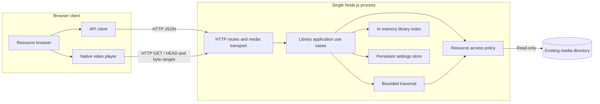

# Anishelf History

These complete snapshots describe their source release, not current support.
Current scope is in [Requirements](requirements.md); current implementation and
V2 target design are in [Architecture](architecture.md).

- [V1 requirements](#v1-requirements)
- [V1 design](#v1-design)
- [V1 deferred requirements](#v1-deferred-requirements)
- [Superseded V2 bridge proposal](#superseded-v2-bridge-proposal)

The V1 source is commit `45962af7675ff904c5b62c00dafea9d104d01422`
(`Bump version`). Original paths were docs/current-version-requirements.md,
docs/current-version-design.md and docs/future-requirements.md. The complete bodies
are retained below; headings and links are adapted for this combined archive.
Historical status statements remain unchanged.

## V1 Requirements

**Current version: V1.**

Architecture and implementation decisions are described in [Current Version — Overall Design](history.md#v1-design).

This document defines the active release scope. Deferred capabilities are maintained in [Future Requirements](history.md#v1-deferred-requirements). Together, these two documents form the requirements set; when planning a new version, move selected requirements here and update the version label.

### 1. Goal

Allow the user to browse existing animation files on the server through a Web interface and select a file to play.

Core workflow: **configure an existing resource directory → scan manually → browse directories and files → play in the browser**.

This release validates resource access and playback. It does not require online anime metadata, episode mapping, tracking records, or a download workflow. The user supplies the existing files.

### 2. Operating Scope

- Personal use, one server, and one resource root with nested directories.
- Read-only access to original media: no uploading, moving, renaming, or deleting files.
- Acceptance testing covers local use and one explicitly selected desktop browser. Listen on localhost by default; LAN access and authentication are later extensions.
- Validate one active playback session; client coordination is outside this release.
- Configure the resource directory through a simple UI form. A missing persistent settings file must allow startup; the application generates it on the first successful save. A multi-step setup wizard is not required.
- Use English for application UI, messages, and metadata. Localization is deferred to O14 in the future requirements. Preserve original resource filenames.

### 3. Minimum Feature List

| ID | Feature | Current requirement |
| --- | --- | --- |
| V01 | Resource directory configuration | Configure and persist one server-accessible root through the UI; allow startup before setup; check existence and readability on startup or scan and expose errors |
| V02 | Manual scanning | Recursively discover agreed video file types; repeated scans do not duplicate paths; rescanning reflects additions and removals |
| V03 | Resource browsing | Show the actual directory hierarchy and original filenames with stable natural sorting; support parent-directory navigation |
| V04 | Web playback | Open a selected file in the player and serve its media from the server without requiring a full download before playback |
| V05 | Basic playback controls | Play, pause, seek, volume, fullscreen, and return to the original directory |
| V06 | Failure feedback | Distinguish missing files, unreadable files, and unsupported media or playback failures; provide understandable feedback |

Directories are the organizational unit and files are the playback unit. Anime identification, manual title linking, episode parsing, posters, and detail pages are unnecessary. Natural sorting helps users select files whose names contain episode numbers.

### 4. Playback Compatibility Boundary

Version 1 starts with browser direct playback. **Server-side transcoding and remuxing are not required for this release.**

Manual on-demand preparation of reusable Web-compatible copies is assigned to a later release; see [On-demand Web Preparation](history.md#v1-deferred-requirements).

- Select the target browser and version before implementation, then collect representative files from the user's existing library.
- MP4 with H.264 video and AAC audio is the initial validation candidate. Actual browser and file testing determines support; an extension alone does not guarantee playback.
- Document the file types included in scanning. Discovery does not imply that the browser supports the contained codecs.
- Subtitle discovery, loading, rendering, selection, and controls are outside this release, including external WebVTT. Subtitles already burned into the video image require no separate support. Audio-track selection is also deferred.
- If files such as MKV or HEVC media cannot play directly in the target browser, display an unsupported-media message. Do not automatically convert them or launch an external player.

**Scope validation prerequisite:** check whether representative files from the user's actual library can play directly. If the primary library requires conversion, this minimum release validates infrastructure but does not yet satisfy everyday viewing needs. In that case, explicitly revise the scope to add only the compatibility path required by those samples, rather than expanding into general format support.

### 5. Minimum Interface

Only two screens are required:

1. **Resource browser:** current directory, subdirectories and files, scan action, scan status, and errors.
2. **Player:** filename, video player, back action, and playback errors.

A dashboard, anime detail page, task center, tracking page, and integration settings are outside this release.

### 6. Explicit Exclusions

- Online metadata search, cover fetching, anime recognition, and episode mapping.
- Persistent playback progress, resume playback, watched markers, a continue-watching list, and automatic next-episode playback.
- Tracking status, subscriptions, RSS, resource search, download clients, and automatic ingestion.
- A dedicated Web action to download existing library files to the user's device; media delivery for playback remains included.
- AniList accounts or other external synchronization.
- Desktop player bridges, remote control, cross-client handoff, and native apps.
- Server-side transcoding, remuxing, all subtitle support, audio-track selection, and universal format support.
- Multiple users, multiple libraries, public access, file management, and automatic filesystem monitoring.

These belong to [Future Requirements](history.md#v1-deferred-requirements) and must not become hidden Version 1 dependencies.

### 7. Acceptance Criteria

| ID | Scenario | Passing result |
| --- | --- | --- |
| A01 | Configure and scan a directory containing nested folders and video files | The Web interface shows the hierarchy and allows navigation |
| A02 | Repeat a scan, then add or remove a file and rescan | No duplicate entries; the listing reflects the changes |
| A03 | Select a validated supported sample | Playback starts in the target browser with working audio and video before the entire file is downloaded |
| A04 | Pause, resume, seek to an unplayed position, adjust volume, and enter fullscreen | Controls work and playback resumes from the requested position |
| A05 | Use an unreadable directory, remove a file after scanning, or open unplayable media | An appropriate error appears; the interface remains usable and allows returning to the listing |
| A06 | Exit the player | The original directory is restored and another file can be selected |
| A07 | Use paths containing Chinese characters and spaces, then attempt to access a file outside the configured root | Valid resources play; outside-root access is rejected, including escapes through symbolic links |

Record the browser version and media codecs for the acceptance samples. Passing these scenarios completes Version 1 without waiting for future features.

### 8. Essential Quality Requirements

- Scanning and playback never modify original media.
- Media access is restricted to the configured root; endpoints cannot read arbitrary system paths.
- Scanning exposes running and completion states; an error does not make the resource browser unusable.
- Media delivery supports the partial reads required for seeking and does not load an entire video into server memory.
- Persist the resource-directory configuration. The file index may be rebuilt on startup; a comprehensive database model for future features is unnecessary.

Language, framework, and database choices are not prescribed by this document.

## V1 Design

**Version: V1**  
**Status: Design with implemented backend module boundaries; end-to-end acceptance and browser compatibility are not certified.**
**Scope authority:** [Current Version Requirements](history.md#v1-requirements).

This document describes only the active release: configure an existing resource directory, scan it, browse files, and play supported files in a browser. The two requirements documents remain the requirements sources; this document explains how to implement the current one.

### 1. Design Summary

Use a single Node.js backend with a React Web client. The server owns resource access and a rebuildable in-memory index; the browser owns playback and its transient UI state.

The system is client–server, with a browser–server deployment for V1. It is a modular monolith: modules share one backend process, and no module requires a separate service.

No database, media-processing process, account system, persistent viewing record, or background scheduling platform is needed. Subtitle functionality and a dedicated download action are outside this design.

### 2. Overall Architecture



The JSON API returns directory and scan information. The video element requests media directly from its URL; the UI must not fetch the complete video into a Blob before playing it. Original media stays outside the repository and is never exposed as an unrestricted static directory.

#### Development and production

| Environment | Arrangement |
| --- | --- |
| Development | Vite serves the UI; its `/api` proxy forwards JSON and media requests to the backend. Bind both servers to loopback. |
| Production | Caddy or another Web server serves `web/dist` and proxies `/api` to the Node.js backend on the same browser origin. |

Proposed defaults are `127.0.0.1:3000` for the backend and the existing Vite development port for the UI. The backend offers built-page hosting only in development mode. In production, the Web server serves only the explicit frontend build directory as static assets. Unknown API paths return API errors, never the SPA HTML fallback.

### 3. Technology Decisions

| Area | Choice | Reason and boundary |
| --- | --- | --- |
| Runtime | Node.js 24 LTS | Matches the repository's `.nvmrc`; file and network I/O are the primary backend workload. |
| Language | TypeScript, strict mode, ESM | Matches the existing packages; type-check both workspaces independently. |
| Backend framework | Fastify | Routes, validation, streamed responses, and integration with the application Pino logger. |
| Logging | Pino | Structured JSON logs; one application logger shared by backend modules and Fastify. |
| Frontend | Existing React + Vite setup | Retain the existing scaffold; no SSR is needed for a local resource browser. |
| Navigation | React Router in Data Mode | URL routes identify directories and files; loaders, actions, and revalidation manage server data. |
| Playback | Native HTML `<video controls>` | Supplies the basic controls; browser decoding determines actual codec support. No player SDK or streaming protocol layer is needed. |
| File access | Node.js asynchronous filesystem APIs and readable streams | Enumerate without synchronous bulk traversal and stream without whole-file buffering. |
| API | HTTP JSON plus HTTP media requests | Poll scan status only while a scan is active; no WebSocket or SSE requirement. |
| Request validation | Fastify route JSON Schemas | Validate IDs and request shapes at the server boundary; TypeScript alone does not validate incoming data. |
| UI state | Router loader/action data and local React state | The router owns server data; component state handles media errors and explicit player resets. |
| UI styling | Tailwind CSS 4 + shadcn/ui | Tailwind utilities and semantic theme tokens; shadcn components are owned in `web/src/components/ui`. |
| Configuration and persistence | Deployment TOML plus persistent JSON settings; in-memory file index | Startup parameters are separate from application settings; a manual scan rebuilds the index. |
| Validation | Type checking, Vitest backend tests, browser acceptance tests | Test file access and HTTP behavior, then verify real media in the selected browser. |

Node 24 is an LTS line in the official [release listing](https://nodejs.org/en/about/previous-releases). Node provides asynchronous [filesystem and stream access](https://nodejs.org/api/fs.html); Fastify accepts [stream replies](https://fastify.dev/docs/latest/Reference/Reply/#streams). Vite supports the frontend development/build workflow described in its [guide](https://vite.dev/guide/).

### 4. Module Design

#### Backend

| Module | Responsibilities | Inputs and outputs | Requirement |
| --- | --- | --- | --- |
| Deployment configuration | Load and validate startup parameters | Deployment TOML → validated deployment settings | V01 |
| Persistent settings store | Validate application settings and directory separation; load and atomically save JSON before publishing settings in memory | Persistent JSON and replacement settings → committed settings or configuration error | V01 |
| Library application | Own use cases, operation exclusion, latest scan state, cancellation, root changes, and snapshot publication | Settings/scan/query requests → application results; file ID → safely opened media handle | V01–V06 |
| Resource access | Centralize root availability, confinement, file-type policy, regular-file checks, and safe opening | Captured resource root and internal relative path → validated access or typed error | V01, V04, V06 |
| Scanner | Traverse one fixed root with bounded concurrency; collect progress and warnings; return candidate entries | Resource-access instance, root name, progress, abort signal → candidate entries or cancellation | V02 |
| Library index | Hold the active snapshot, validate replacements, resolve IDs, and list direct children in stable natural order | Candidate entries or resource ID → snapshot or metadata | V02, V03 |
| HTTP application and media transport | Register schemas/routes, map errors, serialize responses, handle HEAD/Range, stream media, and release handles | HTTP requests → JSON, media, or UI assets | V01–V06 |

`LibraryApplication` is the public entry point for library operations. HTTP handlers
call its use cases rather than combining the scanner, index, filesystem, and settings
store themselves. Application and lower-level modules have no Fastify dependency.
The entry point assembles the persistent store, index, application, logger, and HTTP
server; `createHttpApp` receives the application as its library dependency.

The application reserves the scan operation before asynchronous root preflight.
Concurrent starts share that preflight and the running scan. Settings changes are
excluded throughout preflight and traversal, and scans are excluded while saving.
The application captures settings for each scan, publishes only successful candidates,
retains the old snapshot on failure, and clears the index and latest scan only after
a changed root has been saved successfully. Saving the same root preserves both.
Shutdown rejects new operations, cancels traversal, and waits for pending preflight,
filesystem work, and settings saves to settle.

The scanner receives a fixed resource-access instance and returns candidate entries;
it does not read mutable settings, save configuration, own task lifecycle, or publish
the index. The index has no filesystem dependency. Root availability and safe opening
share the resource-access policy. File metadata and media opening capture the entry
and its matching root before asynchronous access; an overlapping settings change
cannot redirect the lookup into the new root. An already opened stream retains its
handle until completion or disconnect.

HTTP owns transport behavior: schemas, playback URLs, status codes, HEAD, byte ranges,
and stream cleanup. Application results explicitly select public fields. Internal
entries and snapshot maps live in the library model; public API contracts define
serializable DTOs independently. Biome import restrictions enforce the HTTP,
application, lower-level, and public-contract dependency boundaries.

#### Frontend

| Module | Responsibilities |
| --- | --- |
| App/navigation | Switch between browsing and playback; retain the selected directory when returning |
| Resource browser | Render folders and files, parent navigation, scan action, and loading/empty/error states |
| Scan feedback | Poll active scan state, show counts and warnings, refresh listings after successful publication |
| Player | Resolve file metadata, set the media URL, expose native controls and a return action, translate playback failures |
| API client | Typed JSON requests, request cancellation, and a common error shape |

Use React Router's Data Mode with `createBrowserRouter` and `RouterProvider`: `/` displays the root, `/directories/:id` displays a folder, and `/files/:id` selects the player. The shared layout renders an `Outlet`; loaders fetch library status, directory listings, and file metadata using the router request's abort signal. A scan action is submitted with `useFetcher`, and `useRevalidator` refreshes active loaders once per second during scanning. Child error boundaries provide retries while keeping the scan controls available. File links retain `?directory=<id>` for returning to the original listing. For direct file links without that query, use the parent ID from file metadata, with the root as a fallback. Selection is derived from the URL so reloads and browser back/forward restore the view. Unload video when leaving the player; scan revalidation preserves playback. Production Web server configuration must return the SPA entry for page routes while keeping proxied `/api` responses separate.

### 5. Configuration and In-Memory Data

#### Configuration

Use two configuration files with separate responsibilities:

| File | Contents | Location and lifecycle |
| --- | --- | --- |
| Deployment TOML | Startup parameters: listen address, port, dynamic data directory, log level, and log destination | Selected by the `ANISHELF_CONFIG` environment variable; read at startup |
| Persistent JSON | Application settings, initially the resource root | `settings.json` in the configured dynamic data directory; survives restart |

Example deployment configuration:

```toml
host = "127.0.0.1"
port = 3000
dataDir = "/absolute/path/to/anishelf-data"

[logging]
level = "info"
destination = "stdout"
# For file logging, set destination = "file" and path to an absolute file path.
# path = "/absolute/path/to/logs/anishelf.log"
```

Example persistent `settings.json`:

```json
{
  "resourceRoot": "/absolute/path/to/media"
}
```

Require `ANISHELF_CONFIG` to identify the deployment file. Use absolute paths for that file, the dynamic data directory, the resource root, and any log file. Bind to loopback; broad network exposure is not a supported V1 setting. Deployment TOML changes and manual JSON file edits require restart. Runtime updates through the persistent configuration manager validate and atomically save settings before publishing them in memory; the UI provides a resource directory form backed by GET/PUT `/api/settings`. No file watcher is required.

Missing or invalid deployment configuration, and malformed or unreadable existing persistent settings, fail startup with an actionable terminal message. The application prepares the writable dynamic data directory. A missing `settings.json` enters setup mode with `resourceRoot: null` while HTTP stays available. The user enters an absolute server resource directory in the UI; the first successful save generates `settings.json`. Scanning is disabled until a directory is configured. Saves are excluded while scanning; a changed root clears the previous index and scan state, returns the UI to the root page, and requires a new manual scan. A syntactically valid but missing/unreadable media root leaves the HTTP UI available with a library error; the user can fix the directory and retry scanning.

Any application write to persistent settings must use a temporary file followed by atomic replacement, preserving the previous file on failure. Deployment configuration is never rewritten by the application. The dynamic data directory must remain separate from the read-only media directory and must not be served as static assets.

#### Logging

Use [Pino](https://github.com/pinojs/pino/blob/main/docs/api.md) as the backend logging library. Initialize one application logger from validated deployment settings and pass it to Fastify through [`loggerInstance`](https://fastify.dev/docs/latest/Reference/Logging/#using-custom-loggers). Use child loggers for module and request context instead of maintaining separate logging implementations.

Map `logging.level` to Pino's level option. Use a synchronous Pino destination for stdout or file output; the current application has low log volume. Keep production and file output as newline-delimited JSON. The development command pipes stdout through the `pino-pretty` development dependency for readable, colored terminal logs with local timestamps. Before logger initialization, deployment configuration failures still use a concise stderr diagnostic.

- Use structured backend logs with timestamp, level, event, and request ID where applicable. Record startup/shutdown, configuration failures, scan start/completion/failure with counts and duration, HTTP outcomes, and media I/O failures.
- Configure `logging.level` in deployment TOML: `trace`, `debug`, `info`, `warn`, `error`, `fatal`, or `silent`; default to `info`. Emit only events at or above the selected level; `silent` disables normal logging.
- Configure the save location through `logging.destination`: `stdout` by default, or `file` with a required absolute `logging.path`. File output appends to the selected file; create its parent directory if needed, then delegate file opening and writes to Pino. Deployment loading validates the level, destination, and path format.
- Use `info` for normal lifecycle and completed scans, `warn` for recoverable scan/access problems, and `error` for failed operations or unexpected failures. Routine requests and client cancellations should not flood warning/error logs; do not log each media chunk or each scanned entry at `info`.
- Do not log media contents, complete configuration files, secrets, or request/response bodies by default. Absolute paths may appear in local diagnostic logs but must not be exposed in API errors.
- Log writes are synchronous; avoid high-volume per-entry or per-chunk logs. Use one logger for the process lifetime; the operating system releases file descriptors on exit. Delegate output errors to Pino; no application-specific error listener or destination switching is required. Automatic output fallback is deferred.
- No application-managed asynchronous log queue is required. Asynchronous logging, log rotation, retention, file reopening, signal handling, and automatic output fallback are deferred to [Future Requirements](history.md#v1-deferred-requirements).

#### Data model

| Record | Fields | Lifecycle |
| --- | --- | --- |
| DirectoryEntry | `id`, `parentId`, `name`, internal `relativePath` | In-memory snapshot |
| FileEntry | `id`, `parentId`, `name`, internal `relativePath`, `sizeBytes`, `modifiedAt`, `mimeType` | In-memory snapshot; rechecked when serving |
| LibrarySnapshot | `revision`, `scannedAt`, root ID, entries by ID, child IDs by parent | Atomically replaced after a successful scan |
| ScanState | `id`, `status`, `startedAt`, `finishedAt`, visited/matched counts, warning summary, error | Latest scan only, in memory |

Directory ID `root` identifies the configured root. Other IDs can be deterministic opaque hashes of entry kind and root-relative path. They are lookup keys, not access credentials or proof of confinement. Preserve IDs for unchanged paths between scans. No persistent identity across renames is required.

Do not return absolute filesystem paths. Responses contain IDs, display names, parent links, and necessary file metadata. Media contents stay on disk; browser playback position and duration stay in the current video element and are not saved.

### 6. Scan and Browse Workflow

1. Startup loads deployment configuration and optional persistent settings and creates an empty index with `revision: 0`. Without a saved resource root, the page prompts for directory setup; otherwise it shows **Scan to load files**. No automatic scan is required.
2. A manual request starts one asynchronous scan. A second request returns the existing active scan instead of launching duplicate work.
3. Traverse the canonical root with bounded concurrency, initially eight filesystem operations. Skip symbolic links and non-regular media entries. Gather real subdirectories and matching files without reading video contents.
4. Initial extension allowlist: `.mp4`, `.m4v`, `.webm`, `.mkv`, case-insensitive. This is a discovery policy, not a codec-support promise. Keep one server-side allowlist and MIME mapping.
5. Build a new index separately. Keep the previous snapshot available while scanning.
6. On successful traversal, atomically publish the snapshot. Missing files disappear; duplicate paths cannot create duplicate entries.
7. For a missing or unreadable root, fail the scan and retain the previous snapshot with a visible warning that it may be stale. A failure in a child subtree produces a visible partial-scan warning and a snapshot of accessible entries; omitted entries are not treated as an authoritative deletion history.
8. Poll `GET /api/library` approximately once per second only while scanning, then fetch the current directory again. If it no longer exists, return to the root with a message.

List folders before files. Apply a fixed numeric-aware collator to names and an exact-name tie-breaker so sorting is stable. Return immediate children only; do not send the full tree for each navigation. V1 may return a whole directory listing without pagination; record unusually large-directory behavior during acceptance rather than promise an untested library size.

### 7. HTTP Interface

| Method and path | Purpose | Main results |
| --- | --- | --- |
| `GET /api/health` | HTTP service availability, independent of library readiness | `200` with `{"status":"ok"}` |
| `GET /api/settings` | Read the configured resource directory or setup state | `200` with `{ resourceRoot: string \| null }` |
| `PUT /api/settings` | Validate and persist `{ resourceRoot: string }` | `200`; `400` invalid path/overlap, `409` scan/save in progress, `500` write failure |
| `GET /api/library` | Configuration readiness, index revision, and latest scan state | `200`, including recoverable library errors in the body |
| `POST /api/library/scan` | Start a scan or return the currently running scan | `202`; `409` before setup or during settings save; `503` if the root is unavailable before work starts |
| `GET /api/directories/:id` | Directory metadata, parent reference, and direct children | `200`, `404` |
| `GET /api/files/:id` | File metadata, current readability, and playback URL | `200`, `404`, `403` |
| `GET /api/media/:id` | Stream all or part of a file | `200`, `206`, `404`, `403`, `416` |
| `HEAD /api/media/:id` | Describe the file without sending media bytes | `200`, `404`, `403` |

Request validation failures use `400`; unexpected failures use `500`. A disappeared indexed file returns `404 RESOURCE_MISSING`; an unknown ID returns `404 RESOURCE_NOT_FOUND`. Permission failures return `403 RESOURCE_UNREADABLE`. API errors use:

```json
{
  "error": {
    "code": "RESOURCE_MISSING",
    "message": "This file is no longer available. Scan the library again.",
    "requestId": "request-id"
  }
}
```

Return the server-generated request ID in `x-request-id` on every response. Do not trust client-supplied IDs or expose stack traces or absolute paths in responses. Detailed local logs may contain the paths needed to diagnose a failure. Unknown endpoints return `404 ROUTE_NOT_FOUND`; untrusted state-changing requests return `403 REQUEST_FORBIDDEN`.

#### Media response behavior

Support byte-range retrieval for browser seeking according to [HTTP Semantics, RFC 9110](https://www.rfc-editor.org/rfc/rfc9110.html#section-14):

- A normal GET returns `200` with the full representation length and a bounded stream.
- A satisfiable single byte range, including open-ended and suffix forms, returns `206` with correct `Content-Range` and `Content-Length`.
- An unsatisfiable valid range returns `416` and `Content-Range: bytes */<size>`.
- Ignore unsupported multipart ranges or malformed range fields and serve `200`; do not construct multipart responses in V1.
- Ignore Range for HEAD and return the full representation headers without a body.
- Include `Accept-Ranges: bytes` and the mapped media `Content-Type`. Initially use `Cache-Control: no-store` to avoid stale-file cache complexity.
- When `If-Range` is present without a validator this implementation can verify, send the full representation rather than a partial response.

Open the file, obtain its size from that handle, and stream from the same handle. Validate integer bounds before calculating ranges. A client disconnect must destroy the stream and release the descriptor. If an I/O error occurs after headers were sent, terminate that response and log it; do not append JSON to video bytes.

Do not promise that one playback means one HTTP request: seeking and browser buffering can create several requests for the same file.

### 8. Playback and Error Flow

1. Selecting a file switches to the player while retaining its directory ID.
2. Fetch file metadata and current accessibility. On success, assign `/api/media/:id` to the native video element with `controls` and `preload="metadata"`.
3. The browser fetches media and performs decoding. The user starts playback; do not rely on audible autoplay being permitted.
4. Use native play/pause, seek, volume, and fullscreen controls. There is no subtitle track loading, resume position, audio-track chooser, or next-episode action.
5. Returning to the directory pauses and unloads the element, allowing media requests to stop.
6. On a media error, recheck file metadata if needed to distinguish a missing/unreadable resource from decoding or transport failure. If the browser supplies only a generic error, report **This media could not be played in this browser** rather than inventing a codec diagnosis.

The [HTML video element](https://developer.mozilla.org/en-US/docs/Web/HTML/Reference/Elements/video) provides native controls and media error events, but available formats depend on browser capabilities. Initial acceptance uses a real MP4/H.264/AAC sample. A discovered MKV or other file may fail playback; that is handled feedback, not a request to convert it.

Native browser controls may expose their own save/download behavior. V1 adds no application download feature; it does not attempt to prevent users from saving media bytes already delivered for playback.

### 9. File Access and Lifecycle Boundaries

- Resolve the configured root to its canonical path. Resolve resources from index IDs, never from arbitrary client-supplied filesystem paths.
- Skip symlinks during scans. At access time recheck path components, reject symlink replacements, validate canonical containment using path components rather than a string prefix, and require a regular file.
- Use read-only file handles and reject directories, devices, FIFOs, and sockets as media. Keep all serving through the shared access policy.
- Files may disappear after scanning; opening and reading errors are normal failure paths. Modifying a media file during playback is unsupported and may require reopening it.
- Path revalidation reduces stale-path risk but is not a portable guarantee against hostile concurrent directory replacement. V1 assumes the local user controls the media tree and the application has only necessary filesystem permissions. Test symlink escape and replacement before access explicitly.
- Keep the server on loopback, validate expected Host values, and reject untrusted cross-origin state-changing requests. No permissive CORS configuration is needed with the development proxy and same-origin production UI.
- On shutdown, stop accepting scans, cancel traversal, stop accepting new connections, and close outstanding media streams within a bounded grace period. There is no scan recovery journal; restart returns to an empty index.

### 10. Verification and Requirement Coverage

| Requirement | Design coverage | Acceptance evidence |
| --- | --- | --- |
| V01: directory configuration | Configuration and access modules | A01 valid root; A05 missing/unreadable root |
| V02: manual scanning | One scan, bounded traversal, atomic snapshots | A01 nested enumeration; A02 repeat/add/remove |
| V03: browsing | Parent IDs, direct-child listing, natural sorting | A01 navigation; A06 return to original folder |
| V04: playback | Media endpoint and native player | A03 real audio/video before full download; A07 valid special-character paths |
| V05: controls | Native controls plus Range delivery | A04 pause/resume/seek/volume/fullscreen |
| V06: failure feedback | Typed API errors and browser media error handling | A05 missing/unreadable/unplayable resources; A07 rejected outside-root access |

Use backend tests with temporary filesystem fixtures for repeat scans, partial failures, scan deduplication, natural ordering, root confinement, and missing files. HTTP tests should cover HEAD, bounded/open/suffix ranges, unsatisfiable ranges, ignored multipart ranges, and early disconnect cleanup. Test media delivery over a real local HTTP connection as well as handler-level checks.

Run browser acceptance against the production build with the exact browser and OS version recorded. Use known supported and unsupported media samples, seek beyond the initially buffered area, and verify that closing playback releases the request. Observe memory while playing a large file to check that it does not grow with total file size; record actual measurements instead of claiming an untested throughput target.

Before implementation, select the acceptance browser and representative media files. Chrome on the current macOS development machine is a proposed first target, not a validated support claim.

### 11. Implementation Order

1. Align existing workspace tooling and establish the Fastify application, two configuration loaders, Pino logging, and frontend proxy.
2. Implement resource access and scanner/index behavior; connect the resource-browser screen.
3. Implement and test HTTP media delivery, then connect native playback.
4. Complete error states, cleanup, production Web server guidance, and the A01–A07 acceptance run.

Completion is the validated current workflow. This design creates no dependency on future media conversion, subtitles, downloads, tracking, or external integrations.

## V1 Deferred Requirements

### 1. Product Goal and Document Scope

Anishelf is a personal animation media library intended to connect:

**tracking → resource discovery → downloading → library ingestion → Web / desktop playback → viewing history → external tracker synchronization**.

Its core value is better Web playback, shared client state, and coordination between tracking and automatic downloading.

This document contains only capabilities deferred beyond the active release. [Current Version Requirements](history.md#v1-requirements) defines the current scope, presently V1. Together, the two documents cover the current product direction without duplicating active requirements. Future features are not all committed; subsequent releases should follow actual usage needs. Move selected requirements into the current-version document when planning a new release.

### 2. Future Feature Inventory

**Later** means a subsequent core capability. **Optional** means a possible longer-term extension. Existing feature IDs are retained for continuity; gaps correspond to capabilities covered by the current-version document.

#### 2.1 Resource Access and Library

| ID | Feature | Scope |
| --- | --- | --- |
| L05 | Search filenames, choose sorting, and filter resources | Later |
| L06 | Scheduled scans, filesystem monitoring, and incremental updates | Later |
| L07 | Parse anime titles, seasons, episode numbers, and release variants from filenames | Later |
| L08 | Review unidentified files and manually link or correct anime and episode associations | Later |
| L09 | Distinguish regular episodes, specials, continuous season numbering, and multi-episode files | Later |
| L10 | Associate multiple file versions with an episode and select a version for playback | Later |
| L11 | Relink moved files while preserving viewing history | Later |
| L12 | Configure and manage multiple resource roots | Optional |
| L13 | Rename, organize, delete, and reclaim storage with preservation rules | Optional |
| L14 | Download an existing original media file from the Web interface to the user's device | Later |

##### Download Existing Media (L14)

- Provide a download action for an individual library file, preserving its original filename and contents.
- Transfer the existing original file without transcoding or modifying the server copy.
- Apply the same resource-root restrictions and access controls as playback; report missing or unreadable files.
- Initially exclude batch downloads, directory archives, and managed offline libraries.
- Acceptance: the downloaded file matches the source contents and filename, the server original remains unchanged, and unavailable or unauthorized resources cannot be downloaded.

This is a user-facing file download, separate from acquiring new releases through qBittorrent (D01–D08). Both capabilities are deferred beyond the current release. The current release serves media bytes for playback but does not provide a dedicated download action.

#### 2.2 Anime Metadata

| ID | Feature | Scope |
| --- | --- | --- |
| M01 | Search external anime metadata and store provider identifiers | Later |
| M02 | Display covers, aliases, descriptions, seasons, episode counts, and airing information | Later |
| M03 | Provide anime detail and episode views, organizing the library by title | Later |
| M04 | Manually select, correct, and refresh metadata mappings | Later |
| M05 | Cache metadata so external outages do not prevent browsing or playback | Later |
| M06 | Multiple metadata providers, related works, and cross-provider ID mapping | Optional |

#### 2.3 Web Playback and Subtitles

| ID | Feature | Scope |
| --- | --- | --- |
| P03 | Display a matching external WebVTT subtitle with an on/off toggle | Later |
| P05 | Choose a playback strategy based on media and client capabilities | Later |
| P06 | Remux media when only the container is incompatible | Later |
| P07 | Prepare a reusable Web-compatible copy on demand, transcoding only incompatible streams and supporting seeking in the completed output | Later |
| P08 | Discover and select embedded or external subtitles and convert SRT | Later |
| P09 | Support ASS/SSA styling and fonts, plus a compatibility path for image subtitles | Later |
| P10 | Select audio tracks, adjust subtitle timing, change playback speed, and use shortcuts | Later |
| P11 | Next-episode navigation, automatic continuation, and playback preferences | Later |
| P12 | Hardware transcoding, HDR handling, broader browser support, and concurrent resource limits | Optional |
| P13 | Opening/ending skips and chapter navigation | Optional |

##### On-demand Web Preparation (P05–P07)

This capability is assigned to a later release and does not expand the current release. Its workflow is **select an existing file → Prepare for Web → wait for completion → play the prepared copy**.

Preparation reduces server-side processing during playback and avoids repeated conversion when the cached copy is reused. It does not guarantee lower total computation: the initial conversion still consumes resources, and the copy requires additional storage.

Processing rules:

| Source compatibility with the selected target browser | Action |
| --- | --- |
| Directly playable | Use the original file without creating a copy |
| Compatible audio and video, incompatible container | Remux without re-encoding |
| Compatible video, incompatible audio | Copy the video stream and convert only audio |
| Incompatible video | Transcode video and convert audio only if necessary |

Minimum scope for this later feature:

- Provide a manual **Prepare for Web** action; do not convert the entire library automatically.
- Use one fixed output profile validated against the selected browser; do not generate multiple resolutions.
- Process one file at a time and expose queued, processing, ready, and failed states. Show a useful failure reason and allow retry.
- Preserve the original media and store prepared copies in a separate cache directory.
- Enable playback of the prepared copy only after conversion completes successfully. Playback does not start from a partially written output.
- Reuse a valid completed copy for subsequent playback; repeated requests for the same source and profile must not create duplicate jobs.
- Associate each copy with its source identity, source version, and output profile. Source changes invalidate the old copy; invalidated copies are not offered for playback.
- Allow explicit deletion of prepared copies without deleting original media. Clean up incomplete output after failures or interrupted jobs, and report insufficient storage.
- Keep subtitle support within the separately defined subtitle scope; this feature does not implicitly add subtitle burn-in or advanced subtitle rendering.

Acceptance criteria: compatible files bypass conversion; container-only and audio-only cases preserve compatible streams; a prepared incompatible sample plays and seeks in the target browser; repeat playback reuses the copy; source changes invalidate it; failure, retry, and cache deletion leave the original untouched.

Automatic whole-library conversion, idle-time scheduling, playback during conversion, and real-time transcoding fallback are outside this feature's initial scope.

#### 2.4 Viewing History and Tracking

| ID | Feature | Scope |
| --- | --- | --- |
| W01 | Save playback position and duration and resume playback | Later |
| W02 | Continue-watching and recently watched lists | Later |
| W03 | Detect completion and manually mark or unmark episodes as watched | Later |
| W04 | Manage planned, watching, completed, paused, and dropped statuses | Later |
| W05 | Show available unwatched episodes, watched counts, and history | Later |
| W06 | Share records across clients and handle duplicate, out-of-order, or concurrent progress updates | Later |
| W07 | Rewatch history, ratings, tags, and personal notes | Optional |

#### 2.5 Subscriptions and Resource Discovery

| ID | Feature | Scope |
| --- | --- | --- |
| S01 | Enable or pause automatic acquisition from an anime's own page | Later |
| S02 | Set the starting episode and backlog scope with an impact preview | Later |
| S03 | Configure sources such as RSS and discover releases periodically | Later |
| S04 | Match releases to titles and episodes, queuing ambiguous matches for review | Later |
| S05 | Filter by subtitle language, release group, resolution, codec, and keywords | Later |
| S06 | Deduplicate and exclude existing files, active downloads, and unwanted episodes | Later |
| S07 | Explain selection and rejection decisions and allow manual selection or dismissal | Later |
| S08 | Coordinate tracking-status changes with subscriptions and explain their effect on existing tasks | Later |
| S09 | Search multiple sources, rank releases, process season packs, and upgrade quality | Optional |

#### 2.6 Downloads and Automatic Ingestion

| ID | Feature | Scope |
| --- | --- | --- |
| D01 | Connect to qBittorrent and validate configuration and download-path mappings | Later |
| D02 | Submit releases, persist task associations, and prevent duplicate submissions | Later |
| D03 | Display progress, speed, task status, and errors | Later |
| D04 | Pause, resume, cancel, and retry downloads | Later |
| D05 | Check completed files, scan them, and associate them with episodes | Later |
| D06 | Recover from disconnections, externally removed tasks, and server restarts | Later |
| D07 | Distinguish task cancellation, downloaded-data deletion, and library-record removal | Later |
| D08 | Multiple download clients, seeding policies, bandwidth schedules, and storage policies | Optional |

#### 2.7 Desktop and Other Clients

| ID | Feature | Scope |
| --- | --- | --- |
| C01 | Install and pair a desktop player bridge; report connection state and capabilities | Later |
| C02 | Select a file on the Web and launch desktop playback | Later |
| C03 | Report desktop progress, pause, and playback-end events | Later |
| C04 | Control desktop playback, pause, and seeking from the Web | Later |
| C05 | Continue viewing between Web and desktop using saved positions | Later |
| C06 | Manage multiple devices and transfer playback sessions | Optional |
| C07 | Full desktop, mobile, and TV apps, casting, and offline viewing | Optional |

#### 2.8 External Tracking Services

| ID | Feature | Scope |
| --- | --- | --- |
| T01 | Authorize AniList, check connectivity, and disconnect | Later |
| T02 | Import selected tracked titles without implicitly enabling downloads | Later |
| T03 | Map titles and episode numbering and synchronize progress and tracking status | Later |
| T04 | Queue synchronization, retry failures, report expired authorization, and show results | Later |
| T05 | Preview reimport differences and resolve conflicts | Later |
| T06 | Automatic bidirectional synchronization, multiple trackers, and rating synchronization | Optional |

#### 2.9 Interface, Settings, and Maintenance

| ID | Feature | Scope |
| --- | --- | --- |
| O03 | Dashboard for continued viewing, new episodes, downloads, and exceptions | Later |
| O04 | Unified settings for directories, playback preferences, and integrations | Later |
| O05 | Task history, logs, and automation decision explanations | Later |
| O06 | Back up and restore metadata, viewing history, and configuration | Later |
| O07 | LAN access, single-user authentication, and credential protection | Later |
| O08 | Completion and failure notifications with notification preferences | Later |
| O09 | Multiple users, permissions, public deployment support, and remote access | Optional |
| O10 | Plugin extensions and public integration APIs | Optional |
| O11 | Log rotation, retention, and reopening files without restarting the application | Later |
| O12 | Automatic log-output fallback after destination failure | Later |
| O13 | Asynchronous log output with bounded buffering and shutdown flushing | Later |
| O14 | Interface localization and language preferences | Later |
| O15 | Manage API-backed frontend state and caching with TanStack Query | Later |

##### Interface Localization (O14)

- Introduce translation resources for interface labels, status messages, and user-facing errors, with English as the default and fallback language.
- Allow users to select a supported language and persist that preference.
- Keep API field names, error codes, resource IDs, and original filenames unchanged across languages.
- Acceptance: changing the language updates supported interface text and error feedback; missing translations fall back to English; browsing and playback state remain intact.

The current release uses English only and does not include translation resources or a language selector.

##### Frontend State and Caching (O15)

- Use TanStack Query to manage API-backed server state in the Web interface, including resource listings, scan status, and saved settings.
- Define stable query keys and suitable freshness and retention policies for each kind of data. Reuse fresh results and deduplicate concurrent requests for the same data.
- After a successful scan or settings change, update or invalidate the affected queries so subsequent views reflect the server's latest state.
- Keep loading, refresh, and error feedback visible; a failed refresh must not silently present cached data as current.
- Limit this cache to API-backed data. Media playback streams and local-only interface or player state are outside its scope.
- Acceptance: revisiting a still-fresh resource listing reuses cached data; concurrent requests for the same listing do not trigger duplicate fetches; a completed scan or settings change is reflected on the next affected view; and a refresh failure is distinguishable from a successful current result.

This frontend caching improvement is deferred beyond the current release. It does not require the V1 interface to use TanStack Query.

##### Logging Maintenance (O11–O13)

- O11: Define rotation and retention policies using external deployment tooling or a suitable Pino transport. If rotation renames the active file, support reopening the configured path and a deployment trigger such as a Unix signal.
- O12: Switch subsequent log records to a fallback destination after runtime output failure. Specify buffered-record loss, failure reporting, and whether/how the original destination is restored; cover errors handled internally by Pino as well as emitted stream errors.
- O13: Introduce asynchronous Pino output when measured log volume or write latency affects application responsiveness. Bound buffered memory, define backpressure or overflow behavior, and flush pending records within a bounded shutdown period.
- Acceptance: asynchronous output avoids synchronous destination writes on the application path, buffers remain bounded under a slow destination, and normal shutdown writes pending records; timeout or overflow reports any potential record loss.
- Acceptance: rotation directs subsequent logs to the new file without restarting the application; destination failure triggers the defined fallback without replacing existing business-module loggers.

The current release uses one fixed stdout or file destination. It supports configured levels and synchronous writes through a process-lifetime logger. Asynchronous logging, rotation, reopening, signal handling, and automatic destination switching are outside the current release.

### 3. Rules for Future Features

These rules apply when the relevant capabilities are implemented. They do not require the current release to build those systems in advance.

- **Keep states separate:** tracking, subscriptions, downloads, file availability, and viewing status are independent. Deleting a watched file must not erase its history.
- **Verify ingestion:** download completion alone does not prove that a file exists or is playable.
- **Make subscription scope explicit:** show the starting episode and backlog range. Importing a list must not silently start bulk downloads.
- **Allow uncertainty:** uncertain title or episode matches require review rather than forced association.
- **Recover without duplication:** polling, retries, and restarts must not create duplicate active downloads.
- **Protect original files:** cancellation and deletion are distinct. Moving files must account for seeding and path associations.
- **Save local records first:** external synchronization failures must not block playback; retry later.
- **Avoid inflated progress:** keep per-episode records separate from external cumulative progress. Watching a later episode must not imply all earlier episodes were watched.
- **Reject stale events:** delayed player updates must not overwrite newer progress or manual corrections.
- **Validate compatibility:** browser, codec, subtitle, and hardware support must be demonstrated with real media samples.

### 4. Suggested Evolution

| Stage | Question to resolve | Priority candidates |
| --- | --- | --- |
| Later: everyday viewing | Can the product support regular viewing comfortably? | On-demand Web preparation with reusable compatible copies, subtitles, saved progress, resume, and next episode |
| Later: anime library | Can files be organized into anime titles and episodes? | Metadata, identification, manual corrections, episodes, and tracking records |
| Later: automatic acquisition | Can new episodes reach the library automatically? | Subscriptions, discovery, download integration, ingestion, and recovery |
| Later: shared client state | Can players and external trackers share state? | Desktop bridge, playback control, progress reporting, and AniList synchronization |

These later stages are not fixed releases or mandatory ordering. For example, desktop integration can move ahead once viewing records are stable if it becomes the most pressing need. Select one independently verifiable user workflow at a time instead of assigning the entire inventory to a single release.

## Superseded V2 Bridge Proposal

This unimplemented proposal previously made a paired bridge the local-launch mechanism. It is retained for reference only; V2 now only generates/copies a transferable original-media URL; browser invocation is deferred. Pairing, polling, IPC observation and bridge routes are deferred.

Use a small user-started Node.js bridge on Linux with a locally configured absolute mpv executable. The bridge initiates authenticated short polling to the application via the configured loopback origin (including an SSH-forwarded origin); it opens no browser-facing listening port. This avoids browser local-network/CORS dependencies and keeps the server from trying to launch a desktop process remotely.

Pairing flow: the bridge requests a short-lived one-time code, displays it locally, and the user enters it in Settings. The UI shows the pending bridge and requires explicit pairing. Codes expire after five minutes, are rate-limited, and are consumed once. The bridge receives a random credential after pairing; store only its hash on the server and a user-private credential file locally. Permit one paired bridge. Disconnect revokes it and clears pending launches. Reject incorrect Host/Origin on browser mutations; credential-based bridge routes are separate and expose no general command execution.

Every two seconds the paired bridge polls for launch work and reports availability/capabilities. Consider it unavailable after ten seconds without contact. **Open in local player** validates current resource access and creates a request with a 30-second expiry, opaque request ID, source version, and server-generated relative original-media route. The bridge combines this route with its locally configured, paired origin; it never accepts a browser-supplied absolute URL. Validate route shape, disallow redirects to other origins, and recheck source version before dispatch. Credentials travel in authorization headers to the coordinator and never in media URLs or logs.

The bridge durably records a launch request ID before spawning, so retries cannot launch it twice. An uncertain crash after that record requires an explicit new user launch rather than automatic replay. Use a fixed executable and validated argument array, no shell, no user-provided options or playlists, and a private mpv IPC socket. Restrict mpv configuration/scripts and media protocols to the supported loopback HTTP workflow. mpv's [official embedding guidance](https://mpv.io/manual/stable/) recommends structured IPC rather than parsing terminal output; its IPC must remain private.

Expose `requested`, `accepted`, `started`, `failed`, and `expired` launch feedback. Acknowledgement means accepted only. Use mpv IPC loading/initial playback events and bounded startup timeout to distinguish process creation from media start; propagate inaccessible media or missing executable failures. Actual audio/video and seeking still require manual acceptance. This narrow startup observation does not implement desktop progress tracking or remote controls. Launching locally leaves Web history unchanged and does not transfer saved position or external subtitles. Web playback stays usable if pairing or launch fails.
