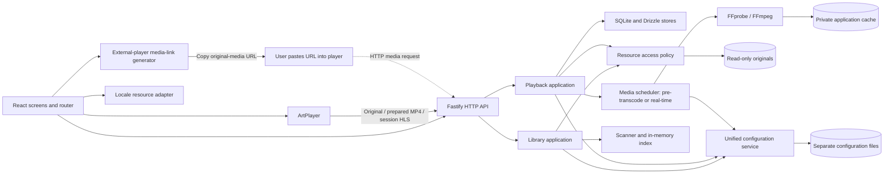

# Anishelf — V2 Design

**Version detail record: V2, active plan; not implemented.** The [current overview](../current-version-design.md) is the project entry point. This file retains the complete detailed specification for V2. Its location in the version archive does not make the active V2 rules obsolete. Maintain this record together with the overview while V2 is active; preserve it when advancing to a later version.

**Active design: V2, planned and not implemented. Latest implemented release: V1.**

The [current requirements](../current-version-requirements.md) define release acceptance; the [overall requirements](../requirements.md) retain the complete inventory. V1 completion and browser acceptance are user-reported. This document selects the V2 design, not evidence that it has shipped. [Development documentation](../development.md) describes the existing implementation.

## Version Reading Guide

Keep the active architecture, inherited functional modules, and current decisions in this document. Move historical release bodies and superseded proposals to [Historical Designs](../historical-design.md). V2 inherits the implemented V1 behavior unless explicitly extended here; readers do not need the historical document to understand current module responsibilities.

| Historical design | V1 status | V2 relationship |
| --- | --- | --- |
| Deployment configuration and persistent settings | Implemented | Retained; optional tool discovery and additional user settings |
| Pino logging | Implemented | Retained; media/job context added |
| Library application, resource access, scanner, index | Implemented | Retained; source identity and subtitle access extend the boundary |
| HTTP application and original media transport | Implemented | Retained; cache, HLS, and session routes added |
| App/navigation, browser, scan feedback, API client | Implemented | Retained and extended for the finished UI |
| Native player | Implemented in V1 | Replaced by ArtPlayer in V2; historical design preserved |
| Settings-only JSON persistence | Implemented in V1 | Settings JSON retained; SQLite + Drizzle added for application records/cache metadata |

## 1. Feature Versions

“Implemented in” records delivered behavior; “Target” records planned changes. Preserve the first implementation version when extending a feature. V2 rows remain unimplemented until acceptance passes.

| Feature / requirement | Implemented in | Target | Design boundary |
| --- | --- | --- | --- |
| Root configuration (V01) | V1 | V1, retained in V2 | One read-only resource root; persistent settings |
| Manual scans (V02) | V1 | V1, retained in V2 | Bounded traversal and atomic in-memory snapshots |
| Directory browsing (V03) | V1 | V2 presentation update | Real hierarchy, original names, stable natural ordering |
| Direct playback and controls (V04–V05) | V1, native video | V2 ArtPlayer replacement | Keep direct media streams and seeking; replace player UI |
| Failure feedback (V06) | V1 | V2 extensions | Add progress, subtitle, preparation, and media-link failures |
| Progress and resume (W01) | — | V2 | Server records, ordered writes, start over |
| Continue watching and recent viewing (W02) | — | V2 | File-based lists; no episode watched status |
| External subtitles (P03) | — | V2 | VTT/SRT/ASS/SSA matching, selection, off |
| Subtitle discovery and extraction (P08) | — | V2, partial | Extract MKV/container text and supported bitmap tracks; browser rendering follows the format matrix |
| Styled subtitles (P09) | — | V2, partial | ASS/SSA rendering and embedded fonts; image-subtitle rendering remains unassigned |
| Strategy selection (P05) | — | V2 | Validated browser profile and source probe |
| Remuxing (P06) | — | V2 | Preserve compatible audio and video streams |
| FFmpeg pre-transcoding and real-time transcoding (P07) | — | V2 | Reusable MP4 copies or session HLS; re-encode only necessary streams |
| External-player media link (C01) | — | V2 | Generate/copy an origin-relative original-media link; manual player open |
| Browser invocation of an external player (C02) | — | Later | Protocol launch or other native-app invocation |
| Everyday Web interface (O16) | — | V2 | Library, player, tasks, settings; responsive and accessible |
| Multilingual foundation (O14, partial) | — | V2 | English catalog and locale-independent contracts; translated UI deferred |
| External configuration (O17) | — | V2 | Separate default files and unified typed access |
| External-player state reading (C03) | — | Later | Read native state when a future integration exposes it |
| All other requirements | — | Unassigned | No implied V3 commitment; see Section 12 |

## 2. Architecture and Technology

Retain a modular Node.js/TypeScript backend with Fastify, Pino, and asynchronous filesystem access. Retain React, Vite, React Router Data Mode, Tailwind CSS, shadcn/ui, Vitest, and Biome. V2 adds ArtPlayer, FFprobe/FFmpeg child processes, SQLite with Drizzle ORM, hls.js for real-time HLS, JASSUB for styled subtitles, and generation of transferable external-player media links. Browser invocation of a player is deferred. TanStack Query remains unassigned.

The external player runs on the browser user's computer and fetches the original media URL itself. With a remote server, resolve the media route against the browser's SSH-forwarded application origin. The browser hands over a URL; it does not proxy media bytes or execute desktop commands.

| Module | Version | Responsibility |
| --- | --- | --- |
| Deployment configuration and logging | V1; V2 extension | Load startup options, resolve media tools, configure shared Pino logger |
| Unified configuration service | V2, extending V1 settings | Initialize separate default files, validate schemas/references, expose typed snapshots and commit settings |
| Library application, scanner, index | V1 retained | Own scans, settings exclusion, publication, browsing |
| Resource access | V1; V2 extension | Confined regular-file access, including subtitle sources |
| HTTP transport | V1; V2 extension | Validation, DTOs, typed errors, HEAD/Range and handle cleanup |
| Playback application | V2 | Source resolution, playback plan, progress sessions and asset selection |
| Media inspector, scheduler, transcode worker | V2 | Probe, decide stream copy/encoding, schedule pre-transcodes and real-time sessions |
| Subtitle service | V2 | Discover/extract subtitle and font assets, retain format/support metadata and serve them safely |
| SQLite repositories through Drizzle | V2 | Transactions for history, jobs, asset metadata, sessions; no media BLOB storage |
| External-player link generator | V2 | Resolve accessible original media and expose a client-reachable URL for copying; no application invocation |
| Locale resources | V2 foundation | English catalog and fallback; stable keys and future locale selection boundary |
| App shell, library browser, scan feedback and API client | V1; V2 extension | Routing, directory context, polling, errors and accessible settings/tasks/history screens |
| ArtPlayer adapter | V2 | Player lifecycle, media events, subtitle selection and resume |

HTTP calls application use cases. Application modules do not depend on Fastify or React; storage, inspection, and processing adapters do not own HTTP contracts. Keep existing import boundaries. The entry point assembles dependencies; avoid putting the new workflow inside route handlers or the scanner.

## 3. Configuration, Persistence, and Identity

### Configuration (V1 retained; V2 additions)

Deployment TOML remains startup-only configuration: `host`, `port`, `dataDir`, and `logging`. Optional `media.ffmpegPath` and `media.ffprobePath` accept explicit absolute executable paths. When omitted, resolve `ffmpeg` and `ffprobe` from the server process environment's **PATH**. Resolve each independently; do not require both overrides and do not invent mandatory binary-specific environment variables. An invalid explicit override produces an actionable tool error rather than silently choosing another binary. Resolve and probe versions/capabilities at startup, retain the resolved path for child processes, and rediscover after restart. Service managers must provide PATH if their default environment omits the tools.

Missing tools do not prevent V1 browsing, direct media delivery, or already usable external subtitles. Disable dependent probing/extraction/transcoding with a precise capability error. The deployment administrator controls executable paths; Web requests never supply executables or arbitrary flags.

`settings.json` contains **user-configurable values only**: the resource root and V2's Web playback preference (`auto`, `direct`, or `pretranscoded`) and total generated-cache budget (default 10 GiB). `auto` tries supported original playback, then a valid prepared copy, then necessary real-time processing. `direct` does not start processing; `pretranscoded` offers preparation and waits for a ready copy if the original is incompatible. Per-file preparation remains explicit. Validate and atomically replace settings before publishing them in memory. Retain the existing `{ resourceRoot }` shape on upgrade by supplying defaults for newly absent keys. Do not move user settings into the database or turn settings into a history/job journal.

The cache budget applies to generated files, not the database or original media. Reserve capacity for active sessions and remove least-recently-used, unleased regenerable assets when necessary; never delete viewing history, originals, or active output. If capacity cannot be made available, return a storage error. Lowering the budget schedules cleanup rather than removing in-use assets.

Originals, writable data, and frontend static assets remain separate and non-overlapping. Use a single process-lifetime Pino logger, configured level and fixed stdout/file destination, synchronous writes and flush on shutdown; add structured job/session IDs and redact credentials. Deferred log rotation/fallback requirements remain unchanged.

### Separate files and unified access (O17)

Treat every numeric tuning value and format choice below as a shipped default in the appropriate file, not a constant embedded in business modules. The deployment file selected by `ANISHELF_CONFIG` remains the bootstrap entry; optional `configDir` defaults to `dataDir/config`. Existing `dataDir/settings.json` remains authoritative for user preferences. Resolve relative `configDir` against the deployment file directory. Do not relocate existing settings silently.

| File | Owned values and initial defaults | Application policy |
| --- | --- | --- |
| Deployment TOML | Host, port, data/config directories, logging, optional FFmpeg/FFprobe paths | Administrator edited; restart |
| `settings.json` | Resource root, Web mode, 10 GiB cache budget | Validated atomic API writes; existing root-only files migrate without losing values |
| `media-formats.json` | Discovery extensions and MIME mapping: MP4/M4V, WebM, MKV; container/codec capability rules | Administrator edited; restart and rescan for discovery changes |
| `transcode-profiles.json` | Versioned preparation and real-time profiles: output container/delivery, codecs, pixel format, CRF, preset, bitrate, segment target | Administrator edited; restart; validate against implemented delivery adapters and detected tools |
| `subtitles.json` | External extensions, extractable codecs, renderer mapping, font types and 10/20/100 MiB text/font/total-font limits | Administrator edited; restart |
| `runtime-policy.json` | Scan concurrency 8; media/probe/extraction slots 1 each; queue 20; progress interval 5 s; near-end 30 s/5%; HLS segment target belongs only to profiles; lease renewal/expiry 10/30 s; paused stop 30 s; cleanup grace, probe/startup/stall/job/shutdown timeouts and diagnostic bounds | Administrator edited; restart; validate bounded values and timing relationships |
| `localization.json` and separate `locales/en.json` | Default/fallback locale `en`, available catalogs and English messages | Administrator edited; restart; other locales and selector deferred |

The implementation must supply documented, finite defaults for the named timeouts and bounds before acceptance; they must not be scattered magic numbers. Keep one authoritative owner for each field. User preferences select profile IDs where exposed, without duplicating definitions. Initial profiles are prepared MP4 with required H.264/yuv420p CRF 20/medium and AAC 192 kbit/s, and real-time HLS/fMP4 with CRF 23/veryfast and AAC 192 kbit/s. Adding a container extension enables discovery, not guaranteed decoding; changing a profile cannot add a muxer, encoder or delivery adapter that does not exist.

The entry point constructs a typed `ConfigurationService`. Only this layer and its file adapters read environment variables, parse configuration files or write settings. Library, resource access/MIME resolution, playback planner, workers, subtitle service and HTTP composition receive immutable typed views through injection. The Web API projects only safe client preferences, locale resources and supported capability data; never raw deployment files, paths or credentials. The frontend uses a matching configuration/locale client instead of duplicating policy constants. Add a read-only `GET /api/client-config` projection; retain validated `GET/PUT /api/settings` for writable preferences.

On first initialization, create each missing file from versioned packaged default templates, then read and validate the files through the normal path. Use exclusive creation so concurrent starts cannot overwrite a file. Never overwrite an existing custom file, silently replace invalid JSON/TOML, or fall back to defaults after an explicit invalid value. Validate schema versions, unknown keys, ranges, references and cross-file consistency before publishing a complete snapshot. Invalid configuration or failed creation reports file/key diagnostics and prevents startup with a partial configuration. This differs from missing optional media binaries, which only disable dependent capabilities.

Additive upgrades supply documented defaults for missing keys through this layer; preserve custom values and back up files before an explicit atomic migration. Unsupported future schema versions require corrective action. Administrator files are restart-only in V2; UI settings commit to disk before replacing the in-memory snapshot. Running scans/jobs capture their effective configuration and profile hash; altered profile content invalidates derived-cache reuse even if its human-readable ID is unchanged. Do not expose arbitrary file editing through HTTP. Validation schemas and path confinement remain code invariants, not configurable bypasses.

### Multilingual readiness (O14 foundation; future M07)

Keep English as the shipped/default/fallback locale. Put UI text and user-facing error translations behind stable message keys in a separate English catalog, including player controls and accessible labels. API errors retain stable codes and interpolation parameters plus an English fallback message; never use translated strings as identity. Locale changes must not recreate playback or alter IDs, filenames, records or routes. No additional language pack or language selector is required in V2.

Future program metadata must support language-tagged titles, aliases and descriptions, an original-language tag, and locale-independent program/episode IDs. Resolution will prefer exact locale, base language, original language, then a deterministic available value. Reserve this contract without adding metadata tables, provider integration or program pages to the file-based V2 workflow. Original filenames remain untouched.

### SQLite and Drizzle ORM (V2)

Use a local `anishelf.sqlite` under `dataDir`, accessed through Drizzle repositories; select `better-sqlite3` as the initial adapter and verify its Node/runtime packaging during implementation. Drizzle supports [SQLite adapters](https://orm.drizzle.team/docs/sqlite/get-started-sqlite). Generate and review versioned SQL migrations with Drizzle Kit, apply them before dependent features become ready, and track applied migrations. Do not perform destructive schema push at runtime. V1 has no history database to import; retain its settings JSON untouched except explicit user-setting upgrades.

| Storage | Contents | Policy |
| --- | --- | --- |
| Deployment TOML | Server/runtime configuration and optional tool overrides | Administrator-controlled, restart to apply |
| settings.json | User-configurable application preferences | Atomic JSON writes; authoritative settings source |
| SQLite durable tables | Root/source identity and progress | Transactional; never erased by cache cleanup |
| SQLite operational/cache tables | Probe results, subtitle/font asset metadata, conversion jobs, prepared assets, HLS sessions | Versioned, invalidatable and recoverable |
| Private cache directories | MP4, HLS manifests/segments, extracted subtitles/fonts | File payloads; referenced by opaque database IDs |
| In-memory index | Rebuildable current directory snapshot | Retain V1 scan behavior |

Use foreign keys, a finite busy timeout, WAL mode, and short transactions. Uniquely constrain source-version/profile/preparation-mode keys for deduplication; enforce progress generation/sequence checks and updates within one transaction. Index history by root and last-viewed time, and jobs by state. Never hold a transaction across FFmpeg work or streaming. Choose `synchronous=FULL` for committed durable records and include WAL-aware backup/migration recovery in operational documentation. SQLite must be on local writable storage; copying a live database file alone is not a complete backup.

The filesystem and SQLite are not one transaction: write/validate and rename an asset first, then commit its ready row. Startup reconciliation removes orphan files, invalidates missing ready assets, and fails interrupted sessions/jobs. Cache deletion marks an asset unavailable transactionally before file removal; retry tombstones after failure. Database/migration failure must not silently create an empty database: preserve data, report diagnostics, disable dependent writes and derived playback, and keep independent V1 functions available where their state is valid.

| Record | Minimum fields | Lifecycle |
| --- | --- | --- |
| Root / source | Canonical root key, file ID, source version | Namespace history/cache; revalidate before use |
| Progress | Source key, position, duration, server time, revision, session generation, sequence | Durable; original, MP4 and HLS share it |
| Probe cache | Source version, tool/probe version, streams/duration | Regenerable |
| Subtitle / font asset | Source/sidecar version, stream or attachment ID, format, converter version, file ID | Lazy extraction and invalidation |
| Transcode job / prepared asset | Source, stream selections, profile/mode, state, output ID, error | Persistent queue; publish only validated completion |
| Real-time session | Source, profile, generation, source-time origin, lease, segment registry, state | Ephemeral files; interrupted sessions expire on restart |

V1 file IDs hash kind and relative path and are not globally unique across roots. V2 therefore namespaces records by canonical root identity. A source version uses high-resolution size/mtime/ctime and available device/inode metadata from the safely opened file; ordinary content replacement invalidates records even at the same path. Check before and after processing. Identical-stat adversarial replacement is outside the trusted-local-media-tree model; this is not a content hash guarantee. Renames create new identities; automatic relinking remains L11, unassigned.

The library index stays in memory and still requires a manual scan after restart. History survives independently. Until scanned, lists explain that availability is unknown; do not expose playable links merely because a history record exists. Partial scan omissions never erase history. Switching roots clears the active listing and playback session but retains records under their original root keys.

## 4. Inherited Library and Media Behavior (V1 → V2)

Preserve one scan with bounded traversal, shared concurrent scan starts, settings/scan exclusion, directories-first natural sorting, and atomic snapshot publication. Retain the prior snapshot on root failure; report partial child failures. Scan only recognized video extensions; inspect subtitles on file selection rather than adding them as playable library entries.

Keep original media read-only and IDs opaque. Recheck canonical containment, path components, symlink replacement, and regular-file type when opening resources. Capture the root and entry together so a settings change cannot redirect an in-flight lookup. Existing open streams keep their handles. This retains the local trusted-tree threat model, not a guarantee against hostile concurrent filesystem mutation.

Retain bounded streaming, `HEAD`, single bounded/open/suffix byte ranges, `206`, and unsatisfiable `416`. Malformed/multipart ranges and unverifiable `If-Range` fall back to full `200`; HEAD ignores Range. Close handles on completion, errors, and disconnect. Never buffer the whole media file into a browser Blob. Prepared-media delivery uses the same transport behavior, resolved through a separate private asset registry.

## 5. ArtPlayer Web Playback (V2; V04–V06, O16)

Replace the native controls with an ArtPlayer instance owned by a React adapter. ArtPlayer controls the underlying browser video element; it does not provide missing codecs or replace server preparation. Use a bundled npm dependency pinned during implementation, not a runtime CDN dependency. Its [options](https://artplayer.org/document/en/start/option), [events](https://artplayer.org/document/en/advanced/event), and [instance lifecycle](https://artplayer.org/document/en/advanced/property) document the integration surface.

1. A file or resume action opens `/files/:id?directory=<id>`. Load the source reference, playback plan, history, and subtitle choices, keeping individual nonfatal failures separate.
2. Mount one player per selected source. Provide the original, ready-copy, or real-time HLS URL, English controls, metadata preload, play/pause, seeking, volume, and fullscreen. Playback starts from user input; do not require audible autoplay.
3. Load history before enabling automatic progress writes. Restore a finite saved position after media metadata arrives, clamped to actual duration; then enable event-driven saving. If history loading fails, playback remains available with a retry action and saving disabled.
4. Map underlying media metadata, pause, seek completion, time updates, ended, and error events into application actions. Keep the adapter independent of route revalidation; scan polling must not recreate the player.
5. On explicit source/copy switch, capture position, pause saving during setup, load the new URL, restore position once ready, and reapply the selected subtitle. Original, copy, and real-time playback use the same history key. HLS uses the source-time mapping in Section 8.
6. On normal exit, await a bounded final save or show the failure, then destroy the instance and release the media source. Tab termination only permits best-effort flushing. Destroy hls.js/JASSUB workers, release real-time sessions, remove timers/listeners, and abort obsolete subtitle/metadata requests. Verify React StrictMode setup/cleanup and repeat navigation.
7. On playback error, recheck accessibility before reporting a missing/unreadable source. If decoding remains uncertain, show a generic playback failure with retry, pre-transcoding, real-time playback, and a Copy media link option. Automatic Web mode may select real-time transcoding for a known incompatibility; a generic error alone must not trigger repeated conversion attempts or launch a native player.

Keep subtitle labels and filenames as text, and subtitle HTML escaping enabled. Do not enable library-provided download, speed, offset, quality menus, extra shortcuts, or unrelated plugin features merely because they exist. Basic keyboard accessibility is required; P10's additional playback tools remain unassigned. Disable any built-in independent resume store so server history is authoritative.

## 6. Progress, Resume, and Lists (V2; W01–W02)

Create a server-issued playback session only after a successful history read. Atomically increment its generation for that source. Each update includes source version, generation, monotonically increasing sequence, position, and duration. Reject an older generation or sequence; retrying an identical accepted update is idempotent. Check finite nonnegative times and clamp to the validated duration. Use server timestamps for ordering, never client clock order or maximum playback position.

Save approximately every five seconds while playing, and on pause, completed seek, ended, and normal exit. Serialize frontend writes and coalesce periodic updates; retain the newest failed payload for visible retry. An intentional backward seek is a newer update. Start over is an explicit atomic operation that increments the session generation and saves zero; delayed pre-reset writes cannot restore old progress. The response supplies the new generation before saving resumes. After server restart, sessions must be reopened before updates are accepted. This protects one-session operation without introducing W06's multi-client reconciliation.

Continue watching includes available records with positive position that are not near the end, ordered by `lastViewedAt` descending with source ID as a stable tie-breaker. Define near-end as remaining time no greater than `min(30 seconds, 5% of duration)` for a finite positive duration. An ended event stores duration as position. This only controls list membership; it does not mark an episode watched. A compact Recently watched list includes finished records as well, under the same availability checks. Missing files may be shown disabled with rescan feedback; do not delete their records. Unknown/nonfinite duration does not qualify for completion and is not persisted as a fabricated value.

## 7. Subtitles (V2; P03, Partial P08–P09)

ArtPlayer documents native subtitle inputs for VTT, SRT, and ASS, but format parsing alone is not a guarantee of ASS typography or effects. Use its normal text-subtitle path for VTT/SRT and the documented [JASSUB integration](https://artplayer.org/?example=jassub&libs=./uncompiled/artplayer-plugin-jassub/index.js) for styled ASS/SSA. Package worker/WASM assets with the application; record and validate pinned versions. The supported V2 matrix is explicit:

| Input | Discovery / extraction | Browser rendering |
| --- | --- | --- |
| External VTT / SRT | Confined same-directory source; serve supported format without unnecessary conversion | ArtPlayer text subtitles |
| External ASS / SSA | Same-directory source; normalize SSA to ASS only if the renderer requires it | JASSUB preserves supported styling, positioning and fonts |
| Embedded WebVTT / SubRip / ASS / SSA, including MKV | FFprobe descriptors; FFmpeg extracts selected stream to a standalone asset, retaining timing/styles where available | Same rendering path as an external file |
| Embedded font attachments | Extract referenced TTF/OTF attachments into private cache with opaque names | Supply only validated font assets to JASSUB; fallback font and warning if unavailable |
| Embedded PGS / VobSub | Identify and extract a supported native bitmap representation with FFmpeg; retain required paired files | Explicitly unsupported in Web V2; no OCR or silent conversion to text |
| Other codecs or malformed assets | Show descriptor and unsupported/extraction error | Video remains usable without the subtitle |

P08 remains partial for other extraction formats; P09 delivers ASS/SSA styling/fonts in V2 while bitmap rendering/burn-in remains unassigned. Do not mistake embedded extraction for native ArtPlayer demuxing of MKV or require video transcoding just to expose a subtitle.

For video stem `Episode 01`, match `Episode 01.<supported extension>` or dot-suffixed variants such as `Episode 01.zh-Hans.ass`. Compare the entire stem exactly, case-insensitive extension, and a dot boundary before suffixes. Display original filename/language/title; ambiguous matches start off and require selection. Include every discovered embedded track with its format/support status. Select only one renderer/track at a time; switching/off tears down the old overlay and works for original, prepared and real-time playback.

Resolve track and attachment IDs on the server, never accept paths or FFmpeg selectors from the client. Preserve original subtitle formats when directly supported. Normalize encoding where needed and reject undecodable inputs visibly. Bound text subtitle size (10 MiB), individual font size (20 MiB), total extracted fonts (100 MiB), task time, diagnostics and total cache usage; bitmap extraction follows the shared cache budget. Ignore attachment filenames as output paths and allow only validated font payloads. Deduplicate extraction by source version, stream/attachment ID and converter version; sidecars include their own source version. Serving through the asset registry rechecks validity and type. No extracted asset is a public static directory.

Keep cue time on the original source timeline. When real-time playback restarts at a source-time offset, map both plain-text cues and JASSUB's renderer clock to that offset; recreate or shift the track for the new generation without accumulating offsets. Test seek, resume, source switching, multiple simultaneous styled lines, font fallback, and CJK text. Missing or unsupported subtitles never force audio/video re-encoding; no automatic burn-in in V2.

## 8. Playback Plan and FFmpeg Transcoding (V2; P05–P07)

### Inspection and minimum necessary processing

Probe on demand, with bounded FFprobe work cached by source version. Return container, duration, video/audio descriptors, subtitle choices, target profile and a per-stream action/reason. Select default video/audio streams, falling back to the first usable stream; missing audio is valid. File extensions alone never determine compatibility. Match codec/profile/pixel format/audio/container and target browser capabilities; uncertain combinations are reported as uncertain, not claimed playable.

The first validation target remains Linux desktop Chromium/Chrome. Record OS, browser, FFmpeg/FFprobe, ArtPlayer, hls.js, JASSUB at acceptance. Availability of a binary alone does not certify its encoders/muxers. HDR conversion, hardware encoding and universal browser support remain unassigned.

| Compatibility with the chosen delivery format and browser | Audio/video action |
| --- | --- |
| Original is supported | Direct original; no media-processing job |
| Only container/packaging is unsupported | Remux; copy compatible streams |
| Audio alone unsupported | Copy video, encode audio |
| Video unsupported | Encode video; copy compatible audio or encode if needed |
| Subtitle needs extraction/format conversion | Process subtitle separately; do not encode otherwise compatible audio/video |

Use the same planner for pre-transcoding and real-time output, evaluating compatibility with MP4 or HLS respectively. Do not encode a copied stream just to force a uniform codec or segment length. Every actual encoding decision must carry a reason. FFmpeg's [stream-copy model](https://ffmpeg.org/ffmpeg.html) underpins the compatible-stream path.

### Pre-transcoding

**Prepare for Web** creates a reusable fast-start MP4. Use a versioned profile: preserve resolution, timeline and compatible streams; encode required video to H.264/yuv420p (initial CRF 20, medium), required audio to AAC (initial 192 kbit/s). These settings require sample validation. Deduplicate by source version, selected streams, profile and mode. Compatible originals return a direct-play result without creating a copy. Completed valid copies take priority over starting new real-time work.

Persist `queued → processing → ready | failed | cancelled` states in SQLite. Process one media job at a time. Write a private temporary output, require successful exit plus stream/duration/timeline validation, recheck source version, rename atomically, then commit the ready record. Only complete MP4s are playable with HEAD/Range. A percentage requires reliable duration/timestamps. On restart revalidate queued work, fail interrupted attempts with retry, reconcile partial/orphan files, and never offer them as ready. Copy deletion invalidates its registry entry, waits for open readers, removes files, and leaves originals/history intact.

### Real-time transcoding

Real-time mode processes an existing file **while it is being watched**; it is not a live-source ingestion feature. Use a session-scoped HLS stream with fragmented MP4 segments. ArtPlayer uses [hls.js](https://github.com/video-dev/hls.js) on the selected MSE-capable browser, with native HLS only on separately validated clients. For required encoding use a distinct versioned real-time profile, initially H.264/yuv420p CRF 23 / veryfast and AAC 192 kbit/s; copy streams instead wherever compatible. No ABR ladder is required. The automatic Web strategy chooses direct original, valid prepared copy, then necessary real-time conversion. Users can also explicitly choose real-time playback or pre-transcoding; a generic media error does not cause an infinite fallback loop.

1. Resolve the source/version and requested source-time position; allocate an opaque transcode session and generation. Return `starting`, not a playable URL until initialization and at least one complete segment exist.
2. FFmpeg emits an event playlist and approximately four-second segments. Write temporary segments and publish only complete ones; publish playlists atomically. Copied video cuts at existing keyframes, so segment durations may be longer. Assert independent segments only when actually guaranteed. See the [FFmpeg HLS muxer documentation](https://ffmpeg.org/ffmpeg-formats.html#hls-2).
3. Transition `starting → streaming → completed`, or `failed/stopped`. Streaming means completed segments are available while FFmpeg is still running; it never means partial segment bytes are playable. At EOF finalize the playlist. These temporary session files are not silently promoted to a durable prepared MP4.
4. Serve playlists and registered init/segment IDs through confined API routes. Playlists use only application-owned relative URLs; no arbitrary file path or external segment URLs. Playlists are no-store; segment URLs include session generation and identify immutable completed bytes.
5. The player displays source duration and position, not the growing HLS playlist duration. In-range seeks reuse generated segments. A seek beyond available coverage asks the backend to stop the old FFmpeg child and create a new generation near the target source keyframe. Return the actual source-time origin; seek/decode forward to the requested position. Old manifests/segments cannot update the new player state. Never require transcoding from time zero to satisfy a late-file seek.
6. Source time is `actual generation origin + local media time`; use it for progress saves, duration clamps, resume, subtitle clocks and the near-end rule. Reset timestamps consistently across audio/video; copied-video pre-roll must not shift subtitle timing. The adapter provides a full-source seek bar instead of relying on a growing playlist's default duration.
7. Renew a lease every ten seconds while the player is present; expire after thirty seconds without renewal. Stop promptly on exit, explicit stop or generation replacement; release all children/readers and reclaim temporary files after a short grace period. Pausing beyond thirty seconds stops processing but retains the source position; resume creates a generation. On server restart sessions expire and the client offers reopen/resume.
8. Bound buffered output and disk consumption by the configured cache budget. Initially pace real-time input near playback speed and stop/fail with actionable storage feedback if the session cannot fit; do not silently drop segments needed by the advertised playlist. Slow encoding may buffer: show that state and offer pre-transcoding, without claiming every source can run at real-time speed.

### Shared scheduling and failure handling

One media-processing slot is shared by pre-transcodes and real-time sessions. Real-time requests take priority: stop an active pre-transcode, discard its incomplete output, and requeue it with a visible interrupted-for-playback reason; it restarts after the session releases the slot. Do not claim partial MP4 resume. Bound the waiting queue at 20 and return retryable busy feedback. Same-source real-time retries share the current session; an explicit new playback session stops the previous one under the one-active-session scope. Subtitle extraction/probing has separate bounded concurrency (one each), size/time limits, and cannot start a second audio/video transcode.

Spawn fixed resolved binaries with argument arrays, no shell, bounded stderr, and validated confined inputs. Use distinct startup/stall watchdogs for real-time sessions and a bounded whole-job timeout for pre-transcodes; do not apply a short startup timeout to an entire film. Kill and await children on timeout/shutdown before cleanup. Check free disk space and handle ENOSPC during writes. Root changes conflict with active media work and require stopping/cancelling it first; source changes invalidate jobs and terminate sessions. All process errors remain actionable without modifying originals or durable viewing history.

## 9. External-Player Media Link (V2; C01)

V2 generates a transferable link for a user to paste into an external player's Open URL command. It does not ask the browser or operating system to invoke another application. That feature is deferred as C02. No player-specific URL scheme or player adapter is required.

Resolve the selected opaque file ID through the existing file API and recheck resource access. Construct an absolute original-media URL by resolving the existing same-origin media route against the browser-visible application origin. This preserves SSH-forwarded origins and avoids server filesystem paths or internal hostnames. Display the URL and provide a copy action; if clipboard access is unavailable, leave the full URL selectable and provide a clear message. The native player fetches the original media directly using HTTP/Range. The browser does not proxy media bytes.

Validate link generation and resource access with spaces, Unicode, percent signs and ampersands, including an SSH-forwarded address. Do not claim the player opened or playback started. The link does not carry Web resume position, credentials, arbitrary commands or player options. Under the current local/loopback deployment assumption the endpoint is reachable without browser-only cookies or custom headers. Authenticated deployments need a separately designed expiring access mechanism before external links can be offered.

External playback is playback only. V2 reads no player state and does not update Web history. Optional external-player state reading (C03) and browser/OS invocation (C02) are later requirements. Remote control, subtitle transfer, and multiple-device management remain unassigned. The superseded bridge proposal is retained in [Historical Designs](../historical-design.md#superseded-v2-bridge-proposal); it is not part of the current architecture.

## 10. HTTP Contracts and Failure Semantics

Keep all existing V1 endpoints and their response shapes unless explicitly extended. New endpoints below are V2 proposals, not current API documentation. V2 extends GET/PUT settings with validated playback/cache preferences while retaining the resource-root field; older partial root updates preserve omitted preferences. A settings-only update must not clear scans or playback unless the root changes. All IDs are opaque, request schemas are strict, and public errors omit filesystem paths and credentials.

| Endpoint | Version | Purpose / result |
| --- | --- | --- |
| `GET /api/client-config` | V2 | Safe effective client preferences, locale messages and capabilities; no server paths or raw configuration |
| Existing `/api/health`, `/api/settings`, `/api/library`, `/api/library/scan`, `/api/directories/:id`, `/api/files/:id`, `/api/media/:id` | V1 retained | Health, configuration, scans, file lookup, original delivery |
| `GET /api/files/:id/playback` | V2 | Source version, per-stream strategy, original/ready URLs, real-time capability, subtitle descriptors |
| `GET /api/history?view=continue\|recent` | V2 | Ordered availability-aware viewing entries |
| `POST /api/files/:id/playback-sessions` | V2 | Read history and issue a generation; fail closed for saving on store error |
| `PUT /api/playback-sessions/:id/progress` | V2 | Ordered, durable, idempotent update |
| `POST /api/playback-sessions/:id/start-over` | V2 | Atomically reset position and rotate generation |
| `POST /api/files/:id/subtitles/:trackId/prepare` | V2 | Create/reuse subtitle/font extraction; return ready asset or pending status |
| `GET /api/subtitle-assets/:id/status` | V2 | Pending/ready/failed subtitle feedback |
| `GET /api/subtitle-assets/:id` | V2 | Validated VTT/SRT/ASS/SSA or declared extracted format only when ready |
| `POST /api/files/:id/preparations` | V2 | Original result `200`, or deduplicated job `202` |
| `GET /api/preparations` | V2 | Queued/processing/ready/failed/cancelled jobs and safe diagnostics |
| `DELETE /api/preparations/:id` | V2 | Cancel queued/running pre-transcode and clean partial files |
| `GET /api/subtitle-assets/:id/fonts/:fontId` | V2 | Registered validated font asset |
| `POST /api/files/:id/transcode-sessions` | V2 | Create/reuse real-time session with source-time target |
| `GET /api/transcode-sessions/:id` | V2 | State, generation, source origin, coverage and playlist URL |
| `POST /api/transcode-sessions/:id/seek` | V2 | Restart outside-coverage seek with a new generation |
| `PUT /api/transcode-sessions/:id/lease`, `DELETE /api/transcode-sessions/:id` | V2 | Renew presence or stop and reclaim session |
| `GET /api/transcode-sessions/:id/:generation/playlist` and `/segments/:segmentId` | V2 | Atomic manifest and complete registered init/media segments |
| `DELETE /api/prepared-assets/:id` | V2 | Remove cached copy, not original/history |
| `GET /api/prepared-assets/:id/media` and `HEAD` | V2 | Registry-validated complete copy with Range behavior |

Use `400` for invalid shapes, `404` for unknown/missing references, `403` for access denial, `409` for stale versions/generations or conflicting work, `429` for bounded queue/rate limits, and `503` for unavailable tools/root/storage capabilities. Preserve V1's structured error envelope and request IDs. Return stable codes such as `SOURCE_CHANGED`, `PROGRESS_CONFLICT`, `PREPARATION_FAILED`, `SUBTITLE_UNSUPPORTED`, and `MEDIA_LINK_UNAVAILABLE`; HTTP success alone never means media decoded or a desktop player started.

## 11. Everyday Interface (V2; O16)

Keep existing directory/file URLs. Add `/tasks` and `/settings`; the shared shell contains Library, Media tasks, and Settings. Preserve the last directory when moving through these screens, and retain player return context. On root change, explicitly explain the reset to root and need to scan. React Router loaders/actions own server state; component state owns transient player and form state. Poll scans/preparations/transcode sessions only while active; stop timers on terminal state or unmount, cancel stale requests, and avoid reloading an active player for unrelated status changes.

| Screen | Layout and actions | Required states |
| --- | --- | --- |
| Library | Continue watching first, compact recent list, breadcrumbs, filename/size rows, scan status | Setup, unscanned, empty, loading, stale/partial scan, removed directory, retry |
| Player | Video as focus, full filename, return link, resume/start over, subtitle/off, source badge | Loading, saving/retry, unsupported media, ready-copy selection, real-time starting/buffering/seeking, missing file |
| Media tasks | Filename, state, reliable progress or indeterminate indicator, retry/cancel, play ready copy, delete copy, active real-time stop | Empty, queued, processing, ready, failed, insufficient space |
| Settings | Resource root, Web playback mode and cache budget in separate groups | Validation, saved, busy |

Use a restrained neutral palette with one accent for primary actions, semantic status colors accompanied by text/icons, consistent 4/8 px spacing, readable 14–16 px body text, and clear page/section hierarchy. Reuse Tailwind theme tokens and shadcn controls. Desktop uses a compact sidebar and broad content area; narrow screens use compact navigation and stacked controls. Long filenames wrap or truncate with an accessible full-name action; controls retain readable labels and visible keyboard focus. Announce status changes without repeatedly interrupting playback.

The primary file action is **Watch** or **Resume**. **Copy media link** is secondary and optional. Pre-transcoding is explicit; automatic Web mode may start only necessary real-time processing. Show Direct / Prepared / Real-time and the processing reason; subtitle/progress controls reflect actual API state. At 1280 px and 390 px widths, verify readable names, no page-wide overflow, focus order, control contrast, fullscreen exit, subtitle placement, and all loading/empty/error states. ArtPlayer accessibility must be tested and supplemented by the adapter where needed. No invented artwork, placeholder data, or controls for unassigned features.

## 12. Delivery Order, Acceptance, and Deferred Scope

| Stage | Target | Coverage and completion evidence |
| --- | --- | --- |
| 1. Source identity, settings and SQLite | V2 | Optional PATH tool discovery, Drizzle migrations, transaction failure, root/content isolation; A08–A10, A14–A15, A25–A28 |
| 2. ArtPlayer and viewing workflow | V2 | Native-player replacement plus progress/lists; A01–A10 regressions and A19 |
| 3. Subtitle service and renderer | V2, partial P08–P09 | External formats, MKV extraction/fonts, styled rendering and bitmap boundaries; A11–A12, A24 |
| 4. Pre-transcoding and real-time HLS | V2 | Stream preservation, seeking/source-time mapping, interruption and recovery; A13–A15, A22–A23 |
| 5. External-player media link | V2 | Correct origin-aware URL, clipboard/selectable fallback and access checks; A16–A18 |
| 6. Complete interface and integration | V2 | Design the shell early, finish all live workflows and visual review; A19–A21 plus A01–A18 and A22–A28 |

Use Vitest for generation/sequence ordering, start-over races, source invalidation, cue conversion, job recovery, and media-link generation and encoding tests. Use real temporary files and HTTP streams for containment, ranges, asset deletion, disk-write failures, and subprocess cleanup. Frontend tests cover adapter cleanup, revalidation without reset, stale responses, and nonblocking failures. Code implementation must pass Biome check, lint, type checks, and relevant tests.

Record actual Linux/browser/player/tool versions and representative samples before marking V2 delivered: compatible original, container-only, audio-only, video conversion, external/embedded text subtitles, unsupported subtitles, long/Chinese filenames, and inaccessible files. Verify stream preservation using probes, and actual playback/seek/subtitle timing in the browser. Verify generated media URLs with representative paths and local/SSH-forwarded origins. Opening a native player is outside V2 acceptance.

Other unselected overall requirements retain **Target: Unassigned**: metadata/episode mapping, subscriptions and qBittorrent, tracker synchronization, watched markers, automatic scans, multiple roots, move relinking, original downloads, bitmap subtitle rendering/OCR/burn-in, audio/speed/offset tools, next episode, desktop control, multiple devices, LAN/public authentication, translated locales and a language selector, bridge integration, TanStack Query migration, and advanced log maintenance. C02 browser invocation and C03 external-player state reading are later requirements. SQLite + Drizzle is selected for V2; settings remain JSON. Historical V1 storage and native-player choices are in the separate historical design document.
